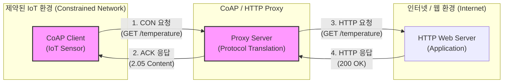

# CoAP (Constrained Application Protocol)

---

## I. 저전력/제한적 IoT 환경을 위한 경량 웹 프로토콜, CoAP의 개요

* **정의**: [[CPU]], 메모리, 전력 등 자원이 매우 제한적인 제약 노드(Constrained Node)와 저손실 통신망(LLN) 환경의 IoT 기기 통신을 위해, IETF(RFC 7252)에서 설계한 UDP 기반의 경량화된 RESTful 웹 전송 [[프로토콜]]
* **필요성/등장배경**: 기존 HTTP의 무거운 텍스트 헤더와 [[TCP]] 연결 지향 오버헤드는 배터리 기반의 초소형 센서나 IoT 기기에 부적합하여, 인터넷 웹 기술과 호환되면서도 경량화된 표준 프로토콜 도입이 요구됨
* **특징**:
* **UDP 기반 및 저전력**: TCP 대신 UDP를 채택하고 최소 4바이트의 압축된 바이너리 헤더를 사용하여 전력 및 대역폭 소모 최소화
* **RESTful 아키텍처**: HTTP의 메서드(GET, POST, PUT, DELETE)와 URI 지원을 통해 기존 웹 인프라와의 매핑(Proxy) 및 통합 용이
* **자체 [[신뢰성]] 보장**: UDP 환경의 데이터 유실을 보완하기 위해 메세지 타입(CON, ACK)을 통한 신뢰성 제어 메커니즘 제공

---

## II. CoAP의 아키텍처 및 핵심 기술 요소

### 가. CoAP의 아키텍처 및 메시지 교환 원리

* CoAP 클라이언트는 UDP 기반의 CON(Confirmable) 메시지로 데이터를 요청하고 서버는 ACK(Acknowledgement)로 응답하여 신뢰성을 확보하며, 프록시를 통해 기존 HTTP 기반 웹 서버와 유연하게 상호 연동됨

### 나. CoAP의 핵심 구성 요소 및 기술

| 구분 | 요소기술(키워드) | 세부 설명 |
| --- | --- | --- |
| **메시지 타입** | CON (Confirmable) | 메시지 수신 시 반드시 수신 측에서 ACK 응답을 보내야 하는 **신뢰성 보장형** 메시지 |
| **메시지 타입** | NON (Non-confirmable) | 수신 확인(ACK)을 요구하지 않는 빠른 전송 목적의 **비신뢰성** 메시지 (예: 주기적 센서 값) |
| **메시지 타입** | ACK / RST (Reset) | CON에 대한 정상 수신 응답(ACK) 및 수신 불가/오류 시 전송하는 초기화(RST) 메시지 |
| **[[전송 계층]]** | UDP (User Datagram) | 3-way Handshake 오버헤드가 없는 UDP를 기본 트랜스포트 레이어로 사용하여 지연시간 최소화 |
| **보안 체계** | DTLS (Datagram TLS) | UDP 환경에서 [[기밀성]], [[무결성]], 인증을 보장하기 위한 데이터그램 기반의 경량 [[암호화]] 표준 |
| **기능 확장** | Observe 패턴 (RFC 7641) | 클라이언트가 리소스 상태를 구독(Subscribe)하면, 상태 변경 시 서버가 비동기적으로 푸시 통지 |
| **기능 확장** | Block-wise 전송 | 페이로드 크기가 큰 데이터를 여러 개의 작은 블록으로 분할하여 전송하는 [[단편화]]/재조립 기법 |
| **서비스 탐색** | Resource Discovery | 멀티캐스트를 통해 동일 네트워크 내의 CoAP 서버 및 제공하는 리소스 경로(URI)를 동적 탐색 (`/.well-known/core`) |

---

## III. IoT 주요 프로토콜 비교 (CoAP vs MQTT) 및 향후 전망

### 가. CoAP와 MQTT의 아키텍처 및 특징 비교

| 비교 항목 | CoAP (Constrained Application Protocol) | [[MQTT (Message Queuing Telemetry Transport)]] |
| --- | --- | --- |
| **아키텍처 패턴** | Client-Server 구조 (RESTful 기반) | Publish-Subscribe (브로커 기반) |
| **전송 계층 (L4)** | **UDP** (경량, 오버헤드 최소화) | **TCP** (연결 지향, 신뢰성 우선) |
| **신뢰성 메커니즘** | CON, NON 메시지 타입 활용 | [[QoS]] 0, 1, 2 레벨 지정 |
| **보안 표준** | DTLS (Datagram TLS) | TLS / SSL |
| **최소 헤더 크기** | 4 Bytes | 2 Bytes |
| **주요 적용 분야** | 스마트 미터링, OMA LwM2M 기반 디바이스 제어 | 실시간 차량 관제, 스마트 팩토리, 센서 텔레메트리 데이터 수집 |

### 나. 향후 활용 전망 및 시사점

* **LwM2M(Lightweight M2M)의 핵심 전송 계층**: OMA(Open Mobile Alliance)에서 제정한 IoT 기기 관리 표준인 LwM2M의 근간 프로토콜로 채택되어, 이동통신사 기반의 스마트 시티 및 원격 검침(AMI) 인프라로 확산 중임
* **5G/6G mMTC 환경과의 시너지**: 대규모 사물 통신(mMTC) 환경에서 수많은 엣지([[EDGE|Edge]]) 디바이스가 저전력으로 네트워크에 동시 접속해야 함에 따라, 통신 부하를 줄이고 기존 웹 생태계와 쉽게 연동되는 CoAP의 전략적 가치는 지속해서 상승할 전망임

---

### 🔗 연관 토픽

- **소속 도메인**: [[00_네트워크_MOC|🌐 네트워크]]
- **세부 분류**: `1. OSI 7계층 & 데이터링크 계층 (L1/L2)`
- **핵심 연관 토픽**:
  - [[프로토콜]]
  - [[MQTT (Message Queuing Telemetry Transport)]]
  - [[전송 계층|전송 계층 (Transport Layer)]]
  - [[TCP]]
  - [[네트워크 프로토콜|네트워크 프로토콜 (Network Protocol)]]
