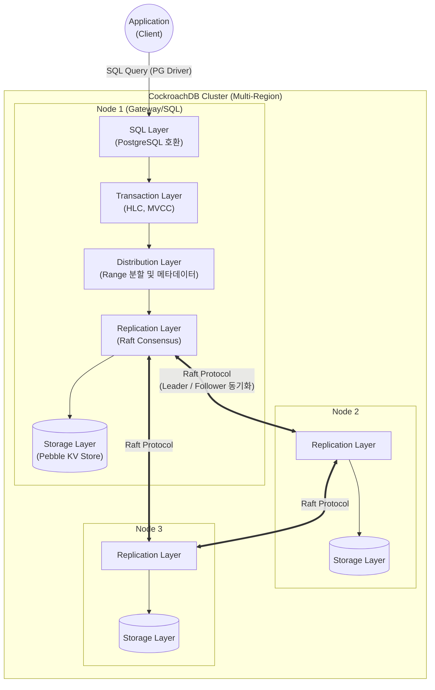

# CockroachDB (코크로치DB)

---

## I. 뛰어난 생존성을 갖춘 분산 클라우드 네이티브 DB, CockroachDB의 개요

* **정의**: 분산 환경에서 강력한 일관성(ACID)과 고가용성을 보장하며, 수평적 확장과 지리적 [[파티셔닝]](Geo-partitioning)을 지원하는 오픈소스 기반 [[New SQL|NewSQL]] [[데이터베이스]]
* **등장배경/필요성**: 기존 RDBMS의 수평적 확장(Scale-out) 한계, [[NoSQL (CAP 이론 BASE 속성)|NoSQL]]의 [[트랜잭션]] [[무결성]] 결여 극복 및 멀티 클라우드/글로벌 분산 환경에서의 데이터 생존성 확보 필요
* **특징**: 하이브리드 논리 클럭(HLC) 기반 동기화, Raft [[합의 알고리즘]] 기반 복제, PostgreSQL 와이어 [[프로토콜]] 호환, 멀티 액티브(Multi-Active) [[HA(High Availability)|가용성]] 제공

---

## II. CockroachDB의 아키텍처 및 핵심 기술 요소

### 가. CockroachDB의 아키텍처 및 동작 원리

* PostgreSQL 드라이버를 통해 인입된 [[SQL(Structured Query Language)|SQL]] 쿼리는 트랜잭션 레이어와 분산 레이어를 거쳐 Key-Value 형태로 변환되며, Raft 프로토콜을 통해 여러 노드 간에 강력한 일관성을 유지하며 복제·저장됨

### 나. CockroachDB의 핵심 기술 및 구성 요소

| 구분 | 요소기술(키워드) | 세부 설명 |
| --- | --- | --- |
| **분산 저장 체계** | Range (레인지) | 전체 데이터를 약 512MB 단위의 논리적 청크(Range)로 분할하여 클러스터 내 다수 노드에 분산 저장 |
| **데이터 복제/합의** | Raft Algorithm | Range 단위로 복제본(Replica) 그룹을 형성하고 리더(Leader)를 선출하여 다수결 기반 데이터 일관성 보장 |
| **시간 동기화** | HLC (Hybrid Logical Clocks) | 특수 하드웨어(원자 시계 등) 없이 물리적 시간과 논리적 카운터를 결합하여 전역적 트랜잭션 인과성 보장 |
| **스토리지 엔진** | Pebble | C++ 기반 RocksDB의 한계를 극복하기 위해 Go 언어로 자체 개발한 고성능 Key-Value 스토리지 엔진 |
| **무결성 보장** | Serializable Isolation | 트랜잭션 간 충돌([[Phantom Read]] 등)을 원천 차단하는 가장 엄격한 수준의 직렬화 가능 ACID 격리 수준 제공 |
| **동시성 제어** | MVCC | 다중 버전 동시성 제어를 통해 읽기/쓰기 작업 간의 락(Lock) 경합을 줄여 분산 환경 성능 극대화 |
| **데이터 배치** | Geo-partitioning | 위치 기반으로 데이터를 파티셔닝하여 쿼리 지연(Latency) 최소화 및 지역별 데이터 규제(GDPR 등) 준수 지원 |
| **호환성** | PostgreSQL Wire Protocol | 기존 PostgreSQL 생태계(드라이버, ORM, 도구)를 그대로 사용할 수 있는 표준 통신 인터페이스 지원 |

---

## III. CockroachDB와 Google Spanner 비교 및 향후 전망

### 가. 대표적 분산 SQL 데이터베이스 비교 (CockroachDB vs Spanner)

| 비교 항목 | CockroachDB (코크로치랩스) | Google Cloud Spanner (구글) |
| --- | --- | --- |
| **설계 기반/환경** | 클라우드 종속성 없음 (Multi-Cloud, On-Prem) | Google Cloud Platform(GCP) 전용 |
| **시간 동기화 방식** | **HLC (하이브리드 논리 시계)** 기반 소프트웨어 처리 | **TrueTime (GPS + 원자 시계)** 하드웨어 장비 의존 |
| **라이선스/오픈소스** | BSL (Business Source License) / 코어 소스 공개 | 완전한 폐쇄형 (Proprietary SaaS) |
| **스토리지 계층** | 자체 개발 Pebble (Key-Value) | 구글 자체 Colossus 분산 파일 시스템 |

### 나. 분산 환경에서의 실무 활용 및 향후 전망

* **멀티/하이브리드 클라우드 아키텍처의 핵심**: 특정 클라우드 벤더([[CSP]])에 종속되지 않고 AWS, Azure, GCP에 걸친 클러스터 구성이 가능하여, 무중단 서비스가 필수적인 금융권(Core Banking) 및 글로벌 이커머스 시스템의 메인 DB로 도입이 확대됨
* **Serverless DB로의 진화**: 인프라 [[프로비저닝]] 없이 트래픽에 따라 자동 확장/축소되고 사용한 만큼만 과금하는 **CockroachDB Serverless** 모델이 출시되면서, [[MSA (Micro Service Architecture)|MSA]] 환경의 마이크로서비스용 DB로 개발 생산성 및 비용 효율성을 극대화하고 있음

---

### 🔗 연관 토픽

- **소속 도메인**: [[00_데이터베이스_MOC|🗄️ 데이터베이스]]
- **세부 분류**: `2. 트랜잭션 & 동시성 제어 (Concurrency)`
- **핵심 연관 토픽**:
  - [[트랜잭션]]
  - [[New SQL]]
  - [[데이터베이스]]
  - [[NoSQL (CAP 이론 BASE 속성)]]
  - [[무결성]]
