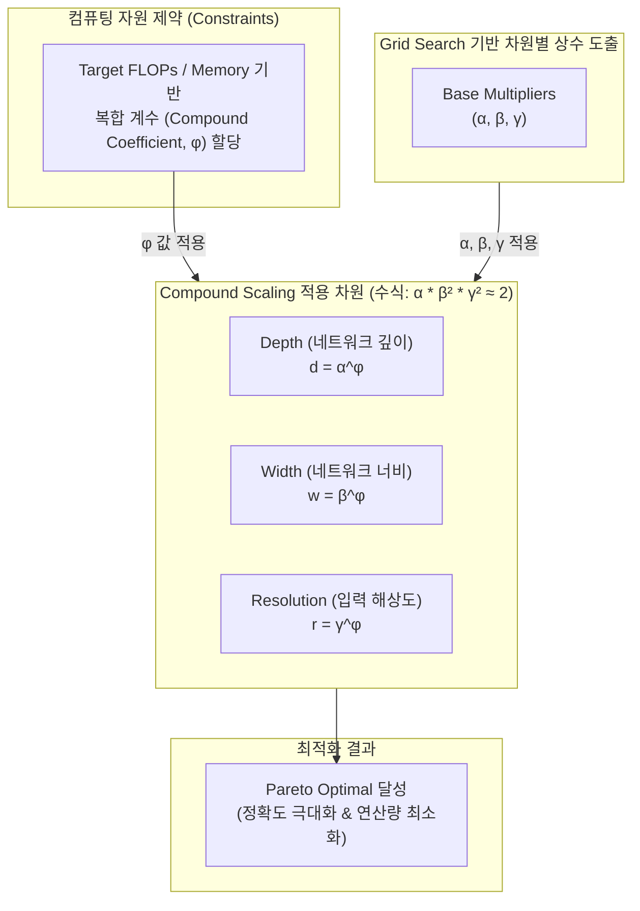

최신 AI 및 [[딥러닝]] 모델 스케일링 기술 동향을 반영하여, 정보관리기술사 1교시형(단답형) 모범답안 형식에 맞추어 작성된 답안입니다.

---

# Compound Scaling

---

## I. 모델 확장의 최적 균형점, Compound Scaling의 개요

### 가. Compound Scaling의 정의

* 딥러닝 모델의 성능을 극대화하기 위해 네트워크의 깊이(Depth), 너비(Width), 입력 해상도(Resolution) 등 다차원 요소를 단일 복합 계수($\phi$)로 균형 있게 동시 확장(Scaling)하는 최적화 기법

### 나. Compound Scaling의 등장배경 및 특징

* **단일 차원 확장의 한계 (한계 효용 체감)**: 깊이나 너비 중 하나의 차원만 무한정 늘릴 경우, 특정 지점부터 정확도 향상이 포화(Saturate)되고 연산 병목 현상 발생
* **Pareto-Optimal 달성**: 제한된 컴퓨팅 자원(FLOPs/Memory) 내에서 모델의 정확도와 연산 효율성 간의 최적의 균형점(Pareto-frontier) 도출
* **[[초거대 언어 모델|LLM]] 스케일링 법칙으로의 진화**: [[CNN]](EfficientNet)의 차원 확장을 넘어, 현재 LLM의 파라미터(N), 데이터 크기(D), 컴퓨팅 자원(C)을 최적으로 배분하는 Compound Scaling Laws(예: Chinchilla 법칙)로 발전

---

## II. Compound Scaling의 개념도 및 핵심 기술 요소

### 가. Compound Scaling의 개념도 및 동작원리

* 컴퓨팅 자원 증가량에 따라 단일 복합 계수($\phi$)를 조절하며, 깊이($\alpha$), 너비($\beta$), 해상도($\gamma$)의 비율을 상수로 고정하여 연산량(FLOPs)이 예측 가능하게 증가($2^\phi$)하도록 제어함.

### 나. Compound Scaling의 핵심 구성 요소

| 분류 | 요소기술(키워드) | 세부 설명 |
| --- | --- | --- |
| **스케일링 차원** | Depth (깊이) | - 레이어(Layer) 수를 확장하여 더 복잡하고 풍부한 특징(Feature) 추출 |
|  | Width (너비) | - 레이어당 채널(Channel) 수를 확장하여 미세한 특징 및 패턴 포착 |
|  |  |  |
| **수학적 모델** | Compound Coefficient ($\phi$) | - 사용 가능한 컴퓨팅 자원에 따라 조절되는 전역(Global) 단일 스케일링 계수 |
|  | Base Multipliers ($\alpha, \beta, \gamma$) | - Grid Search를 통해 도출된 각 차원별 최적 할당 상수 (예: $\alpha=1.2, \beta=1.1, \gamma=1.15$) |
|  | 제약 조건 (Constraint) | - $\alpha \cdot \beta^2 \cdot \gamma^2 \approx 2$ 로 제약하여 $\phi$가 1 증가할 때 총 연산량(FLOPs)이 2배 증가하도록 통제 |
| **적용 아키텍처** | 파레토 최적화 (Pareto Optimal) | - 스케일링 전후로 동일한 연산량 대비 가장 높은 정확도(Accuracy)를 내는 균형점 탐색 기법 |
|  | EfficientNet 아키텍처 | - Compound Scaling 기법을 적용하여 자원 제약 환경부터 대규모 환경까지 확장 가능한 CNN 계열 모델 (B0~B7) |

---

## III. Compound Scaling과 Single Scaling의 비교 및 향후 전망

### 가. Single Scaling과 Compound Scaling의 비교

| 비교 항목 | Single Scaling (단일 스케일링) | Compound Scaling (복합 스케일링) |
| --- | --- | --- |
| **스케일링 대상** | Depth, Width, Resolution 중 택 1 확장 | Depth, Width, Resolution의 균형적, 동시 확장 |
| **자원 할당 방식** | 직관적, 휴리스틱 기반 불균형 할당 | 상수 |
| **제어 파라미터** | Compound Coefficient ($\phi$) | - 사용 가능한 컴퓨팅 자원(목표 자원량)에 따라 스케일링 크기를 조절하는 사용자 지정 단일 계수 |
|  | Base Multipliers ($\alpha, \beta, \gamma$) | - 소형 Base 모델에서 Grid Search를 통해 도출된 각 차원의 스케일링 기본 상수(비율) |
| **최적화 및 제약** | 제약 조건 (Constraint) | - 연산량(FLOPs)을 $2^\phi$ 배로 제어하기 위해 $\alpha \cdot \beta^2 \cdot \gamma^2 \approx 2$ 로 고정 |
|  | 파레토 최적화 (Pareto Optimal) | - 추가적인 자원 투입 대비 최대의 정확도를 내는 최적 성능 경계점(Pareto-frontier) 탐색 |

---

## III. Compound Scaling과 Single Scaling의 비교 및 발전 동향

### 가. 단일 차원 확장(Single Scaling)과 Compound Scaling 비교

| 비교 항목 | Single Dimension Scaling | Compound Scaling |
| --- | --- | --- |
| **확장 대상** | Depth, Width, Resolution 중 택 1 | Depth, Width, Resolution 동시 확장 |
| **자원 분배** | 단일 차원에 자원 집중 (불균형 배분) | $\phi$ 계수에 기반한 다차원 균형 배분 |
| **성능 한계** | 특정 지점 이후 한계 효용 체감 및 과적합 발생 | 자원 대비 최상의 정확도(Pareto Optimal) 확보 |
| **대표 [[알고리즘]]** | ResNet(깊이), Wide-ResNet(너비) | EfficientNet (B0 ~ B7 모델군) |

### 나. 최신 Compound Scaling의 발전 동향 (LLM 관점)

* **Compound Scaling Laws로 진화**: CNN의 구조적 스케일링을 넘어, LLM(거대언어모델)에서 모델 파라미터 크기(N), 학습 데이터 양(D), 연산량(C)을 동시에 스케일링하는 **Compute-Optimal Scaling (Chinchilla 법칙 등)** 으로 사상 확장.
* **Compound AI System**: 단일 모델 차원의 최적화를 넘어, 검색(RAG), 추론기(Reasoner), 도구 사용(Tool Use) 등 여러 컴포넌트를 조합하여 추론 컴퓨팅(Inference Compute) 자원을 최적으로 배분하는 시스템 차원의 스케일링으로 발전 중.

---

### 🔗 연관 토픽

- **소속 도메인**: [[00_인공지능_MOC|🤖 인공지능]]
- **세부 분류**: `1. 수학 · 통계학 & 데이터 전처리`
- **핵심 연관 토픽**:
  - [[CNN|CNN (Convolutional Neural Network)]]
  - [[딥러닝]]
  - [[초거대 언어 모델|초거대 언어 모델(Large Language Model)]]
  - [[비지도 학습]]
  - [[TF-IDF (Term Frequency - Inverse Document Frequency)]]
