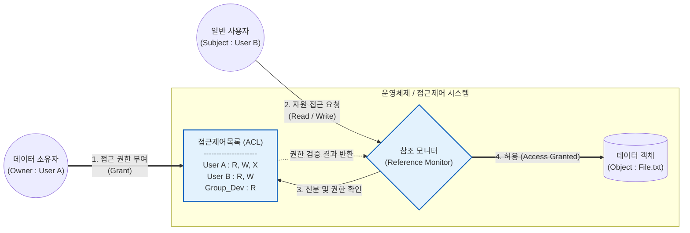

# DAC (Discretionary Access Control)

---

## I. 주체의 신분 기반 접근 권한 부여, DAC의 개요

* **가. DAC(Discretionary Access Control, 임의적 접근통제)의 정의**: 데이터 객체의 소유자(Owner)가 사용자나 사용자 그룹의 신분(Identity)을 기준으로 자신의 재량에 따라 접근 권한을 부여하고 통제하는 자율적 접근통제 메커니즘
* **나. DAC의 필요성 및 특징**:
* **필요성**: 중앙 집중적 관리의 오버헤드 감소, 데이터 소유자 중심의 유연하고 신속한 자원 공유 및 권한 관리 요구 대응
* **특징**:
* **신분 기반(Identity-based)**: 접근 요청자의 신원(ID) 및 소속 그룹에 기반하여 권한 평가
* **재량적 권한 위임**: 소유자가 다른 사용자에게 객체에 대한 권한 부여(Grant) 및 회수(Revoke) 가능
* **취약점 존재**: 소유자 권한이 탈취될 경우(예: 트로이목마, 멀웨어) 내부 정보 유출 및 [[무결성]] 훼손에 취약함

---

## II. DAC의 개념도 및 핵심 통제 기법

### 가. DAC의 권한 부여 및 동작 개념도

* 소유자(User A)가 접근제어목록(ACL)을 재량껏 수정하여 User B에게 권한을 부여하며, 참조 모니터는 요청 시 주체의 신원과 ACL을 대조하여 접근을 통제함

### 나. DAC의 핵심 기술 및 구현 요소

| 구분 | 요소기술(키워드) | 세부 설명 |
| --- | --- | --- |
| **통제 기준** | 신분(Identity) | 주체(사용자, [[프로세스]])의 고유 식별자(ID) 및 소속 그룹(Group) 정보를 접근 제어의 판단 기준으로 사용 |
| **권한 주체** | 소유자 (Owner) | 객체를 생성한 주체로서, 해당 객체에 대해 절대적인 통제권을 가지며 타인에게 권한 위임 가능 |
| **권한 관리** | Grant / Revoke | [[SQL(Structured Query Language)|SQL]] 명령어 등에서 볼 수 있듯 소유자가 특정 주체에게 권한을 부여(Grant)하거나 취소(Revoke)하는 기능 |
| **자료 구조** | 접근통제 행렬 (ACM) | 행(Row)은 주체, 열(Column)은 객체를 나타내며, 교차점에 권한(R/W/X)을 기록하는 2차원 매트릭스 (Access Control Matrix) |
| **구현 기법** | ACL (접근제어목록) | **객체 관점**에서 해당 객체에 접근할 수 있는 주체와 그 권한을 목록화하여 저장 (ACM의 열 단위 분해) |
| **구현 기법** | Capability Ticket | **주체 관점**에서 해당 주체가 접근할 수 있는 객체와 권한의 목록을 자격 증명(티켓) 형태로 소유 (ACM의 행 단위 분해) |
| **적용 환경** | UNIX / 리눅스 파일 시스템 | `chmod`, `chown` 명령어 등을 통해 소유자가 파일의 권한(rwx)을 소유자, 그룹, 기타 사용자로 나누어 설정 |

---

## III. 3대 접근통제 모델 비교 및 보안 발전 동향

### 가. 주요 접근통제 모델(DAC, MAC, RBAC) 비교

| 비교 항목 | DAC (임의적 접근통제) | [[MAC]] (강제적 접근통제) | [[RBAC]] (역할 기반 접근통제) |
| --- | --- | --- | --- |
| **통제 권한자** | **데이터 소유자 (Owner)** | **시스템 관리자 (Admin)** | **보안 관리자 (Sec. Admin)** |
| **통제 기준** | 주체의 신분 (ID, Group) | 주체의 보안 취급 인가(Clearance) 및 객체의 보안 등급(Label) | 주체에게 할당된 역할(Role) |
| **보안성 / 유연성** | 보안성 낮음 / 유연성 **매우 높음** | 보안성 **매우 높음** / 유연성 낮음 | 보안성 보통 / 유연성 높음(관리 용이) |
| **취약점** | 트로이목마, 바이러스에 취약 | 권한 관리가 엄격해 업무 효율성 저하 | 직무 변경 시 역할 갱신 누락 우려 |
| **적용 분야** | 일반 상용 OS (Linux, Windows 등) | 군사, 정보기관, [[방화벽]] 규칙 | 대규모 전사 시스템, ERP, [[DBMS]] |

### 나. 한계 극복 및 향후 발전 동향

* **ABAC (Attribute-Based Access Control)로의 진화**: 클라우드 및 마이크로서비스 환경에서는 DAC의 정적인 신분 확인이나 RBAC의 한계를 극복하기 위해, 사용자의 속성(부서, 직급), 자원 속성, 환경 속성(시간, 위치)을 종합적으로 고려하는 동적 접근 제어(ABAC) 기술이 확산되고 있음
* **제로 트러스트([[제로 트러스트 보안모델|Zero Trust]]) 아키텍처와의 융합**: 신분(ID) 기반의 DAC가 지닌 [[세션]] 탈취 및 내부자 위협(Insider Threat) 취약점을 보완하기 위해, 접속 시점마다 기기 상태와 행위를 지속 검증하는 제로 트러스트 보안 철학이 결합된 하이브리드 접근통제 모델로 발전 중임

---

### 🔗 연관 토픽

- **소속 도메인**: [[00_보안_MOC|🛡️ 보안]]
- **세부 분류**: `1. 정보보안 원칙 & 거버넌스 · 인증`
- **핵심 연관 토픽**:
  - [[RBAC]]
  - [[제로 트러스트 보안모델|제로 트러스트 (Zero Trust) 보안모델]]
  - [[기밀성]]
  - [[접근 제어 접근 통제|접근 제어/접근 통제(Access Control)]]
  - [[접근 통제 모델]]
