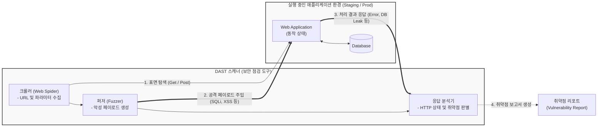

# DAST (Dynamic Application Security Testing)

---

## I. 실행 환경 기반의 블랙박스 보안 검증, DAST의 개요

* **가. DAST(Dynamic Application Security Testing)의 정의**: 소스코드에 대한 접근 없이, **실행 중인(Runtime)** 애플리케이션의 외부에서 해커와 동일한 방식(HTTP 요청 등)으로 모의 공격을 수행하여 보안 취약점을 탐지하는 **블랙박스(Black-box)** 기반 동적 보안 테스트 기법
* **나. DAST의 필요성 및 특징**:
* **필요성**: 소스코드 정적 분석([[SAST]])만으로는 발견할 수 없는 런타임 환경 설정 오류, 인증 우회, [[세션]] 관리 취약점 등의 실질적 위협 식별 필요
* **특징**:
* **언어 독립성**: 애플리케이션의 개발 언어(Java, Python 등)나 내부 구조에 종속되지 않음
* **낮은 오탐율(False Positive)**: 실제 실행되어 나타난 결과를 바탕으로 취약점을 판단하므로 검증의 정확도가 높음
* **런타임 환경 검증**: 웹 서버, [[데이터베이스]] 연동 등 실제 운영(또는 스테이징) 환경과 동일한 상태에서 테스트 수행

---

## II. DAST의 개념도 및 핵심 기술 요소

### 가. DAST의 동작 개념도 및 아키텍처

* DAST 도구는 웹 크롤링을 통해 공격 대상을 식별하고, 자동화된 악성 페이로드([[SQL Injection]], [[XSS]] 등)를 서버에 전송한 후 돌아오는 HTTP 응답의 형태나 에러 코드를 분석하여 취약점을 확정함

### 나. DAST의 핵심 기술 및 구성 요소

| 구분 | 요소기술(키워드) | 세부 설명 |
| --- | --- | --- |
| **정보 수집** | 크롤링 / 스파이더링 | 애플리케이션의 모든 링크, 폼(Form), API 엔드포인트를 자동 탐색하여 공격 가능한 표면(Attack Surface) 식별 |
| **공격 시뮬레이션** | Fuzzing (퍼징) | 예상치 못한 임의의 데이터나 무작위(Random) 값을 입력하여 애플리케이션의 비정상 종료 및 오류 유발 테스트 |
| **공격 시뮬레이션** | Payload Injection | OWASP Top 10 기반의 알려진 악성 스크립트(XSS) 및 쿼리(SQLi) 페이로드를 파라미터에 삽입하여 실행 여부 검증 |
| **상태 점검** | 세션 및 인증 점검 | 세션 토큰 예측 가능성, [[쿠키]] 변조, 권한 상승 및 인증 우회(Bypass) 취약점 등 논리적 보안 결함 점검 |
| **결과 분석** | 응답(Response) 분석 | 공격 페이로드 전송 후 서버의 HTTP 상태 코드, 에러 메시지 노출, DB 구조 노출 등을 분석하여 취약점 판별 |
| **파이프라인** | CI/CD 연동 | REST API 등을 통해 Jenkins, GitLab CI 파이프라인에서 DAST 스캔을 자동 트리거하고 결과를 수집 |

---

## III. SAST와 DAST의 비교 및 애플리케이션 보안 테스트 동향

### 가. 애플리케이션 보안 테스트 기법(SAST vs DAST) 비교

| 비교 항목 | SAST (Static AST, 정적 분석) | DAST (Dynamic AST, 동적 분석) |
| --- | --- | --- |
| **분석 방식** | **화이트박스 (White-box)** 테스트 | **블랙박스 (Black-box)** 테스트 |
| **점검 대상** | **소스 코드** 및 바이너리 | **실행 중인 애플리케이션** (URL, API) |
| **적용 시점** | 개발(Coding), 빌드(Build) 단계 | [[통합 테스트]](Testing), 스테이징(Staging) 단계 |
| **장점** | 개발 초기 단계에서 코드 레벨의 근본적 결함 발견, 빠른 피드백 | 런타임 환경 설정 오류 및 실제 공격자 관점의 취약점 발견, 오탐이 적음 |
| **단점 / 한계** | 실행 환경의 문제점 파악 불가, 오탐(False Positive) 발생률이 높음 | 소스 코드 상의 정확한 취약 위치(Line of Code) 지적 불가, 점검 시간 소요 |

### 나. 향후 전망 및 기술 동향

* **IAST (Interactive AST)의 부상**: SAST의 높은 오탐률과 DAST의 정확한 코드 위치 식별 불가라는 단점을 상호 보완하기 위해, 애플리케이션 내부에 에이전트(Agent)를 삽입하여 테스트 중 코드 실행 흐름과 데이터 유름을 실시간으로 추적하는 **그레이박스(Gray-box) 기반의 IAST** 도입이 확대되고 있음
* **API 및 마이크로서비스 특화 DAST 진화**: 프론트엔드와 백엔드가 분리된 현대적인 [[클라우드 네이티브]] 아키텍처 환경에 발맞추어, 전통적인 웹 UI 크롤링을 넘어 Swagger(OpenAPI) 명세서를 읽어 들이고 **RESTful API 및 GraphQL 엔드포인트를 자동으로 집중 타격**하는 API 특화 DAST 기능이 핵심 트렌드로 부상하고 있음

---

### 🔗 연관 토픽

- **소속 도메인**: [[00_보안_MOC|🛡️ 보안]]
- **세부 분류**: `4. 웹 & 애플리케이션 보안 · 취약점 점검`
- **핵심 연관 토픽**:
  - [[SQL Injection]]
  - [[SAST]]
  - [[XSS]]
  - [[공급망 공격|공급망 공격(Supply Chain Attack)]]
  - [[시큐어코딩]]
