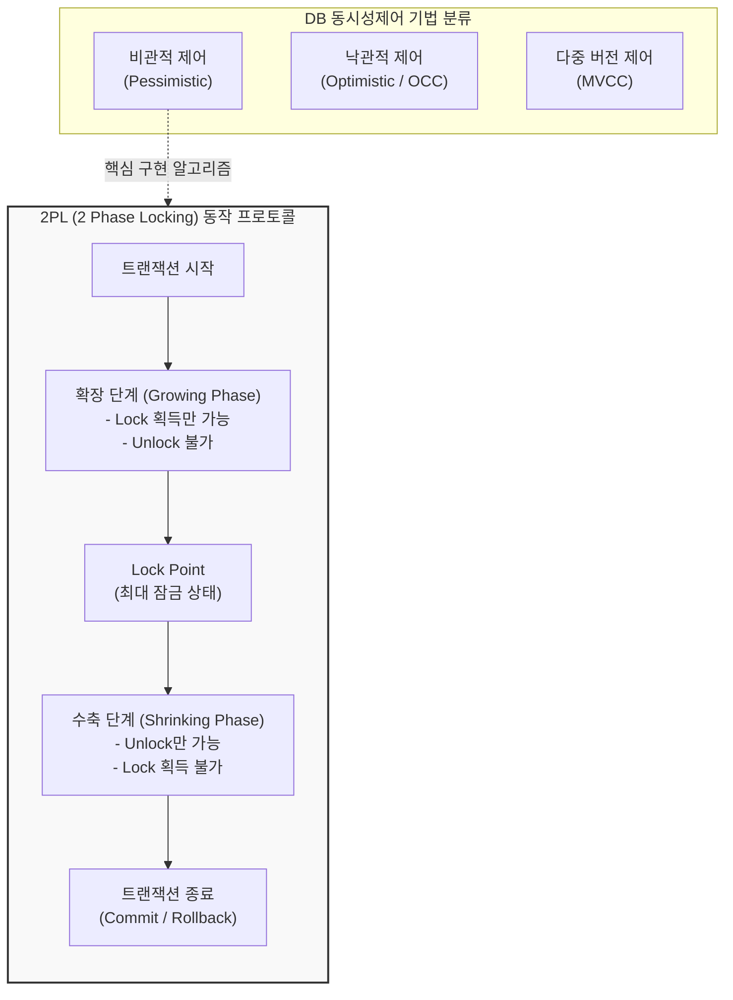

# DB 동시성제어 (Database Concurrency Control)

---

## I. 다중 트랜잭션 환경의 데이터 일관성 보장, DB 동시성제어의 개요

* **가. DB 동시성제어(Concurrency Control)의 정의**: 다중 사용자 환경에서 다수의 트랜잭션이 동시에 동일한 데이터에 접근하고 갱신할 때, 데이터의 [[무결성]](Integrity)과 일관성(Consistency)을 유지하기 위해 트랜잭션의 실행 순서를 제어하는 [[DBMS]]의 핵심 메커니즘
* **나. 동시성제어의 필요성 및 특징**:
* **필요성**: 제어 실패 시 발생하는 4대 이상 현상인 갱신 분실(Lost Update), 모순성(Inconsistency), 연쇄 복귀(Cascading Rollback), 비완료 의존성(Uncommitted Dependency) 방지
* **특징**:
* **ACID 특성 보장**: 트랜잭션의 고립성(Isolation)과 일관성(Consistency)을 하위 레벨에서 강제함
* **직렬가능성(Serializability) 확보**: 여러 트랜잭션이 병행 수행되더라도, 순차적으로 실행된 것과 동일한 결과를 보장
* **Trade-off 관계**: 동시성(병행성)을 높이면 일관성 수준이 낮아지고, 일관성(격리 수준)을 높이면 동시성 및 시스템 성능이 저하됨

---

## II. DB 동시성제어의 개념도 및 핵심 기술 요소

### 가. 동시성제어 주요 메커니즘 및 2PL(2 Phase Locking) 개념도

* 전통적인 비관적 제어는 [[2PL]] 프로토콜을 통해 확장 단계에서만 잠금을 획득하고, 수축 단계에서 해제함으로써 [[교착상태]](Deadlock)를 최소화하고 직렬가능성을 보장함

### 나. 동시성제어의 핵심 기술 및 구성 요소

| 구분 | 요소기술(기법) | 세부 설명 |
| --- | --- | --- |
| **잠금 ([[Locking]])** | S-Lock / X-Lock | 데이터를 읽을 때는 공유잠금(Shared), 수정할 때는 배타잠금(Exclusive)을 획득하여 다른 트랜잭션의 간섭을 차단 |
| **잠금 [[알고리즘]]** | 2PL (2단계 잠금) | 트랜잭션의 잠금(Lock) 요청과 해제(Unlock) 단계를 확장/수축의 2단계로 명확히 분리하여 직렬성을 보장하는 [[프로토콜]] |
| **순서 제어** | 타임스탬프 순서 ([[Timestamp Ordering]]) | 시스템에 진입하는 트랜잭션의 시간 순서(Timestamp)를 기준으로 데이터 접근의 읽기/쓰기 권한 및 대기를 판별 |
| **지연 검증** | 낙관적 검증 (OCC) | 데이터 갱신 시에는 일단 메모리 작업 영역에서 수행하고, [[트랜잭션]] 종료(Commit) 시점에 일괄적으로 충돌 여부를 검증 |
| **버전 관리** | MVCC (다중 버전) | 데이터 변경 시 덮어쓰지 않고 Undo 영역에 이전 버전(Snapshot)을 생성하여, **"읽기와 쓰기 간의 상호 차단(Locking)을 제거"**하는 기법 |
| **통제 수준** | 격리 수준 ([[Isolation Level (격리 레벨고립성 수준)|Isolation Level]]) | Read Uncommitted, Read Committed, Repeatable Read, Serializable 등 4단계로 나누어 동시성과 데이터 정합성의 타협점을 설정 |

---

## III. 주요 동시성제어 기법 비교 및 최신 동향

### 가. 전통적 잠금(Locking) 기법과 다중 버전(MVCC) 기법 비교

| 비교 항목 | 잠금 기반 기법 (Pessimistic Locking / 2PL) | 다중 버전 동시성 제어 (MVCC) |
| --- | --- | --- |
| **기본 철학** | 충돌이 자주 발생할 것이라 가정 (비관적) | 읽기와 쓰기의 충돌을 구조적으로 분리 |
| **제어 방식** | 접근하는 레코드나 테이블에 물리적인 Lock을 걸어 대기 | 변경된 데이터의 **버전(Snapshot)**을 유지하여 읽기 세션에 제공 |
| **읽기/쓰기 간섭** | 쓰기 작업(X-Lock) 진행 시 **읽기 작업(S-Lock) 대기 발생** | 쓰기 작업 중에도 과거 버전을 통해 **대기 없이 읽기 가능** |
| **부하 및 단점** | 데드락(Deadlock) 발생 확률 높음, 동시성 저하 | 주기적인 버전 데이터 정리(Vacuum/Undo Retention) 오버헤드 발생 |
| **적용 DBMS** | 초기 관계형 [[데이터베이스]], 특수 목적 트랜잭션 제어 | Oracle, PostgreSQL, MySQL(InnoDB) 등 현대 RDBMS의 표준 |

### 나. 향후 전망 및 기술 동향

* **글로벌 분산 DB 환경의 동시성 제어 (TrueTime API)**: Google Spanner와 같은 최신 분산형 [[New SQL|NewSQL]] 데이터베이스는 전 세계에 흩어진 노드 간의 엄격한 직렬가능성(Strict Serializability)을 보장하기 위해, 원자 시계와 GPS를 활용한 물리적 시간 동기화 기술(TrueTime API) 기반의 정밀한 타임스탬프 동시성 제어를 수행함
* **인메모리(In-Memory) 기반 낙관적 제어 부상**: 메모리 접근 속도가 극대화된 SAP HANA, Redis(트랜잭션) 등에서는 기존 디스크 I/O 기반의 무거운 Locking(2PL) 대신, 충돌이 적다는 가정하에 [[CPU]] [[스핀락]](Spinlock)과 낙관적 검증(OCC)을 결합하여 초고속 처리량을 달성하는 아키텍처로 진화하고 있음

---

### 🔗 연관 토픽

- **소속 도메인**: [[00_데이터베이스_MOC|🗄️ 데이터베이스]]
- **세부 분류**: `2. 트랜잭션 & 동시성 제어 (Concurrency)`
- **핵심 연관 토픽**:
  - [[무결성]]
  - [[트랜잭션]]
  - [[New SQL]]
  - [[Locking]]
  - [[2PL|2PL (Two-Phase Locking Protocol)]]
