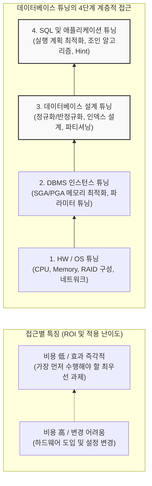

# DB 성능 개선 방안 (Database Tuning)

---

## I. 시스템 자원 최적화 및 처리량 극대화, DB 튜닝의 개요

* **가. DB 튜닝(Performance Tuning)의 정의**: [[데이터베이스]] 시스템이 제한된 하드웨어 자원 내에서 응답 속도(Response Time)를 최소화하고, 초당 [[트랜잭션]] [[처리량]](TPS)을 극대화하기 위해 하드웨어, [[OS(운영체제)|운영체제]], [[DBMS]] 설정, 데이터 모델, [[SQL(Structured Query Language)|SQL]]을 최적화하는 일련의 과정
* **나. DB 튜닝의 필요성 및 특징**:
* **필요성**: 대규모 트래픽 증가에 따른 병목 현상(Bottleneck) 해소, I/O 디스크 접근 최소화를 통한 성능 향상, 불필요한 시스템 증설(Scale-up) 비용 절감
* **특징**:
* **계층적 접근**: 하드웨어부터 SQL까지 각 계층별로 접근하며, **SQL 튜닝이 비용 대비 효과(ROI)가 가장 뛰어남**
* **Trade-off 존재**: 읽기 성능 향상을 위한 인덱스 추가가 쓰기(Insert/Update/Delete) 성능 저하를 유발하는 등 상충 관계가 존재함
* **지속성**: 데이터의 양과 분포는 지속적으로 변하므로, 통계 정보 갱신과 모니터링을 통한 주기적인 튜닝이 필수적임

---

## II. DB 튜닝의 접근 방법론 및 핵심 기술 요소

### 가. DB 튜닝의 계층적 접근 아키텍처 및 ROI

* 튜닝은 시스템 하위 계층(HW)부터 설계되지만, 성능 문제 발생 시 **가장 적은 비용으로 가장 큰 효과(ROI)를 내는 최상위 계층인 SQL 튜닝부터 하향식(Top-Down)으로 접근**하는 것이 원칙임

### 나. DB 튜닝 계층별 핵심 기술 및 기법

| 튜닝 계층 | 요소기술(키워드) | 세부 설명 |
| --- | --- | --- |
| **SQL 튜닝** | 실행 계획 (Execution Plan) | [[옵티마이저]]([[OPTIMIZER|Optimizer]])가 생성한 쿼리 처리 경로를 분석하여 Full Table Scan을 [[RDBMS 인덱스(index)|Index]] Scan 등으로 유도 |
| **SQL 튜닝** | [[조인]] 기법 (Join Method) | 데이터 크기와 인덱스 유무에 따라 Nested Loop, Hash, Sort Merge Join 알고리즘을 최적의 상태로 선택 |
| **SQL 튜닝** | 힌트 (Hint) | 개발자가 옵티마이저의 판단을 오버라이딩하여, 특정 인덱스 사용이나 조인 순서를 직접 강제하는 지시어 |
| **설계 튜닝** | 인덱스 (Index) | B-Tree, Bitmap, Clustered 등 데이터 검색 속도를 향상시키기 위한 자료구조의 최적 설계 (결합 인덱스 순서 최적화 등) |
| **설계 튜닝** | 반정규화 (Denormalization) | 조인으로 인한 성능 저하를 막기 위해, 정규화된 테이블을 의도적으로 통합하거나 중복 칼럼을 추가하는 기법 |
| **설계 튜닝** | [[파티셔닝]] (Partitioning) | 초대용량 테이블을 물리적으로 분할(Range, Hash, List)하여 I/O 분산 및 데이터 관리 효율성 증대 |
| **[[인스턴스]] 튜닝** | 버퍼 캐시 (Buffer Cache) | 디스크 I/O를 최소화하기 위해 자주 사용하는 데이터 블록을 메모리에 적재하는 공간 크기 및 [[알고리즘]] 최적화 |
| **HW/OS 튜닝** | I/O 분산 ([[RAID]]/SSD) | 데이터 파일, 로그 파일, Temp 파일을 서로 다른 물리적 디스크에 분산 배치하여 디스크 경합 해소 |

---

## III. SQL 튜닝의 핵심(Optimizer) 비교 및 최신 동향

### 가. SQL 튜닝의 두뇌, 옵티마이저(RBO vs CBO) 비교

| 비교 항목 | RBO (Rule-Based Optimizer) | CBO (Cost-Based Optimizer) |
| --- | --- | --- |
| **동작 원리** | DBMS에 사전에 정의된 **우선순위 규칙(Rule)** 기반 | 데이터 딕셔너리의 **통계 정보(통계치)**를 바탕으로 계산된 최소 비용(Cost) 기반 |
| **주요 판단 기준** | 인덱스의 유무 및 종류, [[연산자]] 종류 (예: PK 조회 우선) | 테이블의 로우(Row) 수, 블록 크기, 데이터 분포도(선택도) |
| **장점** | 개발자가 실행 계획을 명확하게 예측하고 통제 가능 | 실제 데이터의 분포와 상태를 반영하여 현실적이고 유연한 경로 도출 |
| **단점 / 한계** | 데이터의 양이나 분포가 변해도 융통성 없이 동일한 경로 선택 | 주기적인 통계 정보 수집(Analyze/Gather) 작업이 필수적임 |
| **적용 동향** | 과거 시스템 방식 (현대 DBMS에서는 비권장/폐기됨) | **대부분의 현대 RDBMS (Oracle, MySQL, PostgreSQL)의 표준** |

### 나. DB 성능 튜닝의 향후 전망 및 기술 동향

* **머신러닝 기반의 자율운영 데이터베이스 (Autonomous Database)**: DBA의 경험적 직관에 의존하던 튜닝을 넘어, AI가 쿼리 워크로드를 학습하여 스스로 통계 정보를 갱신하고, 최적의 인덱스를 자동 생성(Auto Indexing) 및 삭제하며, 실행 계획을 동적으로 변경하는 자율 주행 DB 인프라(예: Oracle Autonomous DB)가 확산되고 있음
* **[[클라우드 네이티브]] 환경의 스케일 아웃(Scale-out) 중심 최적화**: 전통적인 단일 서버의 극한 튜닝(Scale-up)보다는, [[MSA (Micro Service Architecture)|MSA]] 환경에 맞추어 읽기 복제본(Read Replica)을 다수 생성해 부하를 분산하고, [[샤딩]](Sharding)과 컴퓨팅/스토리지 분리 아키텍처(예: AWS Aurora)를 활용하여 구조적으로 병목을 회피하는 인프라 레벨의 튜닝 비중이 높아지고 있음

---

### 🔗 연관 토픽

- **소속 도메인**: [[00_데이터베이스_MOC|🗄️ 데이터베이스]]
- **세부 분류**: `2. 트랜잭션 & 동시성 제어 (Concurrency)`
- **핵심 연관 토픽**:
  - [[트랜잭션]]
  - [[RDBMS 인덱스(index)]]
  - [[데이터베이스]]
  - [[SQL(Structured Query Language)]]
  - [[DBMS]]
