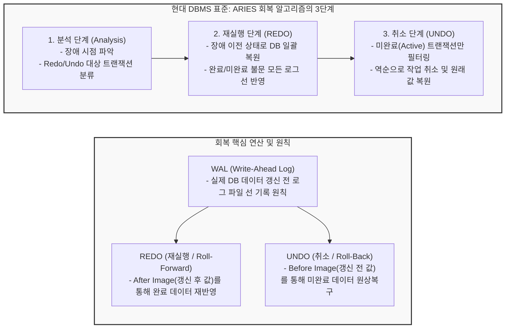

# DB 회복기법 (Database Recovery)

---

## I. 장애 발생 시 데이터 일관성 보장, DB 회복기법의 개요

* **가. DB [[회복기법]](Recovery)의 정의**: [[트랜잭션]] 실행 중 하드웨어 결함, 소프트웨어 오류, 또는 미디어 장애가 발생했을 때, 로그(Log)와 덤프(Dump)를 활용하여 데이터베이스를 장애 발생 이전의 모순이 없는 일관된(Consistent) 상태로 복원하는 [[DBMS]]의 핵심 제어 기능
* **나. 회복기법의 필요성 및 특징**:
* **필요성**: 트랜잭션의 ACID 특성 중 원자성(Atomicity)과 영속성(Durability)을 시스템 붕괴 상황에서도 완벽하게 보장하기 위함
* **특징**:
* **WAL(Write-Ahead Logging) 기반**: [[데이터베이스]] 갱신 전, 변경 내역을 항상 로그에 먼저 기록하는 원칙을 준수
* **2대 핵심 연산 활용**: 완료된 트랜잭션의 유실 방지를 위한 재실행(REDO)과, 미완료 트랜잭션의 원상복구를 위한 취소(UNDO) 연산 수행
* **성능과 복구 시간의 타협**: 검사점(Checkpoint)을 주기로 설정하여 복구 소요 시간(RTO)을 단축하고 성능 오버헤드를 조율함

---

## II. DB 회복의 개념도 및 핵심 기술 요소

### 가. 현대 RDBMS 회복 표준(ARIES) 및 연산 메커니즘 개념도

* 장애 발생 시, [[ARIES]] 알고리즘은 로그를 기반으로 시스템을 크래시 직전 상태로 똑같이 재현(REDO)한 다음, 완료되지 않은 트랜잭션들만 골라내어 역순으로 취소(UNDO)하는 방식으로 정합성을 맞춤

### 나. DB 회복의 핵심 기술 및 구성 요소

| 구분 | 요소기술(기법) | 세부 설명 |
| --- | --- | --- |
| **핵심 원칙** | WAL (Write-Ahead Log) | 메인 메모리의 데이터 버퍼를 디스크에 플러시(Flush)하기 전에, 반드시 로그 버퍼를 먼저 디스크(로그 파일)에 기록하는 원칙 |
| **기본 연산** | REDO (재실행) | 장애 시점에 이미 Commit은 되었으나 디스크 DB에 반영되지 않은 메모리 상의 갱신 내역을 로그를 보고 다시 실행(Roll-forward) |
| **기본 연산** | UNDO (취소) | 장애 시점에 Commit 되지 않은(Active) 트랜잭션의 변경 내역이 디스크 DB에 반영되어 있을 경우, 원래 값으로 되돌림(Roll-back) |
| **로그 기반 회복** | 즉시 갱신 (Immediate) | 트랜잭션 수행 중에도 데이터를 실시간으로 디스크에 반영하는 기법으로, 장애 시 **REDO와 UNDO 모두 필요함** |
| **로그 기반 회복** | 지연 갱신 (Deferred) | 트랜잭션이 Commit 되기 전까지는 디스크 반영을 지연시키는 기법으로, 장애 시 **UNDO가 불필요하며 REDO만 수행** |
| **최적화 기법** | 검사점 (Checkpoint) | 복구 시 전체 로그를 검색하는 시간을 단축하기 위해, 주기적으로 메모리의 변경된 데이터(Dirty Page)를 디스크에 동기화한 지점 |
| **대안 기법** | 그림자 페이징 (Shadow) | 로그를 사용하지 않고 디스크 페이지를 원본(Current)과 복사본(Shadow)으로 분리하여 갱신 후 포인터만 변경하는 복구 기법 |
| **표준 [[알고리즘]]** | ARIES (알고리즘) | IBM에서 설계한 기법으로 LSN(Log Sequence Number)을 활용하여 분석, REDO, UNDO 3단계로 완벽한 데이터 복구를 수행 |

---

## III. 주요 회복 기법 비교 및 최신 동향

### 가. 로그 기반 갱신(회복) 기법 비교: 즉시 갱신 vs 지연 갱신

| 비교 항목 | 즉시 갱신 (Immediate Update) | 지연 갱신 (Deferred Update) |
| --- | --- | --- |
| **디스크 반영 시점** | 트랜잭션 수행 중 **실시간(수시로)** 반영 | 트랜잭션 **부분 완료(Commit) 시점**에 일괄 반영 |
| **필요 회복 연산** | **REDO, UNDO 모두 필요** | **REDO만 필요 (UNDO 불필요)** |
| **장점** | 버퍼 메모리 크기가 제한된 환경에 유리 | 취소 연산(UNDO)이 발생하지 않아 복구 로직이 단순 |
| **단점 / 오버헤드** | 미완료 트랜잭션 발생 시 복구 작업이 복잡하고 무거움 | 수행 중 발생하는 방대한 데이터를 모두 메모리에 보관해야 함 |
| **주요 활용** | **대부분의 현대 범용 RDBMS 환경** | 일부 특수 목적 데이터베이스 |

### 나. 향후 전망 및 기술 동향

* **클라우드 분산 스토리지 기반의 고속 복구 (Crash Recovery Offloading)**: AWS Aurora와 같은 [[클라우드 네이티브]] DB는 컴퓨팅과 스토리지를 분리하여, 복잡한 REDO/UNDO 복구 처리를 스토리지 노드 계층으로 오프로딩(Offloading) 시킴으로써, DB [[인스턴스]] 재시작 시점에 발생하는 복구 시간(Crash Recovery Time)을 기존 수 분에서 수 초 단위로 획기적으로 단축함
* **비휘발성 메모리(NVM) 기반의 Instant Recovery**: 메인 메모리가 전원이 꺼져도 데이터를 유지하는 NVM(Non-Volatile Memory)으로 진화함에 따라, 전통적인 디스크 I/O 기반의 WAL(Write-Ahead Logging) 병목 현상이 제거되고 장애 발생 후 재부팅만으로 즉시 원래 상태로 회복되는 인메모리 아키텍처로 패러다임이 전환되고 있음

---

### 🔗 연관 토픽

- **소속 도메인**: [[00_데이터베이스_MOC|🗄️ 데이터베이스]]
- **세부 분류**: `2. 트랜잭션 & 동시성 제어 (Concurrency)`
- **핵심 연관 토픽**:
  - [[ARIES|ARIES (Algorithms for Recovery and Isolation Exploiting Semantics)]]
  - [[회복기법]]
  - [[트랜잭션]]
  - [[데이터베이스]]
  - [[DBMS]]
