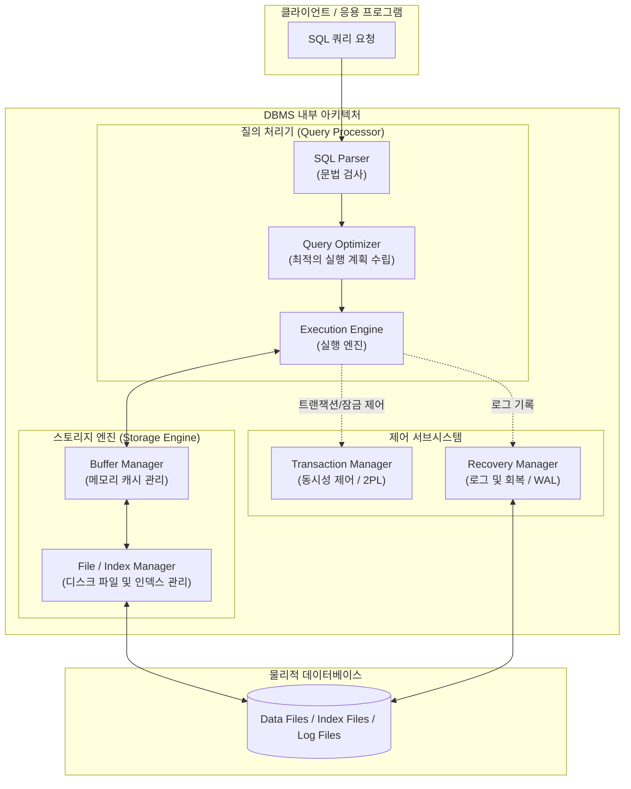

# DBMS (Database Management System)

---

## I. 데이터의 통합 관리와 공유를 위한 핵심 시스템 소프트웨어, DBMS의 개요

* **가. DBMS([[데이터베이스]] 관리 시스템)의 정의**: 데이터의 중복성을 최소화하고 다수의 응용 프로그램과 사용자가 데이터베이스에 안전하게 접근하여 데이터를 공유·관리할 수 있도록 지원하는 범용 시스템 소프트웨어
* **나. DBMS의 필요성 및 특징**:
* **필요성**: 파일 시스템 방식의 데이터 중복, 종속성, [[무결성]] 훼손 문제 해결, 대규모 데이터의 고속 검색 및 [[트랜잭션]] 안전성 보장
* **특징**:
* **데이터 독립성 보장**: 응용 프로그램과 데이터의 구조를 분리하여(논리적/물리적 독립성), 구조 변경 시 프로그램 수정 최소화
* **데이터 무결성(Integrity) 유지**: 제약 조건을 통해 잘못된 데이터의 입력을 원천 차단
* **동시성 제어 및 회복**: 다중 사용자 환경에서 데이터 정합성을 보장하고 장애 발생 시 복구 수행

---

## II. DBMS의 내부 아키텍처 및 핵심 구성 요소

### 가. DBMS의 내부 처리 아키텍처 및 동작 개념도

* 사용자가 요청한 [[SQL(Structured Query Language)|SQL]]은 질의 처리기를 거쳐 최적화된 실행 계획으로 변환되며, 스토리지 엔진과 제어 서브시스템(동시성·회복)의 협력을 통해 디스크의 데이터 파일에 안전하게 반영됨

### 나. DBMS의 핵심 구성 요소 및 기능

| 구분 | 요소기술(키워드) | 세부 설명 |
| --- | --- | --- |
| **질의 처리** | SQL Parser | 사용자가 입력한 SQL 문장의 문법적 오류를 검사하고, 내부 표현식(Parse Tree)으로 변환 |
| **질의 처리** | Query [[OPTIMIZER|Optimizer]] | 비용 기반(CBO)으로 가장 효율적인 데이터 접근 경로(Execution Plan)를 탐색 및 선택 |
| **스토리지** | Buffer Manager | 디스크 I/O를 최소화하기 위해 자주 사용되는 데이터 블록을 메모리(Buffer Cache)에 적재 및 관리 |
| **스토리지** | Storage Engine | 실제 디스크에 데이터를 읽고 쓰는 방식을 제어하며, 인덱스 구조(B-Tree 등)를 관리하는 모듈 (예: InnoDB) |
| **제어 관리** | Transaction Manager | 트랜잭션의 ACID 특성을 보장하기 위해 동시성 제어([[Locking]], MVCC) 및 [[스케줄링]] 수행 |
| **제어 관리** | Recovery Manager | 장애 발생 시 WAL(Write-Ahead Logging) 원칙에 따라 REDO 및 UNDO를 수행하여 시스템 복구 |
| **데이터 정의** | Data Dictionary (Cat.) | 데이터베이스 내의 모든 객체(테이블, 뷰, 인덱스, 권한 등)의 메타데이터를 저장하는 [[시스템 카탈로그]] |

---

## III. DBMS의 패러다임 비교 및 최신 동향

### 가. 데이터베이스 관리 시스템 유형별 비교 (RDBMS vs NoSQL vs NewSQL)

| 비교 항목 | RDBMS (관계형 DBMS) | [[NoSQL (CAP 이론 BASE 속성)|NoSQL]] (비관계형 DBMS) | [[New SQL|NewSQL]] (차세대 분산 DBMS) |
| --- | --- | --- | --- |
| **데이터 모델** | 정형화된 테이블 (행과 열) | Key-Value, Document, Graph 등 | 분산 테이블 구조 (SQL 지원) |
| **확장성 (Scalability)** | 수직 확장 (Scale-up) 중심 | **수평 확장 (Scale-out)** 용이 | **수평 확장 + ACID 트랜잭션 보장** |
| **트랜잭션(ACID)** | **강력한 ACID 보장** | 기본적으로 BASE (결과적 일관성) | 분산 환경에서의 완벽한 ACID 보장 |
| **주요 활용 사례** | 금융 거래, ERP, 정합성이 엄격한 업무 | 대규모 웹 로그, 실시간 추천, 비정형 데이터 | 대규모 트래픽 분산 처리가 필요한 금융/커머스 |
| **대표 소프트웨어** | Oracle, PostgreSQL, MySQL | MongoDB, Redis, Cassandra | Google Spanner, [[CockroachDB]], AWS Aurora |

### 나. 향후 전망 및 기술 동향

* **컴퓨팅과 스토리지 분리 아키텍처(Disaggregated DB) 대세화**: [[클라우드 네이티브]] 환경에서 컴퓨팅 노드와 스토리지 노드를 완전히 분리하고, 스토리지만 독립적으로 확장(예: AWS Aurora, TiDB)함으로써 확장성과 가용성을 극대화하는 구조로 급격히 재편됨
* **AI 기반 자율운영 DB(Autonomous Database) 진화**: 인덱스 생성, 쿼리 튜닝, 파라미터 최적화, 장애 자가 진단 등 전통적으로 DBA의 수동 개입이 필요했던 영역을 AI와 머신러닝이 실시간으로 자동 수행하는 인프라 지능화 기술이 고도화되는 추세임

---

### 🔗 연관 토픽

- **소속 도메인**: [[00_데이터베이스_MOC|🗄️ 데이터베이스]]
- **세부 분류**: `1. 데이터 모델링 & 관계형 DB 설계`
- **핵심 연관 토픽**:
  - [[데이터베이스]]
  - [[시스템 카탈로그|시스템 카탈로그 (System Catalog)]]
  - [[트랜잭션]]
  - [[무결성]]
  - [[OPTIMIZER]]
