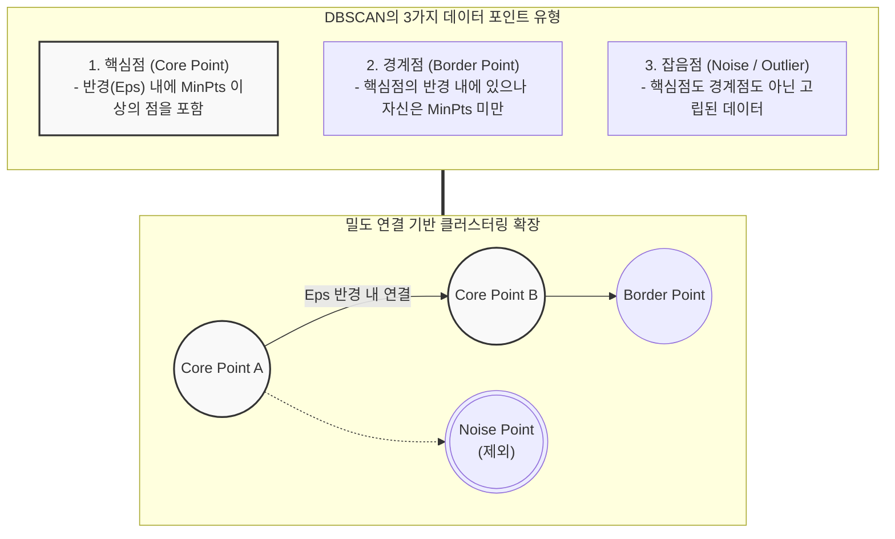

# DBSCAN (Density-Based Spatial Clustering of Applications with Noise)

---

## I. 임의의 형태와 노이즈 처리가 가능한 밀도 기반 군집화, DBSCAN의 개요

* **가. DBSCAN의 정의**: 데이터가 밀집되어 있는 정도(Density)를 기준으로 공간상에 퍼져 있는 데이터 포인트를 그룹화하고, 밀도가 낮은 지역의 데이터는 [[이상치]](Noise/Outlier)로 분류하는 [[비지도 학습]] 기반의 클러스터링 [[알고리즘]]
* **나. DBSCAN의 필요성 및 특징**:
* **필요성**: K-Means 등 거리 기반 알고리즘의 한계인 '원형 형태의 군집만 형성 가능', '사전에 군집 수(k)를 지정해야 함'이라는 제약 극복 필요
* **특징**:
* **임의의 형태(Arbitrary Shape) 군집 탐지**: 달팽이 모양, 고리 모양 등 비선형적이고 복잡한 형태의 군집도 완벽하게 분리 가능
* **군집 수 사전 지정 불필요**: 데이터의 밀도(반경과 최소 개수)에 따라 알고리즘이 스스로 군집의 개수를 결정
* **강력한 노이즈 필터링**: 전체 데이터 중 군집에 속하지 않는 이상치(Noise)를 명확하게 식별하여 제외

---

## II. DBSCAN의 개념도 및 핵심 기술 요소

### 가. DBSCAN의 데이터 포인트 분류 및 군집 확장 개념도

* 알고리즘은 임의의 점에서 시작하여 반경($\epsilon$) 내에 충분한 수(MinPts)의 이웃이 존재하면 핵심점으로 판단하고, 이웃들을 연쇄적으로 연결(Density-connected)하여 하나의 클러스터를 확장함

### 나. DBSCAN의 핵심 기술 및 구성 요소

| 구분 | 요소기술(키워드) | 세부 설명 |
| --- | --- | --- |
| **파라미터** | Eps ($\epsilon$, 이웃 반경) | 데이터 포인트를 중심으로 이웃을 탐색하기 설정한 반경 거리 (Neighborhood Radius) |
| **파라미터** | MinPts (최소 포인트 수) | 특정 데이터의 $\epsilon$ 반경 내에 포함되어야 하는 최소 데이터 개수 (밀도 기준값) |
| **포인트 분류** | Core Point (핵심점) | $\epsilon$ 반경 내에 자신을 포함하여 MinPts 이상의 이웃을 가진 데이터 (군집의 중심 역할) |
| **포인트 분류** | Border Point (경계점) | 핵심점의 $\epsilon$ 반경 내에 속해 있어 군집에 포함되지만, 자기 자신의 반경 내에는 MinPts를 만족하지 못하는 점 |
| **포인트 분류** | Noise (잡음점) | 핵심점도 경계점도 아니며, 어떤 군집에도 속하지 못하고 버려지는 이상치(Outlier) 데이터 |
| **연결성** | Density-Reachable (밀도 도달) | 데이터 $p$에서 시작해 핵심점들을 거쳐 데이터 $q$에 도달할 수 있는 직접/간접적 밀도 관계 |
| **연결성** | Density-Connected (밀도 연결) | 두 데이터 $p$와 $q$가 공통의 핵심점 $o$로부터 밀도 도달이 가능할 때, 두 데이터가 같은 군집에 속함을 정의 |
| **확장 변형** | HDBSCAN | 서로 다른 밀도를 가진 군집을 동시에 탐지할 수 있도록 계층적(Hierarchical) 구조를 결합한 개선된 알고리즘 |

---

## III. K-Means와 DBSCAN 비교 및 향후 활용 동향

### 가. 대표적 군집화 알고리즘 비교 (K-Means vs DBSCAN)

| 비교 항목 | K-Means (분할적 군집화) | DBSCAN (밀도 기반 군집화) |
| --- | --- | --- |
| **군집 형태** | 구형(Convex), 원형 형태의 균등한 크기 | **임의의 복잡한 형태 (Arbitrary Shape)** |
| **파라미터 설정** | 군집의 개수 ($k$)를 사용자가 사전 지정 | 이웃 반경($\epsilon$)과 최소 개수(MinPts) 설정 |
| **노이즈 처리** | 모든 데이터를 억지로 특정 군집에 할당 | **노이즈(이상치)를 명확히 분리하여 배제** |
| **데이터 규모** | 대용량 데이터 처리에 속도가 빠름 | 공간 인덱스(R-Tree 등) 미사용 시 대용량 데이터에서 연산 속도 저하 |
| **주요 한계** | 이상치(Outlier)에 매우 민감함, 비선형 군집 불가 | 밀도가 불균일한 데이터셋에서는 군집화 성능 저하 |

### 나. 향후 전망 및 활용 동향

* **이상치 탐지([[Anomaly(이상현상)|Anomaly]] Detection) 및 보안 분야 활용 확대**: 금융 사기 탐지(Fraud Detection), 네트워크 침입 탐지(IDS), 서버 로그 이상 행위 분석 등 정상 패턴에서 벗어난 노이즈(Noise)를 찾아내는 보안 및 모니터링 영역에서 핵심 알고리즘으로 활용 중임
* **HDBSCAN 및 고차원 데이터 최적화**: 밀도가 다른 데이터가 섞여 있는 현실 세계의 한계를 극복하기 위해 다중 밀도를 자동 처리하는 **HDBSCAN**과, 차원의 저주를 극복하기 위한 [[차원 축소]]([[PCA(Principal Component Analysis)|PCA]]/UMAP) 결합형 밀도 군집화 기법이 활발히 적용되고 있음

---

### 🔗 연관 토픽

- **소속 도메인**: [[00_인공지능_MOC|🤖 인공지능]]
- **세부 분류**: `1. 수학 · 통계학 & 데이터 전처리`
- **핵심 연관 토픽**:
  - [[비지도 학습]]
  - [[이상치]]
  - [[PCA(Principal Component Analysis)]]
  - [[차원 축소|차원 축소(Dimensionality Reduction)]]
  - [[K-평균 알고리즘]]
