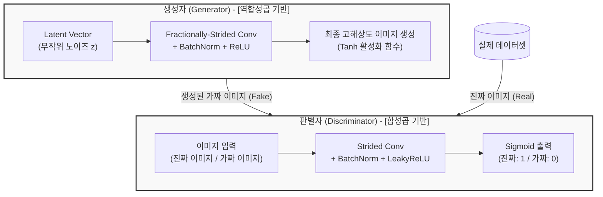

# DCGAN (Deep Convolutional Generative Adversarial Network)

---

## I. 합성곱 신경망을 결합한 안정적 이미지 생성 모델, DCGAN의 개요

* **가. DCGAN의 정의**: 기존 GAN([[GAN (Generative Adversarial Network)|Generative Adversarial Network]])의 학습 불안정성 문제를 해결하기 위해, 생성자와 판별자 네트워크에 **합성곱 신경망([[CNN]])** 구조를 체계적으로 도입하여 고품질 이미지 생성 능력을 극대화한 심층 합성곱 생성적 적대 신경망
* **나. DCGAN의 등장배경 및 특징**:
* **등장배경**: 초기 GAN은 다층 퍼셉트론(MLP) 기반으로 구성되어 학습이 매우 불안정하고(모드붕괴 현상 등), 의미 있는 이미지 공간(Latent Space)을 학습하기 어려웠음
* **특징**:
* **공간적 특징 보존**: CNN 구조를 활용하여 이미지의 픽셀 간 공간적 상관관계(Spatial Correlation)를 효과적으로 학습
* **풀링 계층 제거**: 정보 손실을 막기 위해 풀링(Pooling) 계층 대신 스트라이드 합성곱(Strided Convolution) 활용
* **학습 안정화 기법 도입**: [[배치 정규화]](Batch Normalization)와 활성화 함수 조율을 통해 판별자와 생성자의 균형 확보

---

## II. DCGAN의 아키텍처 및 핵심 기술 요소

### 가. DCGAN의 생성자-판별자 구조 및 동작 개념도

* 생성자는 무작위 노이즈 벡터를 받아 역합성곱(Deconvolution) 연산으로 이미지를 키워 나가고, 판별자는 일반 합성곱 연산을 통해 입력된 이미지가 실제 데이터인지 생성된 가짜인지 판별함

### 나. DCGAN의 핵심 기술 및 구성 요소

| 구분 | 요소기술(키워드) | 세부 설명 |
| --- | --- | --- |
| **아키텍처 규칙** | 풀링(Pooling) 대체 | 정보 손실을 방지하기 위해 판별자에는 **스트라이드 합성곱(Strided Convolution)**, 생성자에는 **역합성곱(Fractionally-strided Conv)** 적용 |
| **정규화 기법** | 배치 정규화 (Batch Norm) | 학습 불안정을 막기 위해 생성자의 출력층과 판별자의 입력층을 제외한 모든 계층에 배치 정규화 적용 |
| **아키텍처 규칙** | 완전 연결 계층 제거 | 네트워크의 깊이를 깊게 유지하면서도 파라미터 수를 줄이기 위해 최상위 합성곱 이후의 Fully Connected Layer 제거 |
| **활성화 함수** | LeakyReLU (판별자) | 판별자 전 계층에 기울기 소실(Gradient Vanishing)을 방지하기 위해 음수 영역에서 약간의 기울기를 갖는 LeakyReLU 사용 |
| **활성화 함수** | ReLU / Tanh (생성자) | 생성자의 은닉층에는 수렴 속도가 빠른 ReLU를 사용하고, 출력층에는 화소 범위(-1 ~ 1) 조절을 위해 Tanh 사용 |
| **학습 제어** | 모드 붕괴(Mode Collapse) 방지 | 다양한 형태의 이미지를 생성하지 못하고 특정 이미지만 반복 생성하는 현상을 구조적 제약을 통해 완화 |

---

## III. 전통적 GAN과 DCGAN 비교 및 최신 생성 AI 동향

### 가. 기본 GAN과 DCGAN의 기술적 특성 비교

| 비교 항목 | 기본 GAN (Standard GAN) | DCGAN (Deep Convolutional GAN) |
| --- | --- | --- |
| **신경망 구조** | 다층 퍼셉트론 (MLP - Fully Connected) | **합성곱 신경망 (CNN)** 기반 아키텍처 |
| **이미지 품질** | 저해상도 및 픽셀이 깨지는 현상 빈번 | 공간 특징 유지를 통해 **선명하고 고품질의 이미지 생성** |
| **학습 안정성** | 매우 불안정 (쉽게 발산하거나 모드 붕괴 발생) | 배치 정규화 및 CNN 제약을 통해 **안정적인 학습 수렴** |
| **잠재 공간(Latent)** | 의미론적 조작(Vector Arithmetic)이 어려움 | 잠재 벡터의 연산(예: 안경 쓴 얼굴 - 안경 없는 얼굴)을 통한 특징 조작 가능 |

### 나. 향후 전망 및 기술 동향

* **고도화된 생성 모델로의 진화 (StyleGAN 및 디퓨전 모델)**: DCGAN은 컨볼루션 기반 생성 모델의 초석을 다졌으나, 이후 이미지의 세부 스타일을 정교하게 제어하는 **StyleGAN** 시리즈를 거쳐, 현재는 확률적 노이즈 제거 과정을 통해 비약적으로 높은 화질과 다양성을 제공하는 디퓨전 모델(Diffusion Models, 예: Stable Diffusion, Midjourney)이 생성 AI 시장의 주류 표준으로 완전히 대체함

---

### 🔗 연관 토픽

- **소속 도메인**: [[00_인공지능_MOC|🤖 인공지능]]
- **세부 분류**: `3. 딥러닝 핵심 아키텍처 & 신경망`
- **핵심 연관 토픽**:
  - [[GAN (Generative Adversarial Network)]]
  - [[인공지능]]
  - [[CNN|CNN (Convolutional Neural Network)]]
  - [[배치 정규화]]
  - [[딥러닝]]
