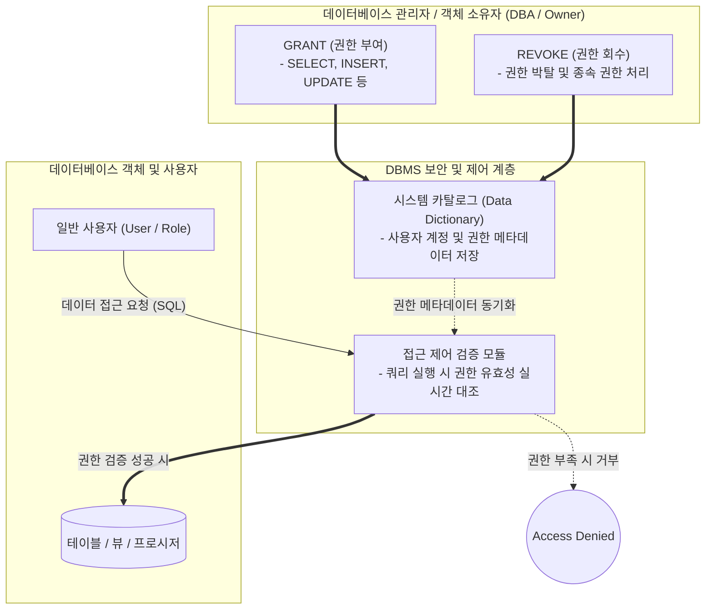

# DCL (Data Control Language)

---

## I. 데이터베이스 보안과 접근 제어를 위한 명령어, DCL의 개요

* **가. DCL(Data Control Language, 데이터 제어어)의 정의**: [[데이터베이스]] 관리자(DBA)나 객체 소유자가 특정 사용자나 그룹에게 데이터베이스 객체(테이블, 뷰 등)에 대한 접근 권한을 부여(Grant)하거나 회수(Revoke)하기 위해 사용하는 [[SQL(Structured Query Language)|SQL]] 명령어 집합
* **나. DCL의 필요성 및 특징**:
* **필요성**: 다중 사용자 환경에서 무단 데이터 접근 방지, 최소 권한의 원칙(Principle of Least Privilege) 실현, 시스템 보안 및 데이터 [[무결성]] 유지
* **특징**:
* **보안 관리의 핵심**: 사용자 계정 생성, 권한 부여 및 회수를 통해 데이터베이스 전반의 접근 통제 수행
* **자동 커밋(Auto-Commit)**: 대부분의 [[DBMS]]에서 DCL 명령어 실행 즉시 트랜잭션이 암묵적으로 커밋되어 데이터베이스에 즉시 반영됨
* **권한 상속 및 전파 제어**: `GRANT OPTION` 등을 통해 권한을 타인에게 재부여할 수 있는 권한 관리 지원

---

## II. DCL의 아키텍처 개념도 및 핵심 명령어 체계

### 가. DCL의 권한 제어 및 처리 아키텍처 개념도

* DBA가 DCL 명령어를 통해 시스템 카탈로그의 권한 정보를 갱신하면, DBMS는 사용자가 SQL을 요청할 때마다 접근 제어 검증 모듈을 통해 권한 유효성을 실시간으로 확인하고 통제함

### 나. DCL의 핵심 명령어 및 관련 제어 요소

| 분류 | 명령어 / 키워드 | 세부 설명 |
| --- | --- | --- |
| **권한 부여** | GRANT | 특정 사용자에게 데이터베이스 객체에 대한 특정 작업(SELECT, INSERT, UPDATE, DELETE 등) 수행 권한을 부여 |
| **권한 부여** | WITH GRANT OPTION | 사용자가 부여받은 권한을 **다른 사용자에게 다시 부여할 수 있는 권한**을 함께 제공하는 옵션 |
| **권한 회수** | REVOKE | 이미 부여된 사용자나 그룹의 특정 데이터베이스 접근 권한을 박탈하거나 회수하는 명령어 |
| **권한 범위** | 시스템 권한 (System Priv.) | 데이터베이스 생성, 사용자 관리, 테이블스페이스 생성 등 DBA 관점의 시스템 전체 제어 권한 (예: `CREATE USER`, `DROP TABLE`) |
| **권한 범위** | 객체 권한 (Object Priv.) | 특정 테이블, 뷰, 시퀀스 등 개별 객체 내부의 조작 권한 (예: `SELECT ON table_name TO user`) |
| **그룹 관리** | ROLE (역할) | 여러 권한들을 하나로 묶어 그룹화한 것으로, 다수의 사용자에게 일괄적으로 권한을 부여할 때 사용 |

---

## III. SQL 명령어 분류 비교 및 최신 보안 동향

### 가. SQL 명령어의 4대 분류 체계 비교

| 분류 | 명칭 (Full Name) | 주요 명령어 | 역할 및 주 사용 목적 |
| --- | --- | --- | --- |
| **[[DDL]]** | Data Definition Language | `CREATE`, `ALTER`, `DROP`, `TRUNCATE` | 데이터베이스 구조([[스키마]])를 정의하고 관리 |
| **[[DML]]** | Data Manipulation Language | `SELECT`, `INSERT`, `UPDATE`, `DELETE` | 테이블에 저장된 실제 데이터를 조회 및 조작 |
| **DCL** | **Data Control Language** | **`GRANT`, `REVOKE**` | **데이터 접근 권한을 제어하고 보안 관리** |
| **TCL** | Transaction Control Lang. | `COMMIT`, `ROLLBACK`, `SAVEPOINT` | 트랜잭션의 영구 반영 및 변경 사항 취소 제어 |

### 나. 향후 전망 및 보안 동향

* **역할 기반([[RBAC]]) 및 속성 기반(ABAC) 접근 제어의 고도화**: 전통적인 개별 사용자 단위의 DCL(`GRANT`/`REVOKE`) 관리 방식에서 벗어나, 조직의 직무 체계와 연동된 **Role(역할)** 기반 관리 및 클라우드 환경의 동적 속성(IP, 시간, 기기 상태)을 결합한 세밀한(Fine-grained) 접근 제어로 진화 중임
* **외부 [[IAM]](Identity and Access Management)과의 통합**: 현대 클라우드 데이터베이스 환경에서는 순수 SQL 기반의 DCL뿐만 아니라, 전사 통합 인증 시스템(OAuth, SAML, LDAP) 및 클라우드 IAM 정책과 연동하여 데이터베이스 접근 권한을 중앙집중식으로 자동 프로비저닝하고 감사(Audit)하는 아키텍처가 표준으로 자리 잡음

---

### 🔗 연관 토픽

- **소속 도메인**: [[00_데이터베이스_MOC|🗄️ 데이터베이스]]
- **세부 분류**: `4. 물리 저장 구조 & 인덱스 최적화`
- **핵심 연관 토픽**:
  - [[SQL(Structured Query Language)]]
  - [[DML]]
  - [[무결성]]
  - [[데이터베이스]]
  - [[DBMS]]
