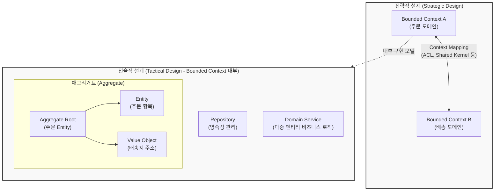

# DDD (Domain-Driven Design)

---

## I. 복잡한 비즈니스 도메인 중심의 소프트웨어 설계 방법론, DDD의 개요

* **가. DDD(Domain-Driven Design, 도메인 주도 설계)의 정의**: 비즈니스 도메인(업무 영역)의 복잡성을 해결하기 위해 개발자와 도메인 전문가가 공통의 언어를 사용하고, 비즈니스 규칙과 모델을 소프트웨어 구조에 직접적으로 반영하여 설계 및 개발하는 방법론
* **나. DDD의 필요성 및 특징**:
* **필요성**: 전통적인 데이터 중심(Data-centric) 설계의 한계 극복, 비즈니스 요구사항 변화에 유연하게 대응하는 [[응집도]] 높은 아키텍처 구축 필요
* **특징**:
* **유비쿼터스 언어(Ubiquitous Language)**: 개발자와 도메인 전문가가 소스코드와 문서 전반에서 동일한 명칭과 용어를 사용하여 소통 단절(Gap) 해소
* **전략적 설계와 전술적 설계의 이원화**: 거대한 도메인을 나누는 경계 설정(전략적)과 객체 지향적으로 모델을 구현하는 기법(전술적)을 유기적으로 결합
* **[[MSA (Micro Service Architecture)|MSA]](마이크로서비스)의 근간**: 분산 환경에서 서비스를 독립된 도메인 단위로 나누고 경계를 정의하는 핵심 지침으로 활용

---

## II. DDD의 아키텍처 개념도 및 핵심 구성 요소

### 가. DDD의 전략적/전술적 설계 아키텍처 개념도

* 전체 비즈니스는 **바운디드 컨텍스트(Bounded Context)** 단위로 분리되어 상호 작용하며(전략적), 각 컨텍스트 내부의 모델은 일관성을 보장하는 애그리거트(Aggregate)와 객체 지향 패턴으로 구현됨(전술적)

### 나. DDD의 핵심 기술 및 구성 요소

| 구분 | 요소기술(키워드) | 세부 설명 |
| --- | --- | --- |
| **소통 체계** | Ubiquitous Language | 도메인 전문가와 개발자가 기획, 코드, 대화에서 모두 동일하게 사용하는 공통의 비즈니스 언어 체계 |
| **전략 설계** | Bounded Context (바운디드 컨텍스트) | 용어의 의미가 일관되게 유지되는 물리적/논리적 경계 영역으로, 마이크로서비스 분리의 기준점 |
| **전략 설계** | Context Mapping (컨텍스트 매핑) | 서로 다른 바운디드 컨텍스트 간의 관계(상하위, 파트너십, 항부제 계층 등)를 정의하고 연동하는 방식 |
| **전술 설계** | Aggregate & Root (애그리거트) | 연관된 객체들의 묶음으로, 데이터 변경의 단위가 되며 외부에서는 반드시 **뿌리(Root Entity)**를 통해서만 접근 허용 |
| **전술 설계** | Entity vs Value Object | 고유한 식별자(ID)를 가지며 생명주기를 추적하는 객체(Entity)와, 속성 값 자체가 중요하여 불변(Immutable)으로 관리되는 객체(VO) |
| **전술 설계** | Domain Event (도메인 이벤트) | 비즈니스적으로 의미 있는 중요한 사건(예: `OrderPlaced`)을 정의하고, 이를 비동기로 발행하여 시스템 간 [[결합도]] 완화 |
| **전술 설계** | Repository / Service | 영속성 계층에서 애그리거트 단위로 객체를 조회/저장하는 저장소(Repository) 및 특정 엔티티에 속하지 않는 도메인 로직 처리(Service) |

---

## III. 전통적 설계와의 비교 및 최신 아키텍처 연계 동향

### 가. 전통적 데이터 중심 설계(Data-Centric)와 DDD의 비교

| 비교 항목 | 전통적 데이터 중심 설계 (CRUD 중심) | 도메인 주도 설계 (DDD) |
| --- | --- | --- |
| **설계의 중심** | [[데이터베이스]] 테이블 구조 및 관계 (ERD) | 현실 세계의 **비즈니스 도메인 및 행위(Behavior)** |
| **비즈니스 로직** | 주로 DB [[프로시저]], 서비스 계층의 거대한 스크립트 | 도메인 모델 내부의 엔티티와 객체 메서드로 [[캡슐화]] |
| **유지보수성** | 요구사항 변경 시 데이터베이스와 연계된 전파 영향도가 매우 큼 | 도메인 경계(Bounded Context) 내에 격리되어 **변경에 대한 영향도가 낮음** |
| **소통 및 협업** | 개발자와 현업(비즈니스 전문가) 간의 용어 괴리 심함 | **유비쿼터스 언어**를 통해 현업과 개발자가 동일한 모델 공유 |

### 나. 향후 전망 및 기술 동향

* **마이크로서비스 아키텍처(MSA) 설계의 표준 정립**: 서비스를 무작위로 쪼개는 것이 아니라, DDD의 **바운디드 컨텍스트** 개념을 활용하여 도메인 경계에 맞게 마이크로서비스를 설계하고 도메인 간 결합도를 낮추는 아키텍처 패턴으로 필수적으로 채택됨
* **이벤트 드븐 아키텍처([[EDA]]) 및 CQRS와의 융합**: 도메인 간의 강한 결합을 피하기 위해 도메인 이벤트(Domain Event)를 발행하고 메시지 큐(Kafka 등)를 통해 비동기로 통신하며, 읽기와 쓰기의 모델을 분리하는 **CQRS(Command Query Responsibility Segregation)** 패턴과 결합하여 대규모 트래픽 처리 구조로 고도화되고 있음

---

### 🔗 연관 토픽

- **소속 도메인**: [[00_소프트웨어공학_MOC|🏗️ 소프트웨어공학]]
- **세부 분류**: `4. 아키텍처 스타일 & 객체지향 설계 원리`
- **핵심 연관 토픽**:
  - [[결합도]]
  - [[응집도]]
  - [[MSA (Micro Service Architecture)]]
  - [[캡슐화|캡슐화 (encapsulation)]]
  - [[EDA|EDA (Event-Driven Architecture)]]
