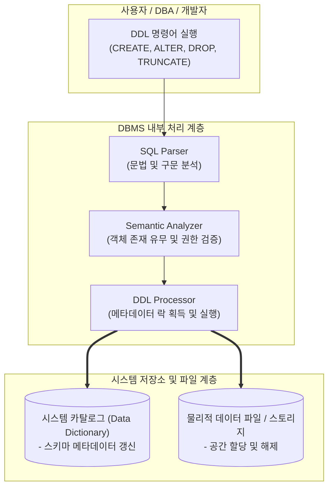

# DDL (Data Definition Language)

---

## I. 데이터베이스 구조를 정의하는 관리 언어, DDL의 개요

* **가. DDL(Data Definition Language, 데이터 정의어)의 정의**: 데이터베이스의 구조([[스키마]]), 테이블, 뷰, 인덱스 등 [[데이터베이스]] 객체를 생성(Create), 수정(Alter), 삭제(Drop)하거나 이름을 변경하는 등 구조적 메타데이터를 관리하는 [[SQL(Structured Query Language)|SQL]] 명령어 집합
* **나. DDL의 필요성 및 특징**:
* **필요성**: 데이터를 저장하기 위한 그릇(Schema)의 체계적 설계 및 관리, 데이터 [[무결성]] 제약 조건 부여, 시스템 변경에 따른 유연한 구조 재편
* **특징**:
* **[[시스템 카탈로그]] 반영**: DDL 실행 결과는 데이터가 아닌 메타데이터(Metadata)로 시스템 카탈로그(Data Dictionary)에 즉시 기록됨
* **암묵적 커밋(Implicit Commit)**: 대부분의 RDBMS에서 DDL 명령어 실행 전후로 자동 커밋(Commit)이 발생하여 이전 트랜잭션을 강제로 확정하므로 **Rollback이 불가**함
* **배타적 락(Exclusive Lock)**: 객체 구조를 변경하는 동안 타 트랜잭션의 접근을 제어하기 위해 메타데이터 락이 발생함

---

## II. DDL의 아키텍처 개념도 및 핵심 명령어 체계

### 가. DDL의 처리 아키텍처 및 동작 개념도

* 사용자가 DDL 명령어를 입력하면 파서와 의미 분석기를 거쳐 검증된 후, DDL 프로세서가 시스템 카탈로그의 메타데이터를 갱신하고 스토리지의 물리적 구조를 재조정함

### 나. DDL의 핵심 명령어 및 구성 요소

| 분류 | 명령어 / 키워드 | 세부 설명 |
| --- | --- | --- |
| **생성** | CREATE | 데이터베이스, 테이블, 뷰, 인덱스, [[프로시저]] 등 새로운 데이터베이스 객체를 생성 |
| **수정** | ALTER | 이미 존재하는 객체의 구조를 변경 (예: 테이블에 컬럼 추가, 데이터 타입 변경, 제약 조건 추가 등) |
| **삭제** | DROP | 객체 자체의 구조와 내부에 저장된 모든 데이터를 완전히 삭제 (복구 및 롤백 불가) |
| **초기화** | TRUNCATE | 테이블의 구조는 남겨둔 채 내부의 **모든 데이터를 고속으로 삭제**하고 저장 공간을 초기화 (DELETE보다 속도가 빠름) |
| **이름 변경** | RENAME | 생성된 테이블이나 컬럼 등의 객체 이름을 새로운 이름으로 변경 |
| **제약 조건** | Constraint | 데이터의 무결성을 보장하기 위해 `PRIMARY KEY`, `FOREIGN KEY`, `UNIQUE`, `CHECK`, `NOT NULL` 등 정의 |

---

## III. DDL과 DML의 비교 및 최신 스키마 관리 동향

### 가. DDL과 DML의 핵심 특성 비교

| 비교 항목 | DDL (Data Definition Language) | [[DML]] (Data Manipulation Language) |
| --- | --- | --- |
| **관리 대상** | **데이터베이스 구조 (Schema / Metadata)** | **테이블에 저장된 실제 데이터 (Rows)** |
| **주요 명령어** | `CREATE`, `ALTER`, `DROP`, `TRUNCATE` | `SELECT`, `INSERT`, `UPDATE`, `DELETE` |
| **[[트랜잭션]] 제어** | 실행 시 **자동 커밋 (Implicit Commit)** 발생 | 트랜잭션 범위 내에서 동작, `Rollback` 가능 |
| **복구 가능 여부** | 불가 (실행 즉시 메타데이터에 영구 반영) | 가능 (`ROLLBACK`을 통해 이전 상태로 복원) |
| **락(Lock) 범위** | 메타데이터 락 (Exclusive Lock 중심) | 데이터 레코드 또는 테이블 락 (Row/Table Lock) |

### 나. 향후 전망 및 최신 관리 동향

* **코드형 인프라(IaC) 및 DB [[형상 관리]] 도구의 보편화**: 과거에는 DBA가 수동으로 DDL 스크립트를 운영계에 반영했으나, 최근에는 **Flyway, Liquibase** 등 데이터베이스 마이그레이션 도구를 활용하여 DDL 변경 이력을 코드(Git)로 관리하고 CI/CD 파이프라인을 통해 안전하게 배포하는 형상 관리 체계가 표준으로 자리 잡음
* **무중단 스키마 변경(Online Schema Change) 기술**: 대규모 트래픽을 처리하는 서비스에서 `ALTER TABLE` 수행 시 발생하는 테이블 락으로 인한 서비스 장애를 막기 위해, 백그라운드에서 임시 테이블을 생성하고 데이터를 복사한 뒤 스위칭하는 무중단 DDL 수행 기법이 필수적으로 적용되고 있음

---

### 🔗 연관 토픽

- **소속 도메인**: [[00_데이터베이스_MOC|🗄️ 데이터베이스]]
- **세부 분류**: `1. 데이터 모델링 & 관계형 DB 설계`
- **핵심 연관 토픽**:
  - [[시스템 카탈로그|시스템 카탈로그 (System Catalog)]]
  - [[무결성]]
  - [[DML]]
  - [[SQL(Structured Query Language)]]
  - [[데이터베이스]]
