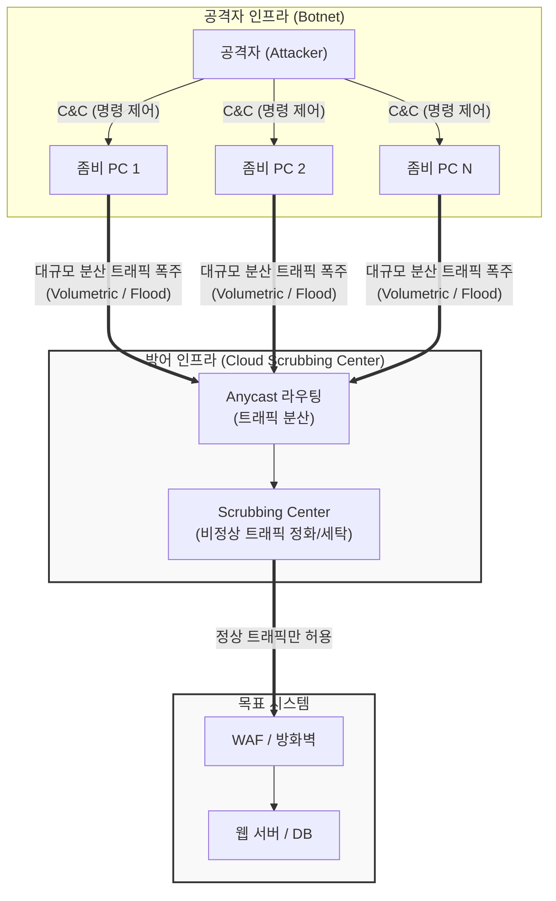

# DDoS (Distributed Denial of Service)

---

## I. 다수의 좀비 PC를 활용한 가용성 파괴 공격, DDoS의 개요

* **가. DDoS(Distributed [[DoS (Denial of Service)|Denial of Service]], 분산 서비스 거부)의 정의**: 공격자가 악성코드로 감염시킨 다수의 분산된 시스템(봇넷)을 원격에서 제어하여, 특정 웹 서버나 네트워크 인프라에 대량의 트래픽이나 요청을 동시에 집중시킴으로써 정상적인 서비스 제공을 불가능하게 만드는 사이버 공격 기법
* **나. DDoS의 필요성(대응 배경) 및 특징**:
* **필요성**: 단일 소스 기반의 단순 DoS 공격을 넘어선 수만~수백만 대의 분산된 공격 원천 차단, 대규모 트래픽 유입 시 서비스 [[HA(High Availability)|가용성]](Availability) 보장 필요
* **특징**:
* **분산 및 익명성**: 전 세계에 퍼진 좀비 PC(Botnet)를 활용하므로 공격자 추적과 최초 출발지 차단이 극도로 어려움
* **자원 고갈 유발**: 네트워크 대역폭, 서버 [[CPU]]/메모리, [[세션]] 테이블 등의 시스템 자원을 고갈시켜 마비 유도
* **다층적 공격 벡터**: [[네트워크 계층]](L3/4)부터 애플리케이션 계층(L7)까지 다양한 계층을 타겟으로 진화

---

## II. DDoS의 아키텍처 개념도 및 핵심 기술 요소

### 가. DDoS 공격 인프라 및 방어 체계 개념도

* 공격자는 C&C 서버를 통해 분산된 좀비 PC들을 조종하여 타겟에 대규모 공격을 감행하며, 방어 측은 클라우드 기반의 스크러빙 센터(Scrubbing Center)를 통해 비정상 트래픽을 걸러내고 정상 트래픽만 서버로 유도함

### 나. DDoS의 핵심 공격 유형 및 기술 요소

| 분류 | 공격 기법 (Keyword) | 세부 설명 |
| --- | --- | --- |
| **대역폭 고갈** | Volumetric Attacks | UDP Flood, [[ICMP]] Flood 등 네트워크 대역폭의 한계를 초과하는 거대한 트래픽을 발생시켜 회선 마비 유도 |
| **[[프로토콜]] 공격** | SYN Flood | [[TCP]] 3-Way Handshake 과정을 악용하여 허위의 ACK 응답을 대기하게 만듦으로써 서버의 연결 테이블(Connection Pool) 고갈 |
| **프로토콜 공격** | Ping of Death / Land | 규격에 어긋난 대형 패킷을 전송하거나 출발지/목적지 IP를 동일하게 조작하여 시스템 패닉 및 오작동 유발 |
| **애플리케이션** | HTTP Get/POST Flood | 정상적인 웹 요청처럼 위장하여 특정 고부하 페이지(검색, 대용량 다운로드 등)를 무한 반복 호출 |
| **애플리케이션** | Slowloris (Slow HTTP) | HTTP 헤더를 매우 느린 속도로 분할 전송하여, 서버의 동시 연결 제한(Connection Limit)을 장기간 점유 |
| **통제 요소** | Botnet / C&C Server | 악성코드로 감염된 단말들의 집합(봇넷)과 이를 원격에서 조종하기 위한 명령 제어(Command & Control) 서버 |
| **방어 기술** | Scrubbing Center | 의심스러운 트래픽을 우회시켜 패턴 분석 및 정화 과정을 거친 후, 깨끗한 트래픽만 원본 서버로 전달하는 전문 보안 시설 |

---

## III. 네트워크 계층 vs 애플리케이션 계층 DDoS 비교 및 방어 동향

### 가. 네트워크/프로토콜 공격(L3/4)과 애플리케이션 공격(L7) 비교

| 비교 항목 | 네트워크/프로토콜 공격 (L3 / L4 DDoS) | 애플리케이션 공격 (L7 DDoS) |
| --- | --- | --- |
| **타겟 계층** | OSI 3계층(네트워크) 및 4계층(전송) | OSI 7계층(애플리케이션 - 웹 서버/DB) |
| **공격 방식** | 대량의 패킷을 보내 회선 대역폭 또는 네트워크 장비 자원 고갈 | 정상적인 웹 요청 형태로 위장하여 서버의 **[[프로세스]] 및 DB 자원 고갈** |
| **트래픽 특징** | 트래픽의 용량(Gbps, Mpps)이 매우 큼 | 트래픽 용량은 적으나, **구분이 어려워 탐지가 까다로움** |
| **대표 사례** | SYN Flood, UDP Flood, ICMP Flood | HTTP Get/POST Flood, Slowloris, RUDY |
| **대응 방법** | [[ISP (Information Strategy Plan)|ISP]] 연동 대역폭 확장, 패킷 필터링, Anti-DDoS 장비 | 웹 [[방화벽]](WAF), 챌린지 검증(CAPTCHA), 행위 기반 탐지 |

### 나. 향후 전망 및 방어 동향

* **클라우드 기반 스크러빙 서비스([[SecaaS (Security as a Service)|SecaaS]])의 보편화**: 온프레미스 장비만으로는 테라비트(Tbps) 급의 초대형 대역폭 공격에 대응하기 어려워짐에 따라, 클라우드 가상 라우팅(Anycast)을 활용해 트래픽을 분산하고 클라우드 단에서 원천 차단하는 **클라우드 Anti-DDoS 서비스**가 필수 표준으로 자리 잡음
* **AI 머신러닝 기반의 실시간 행위 분석 탐지**: 시그니처 기반 탐지를 우회하는 지능형 L7 공격에 대응하기 위해, 정상 사용자와 봇(Bot)의 미세한 마우스 움직임, 요청 패턴, 세션 유지 행위를 AI가 실시간 학습하여 오탐 없이 즉각 차단하는 지능형 방어 체계로 고도화되는 추세임

---

### 🔗 연관 토픽

- **소속 도메인**: [[00_보안_MOC|🛡️ 보안]]
- **세부 분류**: `1. 정보보안 원칙 & 거버넌스 · 인증`
- **핵심 연관 토픽**:
  - [[DoS (Denial of Service)]]
  - [[ICMP]]
  - [[SecaaS (Security as a Service)]]
  - [[기밀성]]
  - [[DRDOS]]
