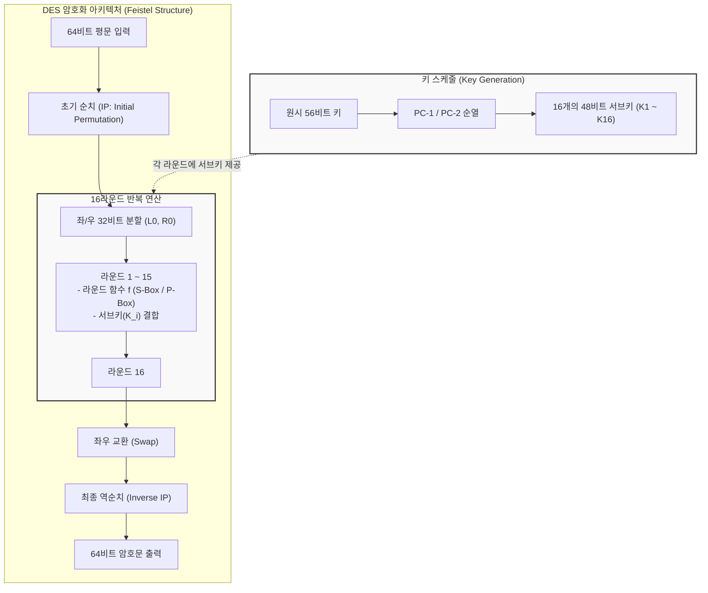

# DES (Data Encryption Standard)

---

## I. 대칭키 암호화의 역사적 표준, DES의 개요

* **가. DES(Data Encryption Standard)의 정의**: 1970년대 미국 NBS(현 NIST)가 IBM이 개발한 Lucifer 알고리즘을 기반으로 제정한 **블록 [[대칭키 암호화]] 표준**으로, 64비트 평문 블록을 56비트의 비밀키를 사용하여 16라운드에 걸쳐 암호화하는 대칭 [[암호 알고리즘]]
* **나. DES의 필요성 및 특징**:
* **필요성**: 상업 및 금융 거래 데이터의 [[기밀성]] 보장을 위한 전 세계적인 [[암호화]] 표준 규격 마련, 암호학의 현대화 및 대칭키 [[알고리즘]] 연구 촉진
* **특징**:
* **페이스텔 구조(Feistel Structure)**: 암호화와 복호화 과정이 거의 동일한 구조를 가지도록 설계되어 구현이 용이함
* **대칭키 암호**: 암호화와 복호화에 동일한 키를 사용하는 대칭키(Secret Key) 방식 기반
* **보안성의 한계**: 키 길이가 56비트로 짧아 현대의 고성능 컴퓨팅 환경에서는 무차별 대입 공격(Brute-Force Attack)에 취약하여 현재는 폐기됨

---

## II. DES의 아키텍처 및 핵심 기술 요소

### 가. DES의 페이스텔 구조 및 16라운드 암호화 개념도

* DES는 64비트 평문을 좌우로 나누어 16라운드 동안 치환과 전치(Feistel 함수)를 반복하며, 매 라운드마다 56비트 키에서 생성된 48비트 서브키를 결합하여 암호문을 생성함

### 나. DES의 핵심 기술 및 구성 요소

| 구분 | 요소기술(키워드) | 세부 설명 |
| --- | --- | --- |
| **블록 규격** | 64비트 블록 크기 | 한 번에 처리하는 데이터의 단위가 64비트(8바이트) 단위로 고정됨 |
| **키 규격** | 56비트 비밀키 | 전체 64비트 키 중 8비트는 오류 검출용 패리티 비트로 사용되어 실질적인 암호화 키 길이는 56비트임 |
| **구조 설계** | Feistel 구조 | 블록을 좌우로 나누어 한쪽은 연산에 사용하고 다른쪽은 그대로 넘기는 방식을 반복하여 암/복호화 로직을 대칭화 |
| **핵심 연산** | S-Box (치환 상자) | 비선형성을 제공하여 암호문의 안전성을 높이는 핵심 요소로, 6비트 입력을 받아 4비트 출력으로 변환 (총 8개 존재) |
| **핵심 연산** | P-Box (전치 상자) | 비트들의 위치를 물리적으로 재배치하여 확산(Diffusion) 효과를 극대화 |
| **키 생성** | Key Schedule | 56비트 마스터 키로부터 좌측 시프트(Left Shift)와 순열 연산을 통해 16개의 48비트 서브키를 생성 |

---

## III. DES의 취약점 극복 및 현대 암호화 표준 동향

### 가. DES와 후속 표준(3DES, AES) 비교

| 비교 항목 | DES (Data Encryption Std.) | 3DES (Triple DES) | [[AES]] (Advanced Encryption Std.) |
| :--- | :--- | :--- |
| **키 길이** | **56비트** (매우 취약) | 112비트 또는 168비트 | **128비트, 192비트, 256비트** |
| **블록 크기**| 64비트 | 64비트 | **128비트** |
| **구조 방식**| 페이스텔 구조 (16라운드) | DES를 3번 반복 적용 (Encrypt-Decrypt-Encrypt) | **SPN 구조 (Substitution-Permutation Network)** |
| **보안성** | 크래킹 툴에 의해 실시간 해독 가능 (폐기됨)| DES의 한계를 극복했으나 속도가 매우 느림 | **강력한 암호화 [[무결성]] 보장 (현대 표준)** |
| **적용 시점** | 1977년 (NIST 표준 지정) | 1990년대 대안 표준 | **2001년 ~ 현재 (전 세계 표준)** |

### 나. 향후 전망 및 보안 동향

* **DES 및 3DES의 완전한 퇴출**: 56비트의 짧은 키 길이로 인해 이미 수십 년 전에 무차별 대입 공격에 뚫린 DES에 이어, 이를 3번 반복하던 3DES 역시 보안 취약점과 성능 저하 문제로 인해 미국 NIST 등 주요 기관에서 사용이 전면 금지(Deprecated)됨
* **AES 및 [[양자 암호]] 내성 암호(PQC)로의 전환**: 현재는 대칭키 암호의 표준인 AES(Rijndael)가 전 세계 금융, 통신, 클라우드 인프라의 기본 암호화로 자리 잡았으며, 다가오는 양자 컴퓨팅 시대에 대비해 이를 대체할 격자 기반 등의 **PQC(Post-Quantum Cryptography)** 표준화로 패러다임이 빠르게 전환되고 있음

---

### 🔗 연관 토픽

- **소속 도메인**: [[00_보안_MOC|🛡️ 보안]]
- **세부 분류**: `1. 정보보안 원칙 & 거버넌스 · 인증`
- **핵심 연관 토픽**:
  - [[암호화|암호화 (Encryption)]]
  - [[대칭키 암호화]]
  - [[AES]]
  - [[기밀성]]
  - [[암호 알고리즘]]
