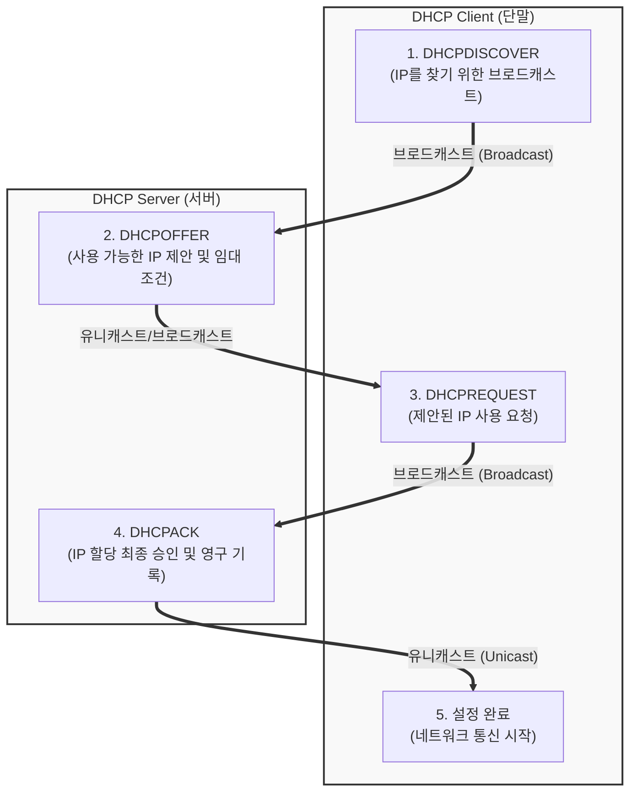

# DHCP (Dynamic Host Configuration Protocol)

---

## I. 네트워크 설정 자동화를 위한 핵심 프로토콜, DHCP의 개요

* **가. DHCP(Dynamic Host Configuration Protocol)의 정의**: IP 네트워크 상의 호스트(단말)에게 IP 주소, 서브넷 마스크, 기본 [[게이트웨이]], [[DNS(Domain Name System)|DNS]] 서버 주소 등의 네트워크 구성 정보를 수동 설정 없이 **동적으로 자동 할당**해 주는 응용 계층(Application Layer) [[프로토콜]]
* **나. DHCP의 필요성 및 특징**:
* **필요성**: 대규모 네트워크 환경에서 관리자가 수십/수백 대의 단말에 IP를 수동 입력하는 번거로움 해소, IP 주소 고갈 방지 및 중복 IP 충돌 원천 차단
* **특징**:
* **임대(Lease) 기반 관리**: IP 주소를 영구히 부여하지 않고 일정 기간(Lease Time) 동안만 대여하며, 반환된 IP는 재활용
* **클라이언트-서버 구조**: UDP 포트 67(서버)과 68(클라이언트)을 사용하여 브로드캐스트 기반의 통신 수행
* **DORA [[프로세스]]**: 탐색, 제안, 요청, 승인의 4단계 표준 절차를 통해 신속하게 네트워크 설정 완료

---

## II. DHCP의 아키텍처 및 핵심 기술 요소

### 가. DHCP의 DORA 프로세스 동작 개념도

* 단말이 네트워크에 처음 접속하면 브로드캐스트를 통해 DHCP 서버를 찾고(`Discover`), 서버가 제안한 IP(`Offer`)에 대해 요청(`Request`)을 보내면, 서버가 최종 승인(`ACK`)하여 IP 할당이 완료됨

### 나. DHCP의 핵심 기술 및 구성 요소

| 구분 | 요소기술(키워드) | 세부 설명 |
| --- | --- | --- |
| **DORA 절차** | DHCPDISCOVER | 클라이언트가 네트워크에 처음 접속했을 때 사용 가능한 DHCP 서버를 찾기 위해 송신하는 브로드캐스트 패킷 |
| **DORA 절차** | DHCPOFFER | 디스커버를 수신한 DHCP 서버가 할당 가능한 IP 주소와 서브넷, 임대 기간 등의 정보를 클라이언트에 제안 |
| **DORA 절차** | DHCPREQUEST | 서버의 제안을 받아들인 클라이언트가 특정 IP 주소를 사용하겠다고 서버와 네트워크에 공식 요청 |
| **DORA 절차** | DHCPACK | 서버가 클라이언트의 요청을 최종 승인하고 IP 주소를 할당하며, 클라이언트는 이때부터 정식 통신 개시 |
| **자원 관리** | Lease Time (임대 기간) | 할당된 IP 주소를 사용할 수 있는 유효 기간으로, 만료 전 갱신(Renewal) 절차를 거치지 않으면 반환됨 |
| **라우팅 제어** | DHCP Relay Agent | [[라우터]] 장비 등에 설정되어, 서로 다른 서브넷(Broadcast Domain) 간에 DHCP 요청을 전달해 주는 중계 에이전트 |
| **통신 규격** | UDP 포트 67 / 68 | 서버는 67번, 클라이언트는 68번 포트를 사용하여 신뢰성보다 속도가 빠른 UDP 기반 통신 수행 |

---

## III. 수동 IP 설정과 DHCP 비교 및 최신 동향

### 가. 수동 IP 설정(Static IP)과 DHCP 비교

| 비교 항목 | 수동 IP 설정 (Static IP) | 동적 IP 할당 (DHCP) |
| --- | --- | --- |
| **설정 방식** | 관리자가 단말마다 직접 IP, 게이트웨이, DNS 수동 입력 | DHCP 서버가 자동으로 네트워크 설정을 단말에 부여 |
| **관리 용이성** | 단말 수가 많을 경우 관리가 매우 어렵고 휴먼 에러 발생 | 중앙 집중식으로 자동 관리되어 [[유지보수]] 용이 |
| **IP 자원 효율** | 사용하지 않는 시간에도 IP가 고정 점유되어 낭비 발생 | 임대 만료 후 미사용 IP를 회수하여 재활용하므로 **효율적** |
| **적용 대상** | 서버, 프린터, 네트워크 장비 등 고정 접근이 필요한 대상 | 일반 사용자 PC, 스마트폰, 노트북 등 모바일/동적 단말 |

### 나. 향후 전망 및 기술 동향

* **IPAM(IP Address Management) 자동화 시스템과의 통합**: 사내 네트워크의 대규모화와 클라우드 전환에 따라, 단순 DHCP 서버 관리를 넘어 IP 주소의 할당 현황, 충돌 여부, 사용 이력을 통합 관리하고 자동 프로비저닝하는 IPAM 솔루션과의 연동이 보편화됨
* **[[클라우드 네이티브]] VPC 및 [[컨테이너]] CNI 연동**: 퍼블릭 클라우드(AWS VPC 등)나 [[쿠버네티스]] 환경에서는 전통적인 DHCP 브로드캐스트 방식 대신, 가상 라우터와 메타데이터 서비스(또는 CNI 플러그인)가 가상 머신과 Pod에 IP 주소를 실시간으로 할당하고 제어하는 구조로 진화하고 있음

---

### 🔗 연관 토픽

- **소속 도메인**: [[00_네트워크_MOC|🌐 네트워크]]
- **세부 분류**: `1. OSI 7계층 & 데이터링크 계층 (L1/L2)`
- **핵심 연관 토픽**:
  - [[게이트웨이]]
  - [[라우터]]
  - [[RARP]]
  - [[IP]]
  - [[DNS(Domain Name System)]]
