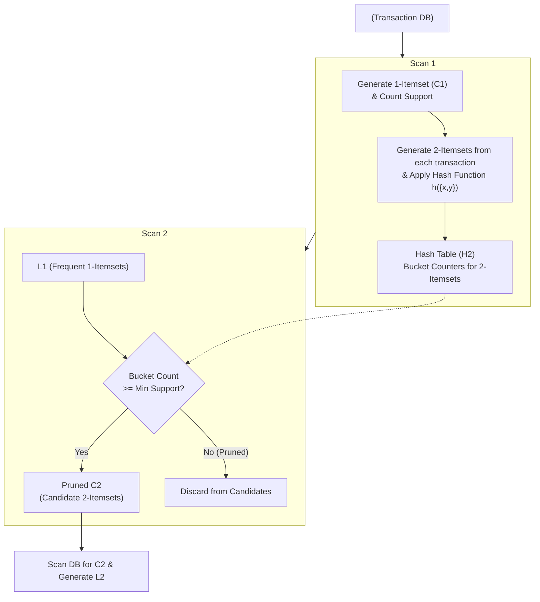

# DHP (Direct Hashing & Pruning)

---

## I. Apriori 알고리즘의 성능 개선, DHP 알고리즘의 개요

* **정의**: 연관 규칙 탐색 알고리즘인 Apriori의 성능 개선을 위해 [[해시 테이블]](Hash Table)을 활용하여 후보 생성 시 발생하는 메모리 낭비와 연산량을 줄이는 [[알고리즘]]
* 데이터 마이닝의 장바구니 분석(Market Basket Analysis)에서 빈발 항목 집합(Frequent Itemset)을 추출할 때 활용됨
* **특징**: Direct Hashing(해시 함수 활용), Pruning(해시 버킷 카운트 기반 가지치기), Candidate Reduction(후보 항목 집합 축소)

---

## II. DHP 알고리즘의 동작 원리 및 핵심 구성요소

### 가. DHP 알고리즘의 동작 원리 (해시 기반 Pruning)

* 데이터베이스를 스캔하면서 $k$-itemset 후보를 평가함과 동시에, [[트랜잭션]] 내의 $(k+1)$-itemset을 생성하여 해시 테이블의 버킷 카운트를 증가시킴.
* 다음 단계에서 후보 집합 $C_{k+1}$을 생성할 때, 해시 버킷의 카운트가 최소 [[지지도]](Minimum Support)를 넘지 못하면 해당 항목 집합은 후보에서 즉시 제외(Pruning)함.

### 나. DHP 알고리즘의 핵심 기술 요소

| 분류 | 요소기술(키워드) | 세부 설명 |
| --- | --- | --- |
| **데이터 구조** | 해시 테이블 (Hash Table) | 항목 집합을 매핑하고, 매핑된 항목 집합의 누적 빈도를 저장하는 자료구조 |
| **데이터 구조** | 버킷 카운터 (Bucket Counter) | 각 해시 주소에 매핑된 (k+1)-itemset들의 발생 횟수 합 |
| **핵심 기법** | Direct Hashing | 해시 함수 $h(x, y)$를 통해 항목 집합을 해시 테이블의 특정 인덱스로 매핑 |
| **핵심 기법** | Pruning (가지치기) | 해시 버킷의 카운트가 최소 지지도 미만인 경우 후보 생성 단계에서 배제 |
| **평가 기준** | Minimum Support (최소 지지도) | 항목 집합이 유의미하다고 판단하기 위한 최소 발생 비율/횟수 |
| **성능 최적화** | Transaction Trimming | 후보 집합을 포함하지 않는 트랜잭션을 다음 스캔 대상에서 제외하여 스캔 비용 감소 |
| **성능 최적화** | Candidate Reduction | Apriori와 달리 Join 스텝 전에 해시값을 확인하여 불필요한 후보 조합을 사전에 방지 |
| **적용 알고리즘** | Apriori Property | 부분 집합이 빈발하지 않으면, 상위 집합도 빈발하지 않음을 이용 |

---

## III. DHP 알고리즘의 비교 및 향후 전망

### 가. DHP와 주요 연관 규칙 알고리즘 비교

| 비교 항목 | Apriori | DHP (Direct Hashing & Pruning) | FP-Growth |
| --- | --- | --- | --- |
| **핵심 기법** | Candidate Generation & Test | Hash Table & Pruning | FP-Tree 구성 (No Candidate) |
| **후보 집합 크기** | 매우 큼 | 해싱을 통해 크게 감소 | 후보 집합 생성 안 함 |
| **DB 스캔 횟수** | 후보 항목 크기($k$)만큼 반복 | $k$만큼 반복 (트리밍으로 크기 감소) | 2회 스캔으로 고정 |
| **메모리 사용량** | 후보 집합 저장에 다량 소모 | 초기 해시 테이블 구축에 소모 | 트리 구축 메모리 소모 큼 |
| **적합한 환경** | 소규모 데이터셋 | **초기 단계(2-itemset) 후보가 많은 환경** | 대규모 데이터셋 |

### 나. 한계점 및 향후 전망

* **한계점**: 2-itemset 등 초기 후보를 줄이는 데는 매우 효과적이나, 여전히 빈발 항목 집합의 최대 길이만큼 데이터베이스를 다중 스캔(Multi-pass)해야 하는 단점이 존재함.
* **개선 및 전망**:
* 다중 스캔 문제를 극복하기 위해 DIC(Dynamic Itemset Counting) 알고리즘이나 [[파티셔닝]](Partitioning) 기법과 결합하여 I/O 비용을 최소화하는 방향으로 발전함.
* 최근에는 빅데이터 처리 환경(Hadoop, Spark 등)에서 병렬 분산 처리를 통해 연관 규칙 탐색의 성능을 극대화하는 분산 FP-Growth 기반 아키텍처로 대체되는 추세임.

---

### 🔗 연관 토픽

- **소속 도메인**: [[00_데이터베이스_MOC|🗄️ 데이터베이스]]
- **세부 분류**: `4. 물리 저장 구조 & 인덱스 최적화`
- **핵심 연관 토픽**:
  - [[파티셔닝|파티션]]
  - [[분산 데이터베이스|분산 데이터베이스 (Distributed Database)]]
  - [[지지도]]
  - [[트랜잭션]]
  - [[샤딩|샤딩 (Sharding)]]
