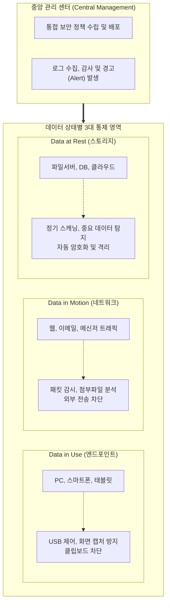

# DLP (Data Loss Prevention)

---

## I. 내부자 위협 대응 및 중요 정보 유출 원천 차단, DLP의 개요

* **정의**: 조직의 중요 데이터(개인정보, 기밀문서 등)를 식별 및 분류하고, 엔드포인트·네트워크·스토리지 전 구간에서 데이터의 흐름을 감시하여 무단 유출을 사전에 탐지 및 차단하는 통합 데이터 보안 솔루션
* **등장 배경 및 필요성**:
* **내부자 위협 증가**: 악의적 목적 또는 관리자 실수로 인한 핵심 영업비밀 및 고객 정보 유출 사고 급증
* **규제 컴플라이언스 준수**: [[개인정보보호법]], GDPR 등 정보 보호 관련 법적 규제 강화에 따른 기술적 보호 조치 의무화

* **특징**: 내용 기반(Content-aware) 탐지, 데이터 상태(Use, Motion, Rest)별 다중 계층 통제, 중앙 집중식 정책 관리 및 감사

---

## II. DLP의 아키텍처 및 핵심 구성요소

### 가. DLP의 아키텍처 및 동작 원리

* 관리 서버에서 수립된 보안 정책을 각 구간(엔드포인트, 네트워크, 스토리지)에 배포하여 데이터 흐름을 실시간으로 감시함
* 중요 정보로 분류된 데이터가 인가되지 않은 채널(USB, 외부 메일 등)로 이동하려는 시도를 식별 시, 즉시 전송을 차단하고 로그를 기록함

### 나. DLP의 핵심 기술 요소

| 구분 | 요소기술(키워드) | 세부 설명 |
| --- | --- | --- |
| **데이터 탐지 (정형)** | [[EDM]] (Exact Data Matching) | DB 등에 저장된 실제 데이터(주민번호, 계좌번호 등)와 정확히 일치하는 구조화된 데이터를 매칭하여 유출 차단 |
| **데이터 탐지 (비정형)** | IDM (Indexed Document Matching) | 기밀문서, 설계도면 원본에서 추출한 해시 및 문서 지문(Fingerprinting)을 비교하여 변형된 비정형 데이터 탐지 |
| **데이터 탐지 (분석)** | OCR (광학 문자 인식) | 이미지 파일(JPG, PDF 등) 내에 포함된 텍스트를 추출하여 중요 정보 포함 여부 분석 |
| **문맥 인지** | Context-Awareness | 단순 키워드가 아닌 데이터가 사용되는 문맥, 사용자 위치, 접근 시간 등을 종합 분석하여 오탐율 최소화 |
| **엔드포인트 통제** | 매체 제어 (Device Control) | USB, 외장하드, 블루투스 등 이동형 저장매체의 접근 권한 제어 및 쓰기 금지 처리 |
| **네트워크 통제** | 컨텐츠 필터링 (Content Filtering) | 메일 본문 및 첨부파일, 웹 업로드 패킷을 심층 패킷 분석(DPI)하여 정책 위반 데이터 전송 차단 |
| **스토리지 통제** | 데이터 디스커버리 (Discovery) | 사내 분산된 시스템에 방치된 중요 데이터를 주기적으로 스캐닝하여 분류하고, 안전한 저장소로 격리 |
| **연동/대응** | [[DRM(Digital Right Management)|DRM]] / ZTNA 연동 | 문서 외부 반출 필요 시 DRM으로 암호화하여 승인 처리하거나, 제로 트러스트 아키텍처와 연계하여 접근 제어 |

---

## III. DLP와 DRM의 비교 및 향후 동향

### 가. 데이터 보안 핵심 솔루션 비교 (DLP vs DRM)

| 비교 항목 | DLP (Data Loss Prevention) | DRM (Digital Rights Management) |
| --- | --- | --- |
| **핵심 목적** | 정보 유출 **경로(채널) 차단** 및 흐름 통제 | 데이터(문서) **자체의 [[암호화]]** 및 권한 제어 |
| **보호 대상** | 사내망을 이동하거나 저장된 모든 데이터 | 사전에 정의되거나 생성된 특정 문서/파일 |
| **제어 방식** | 컨텐츠 내용(패턴, 지문) 분석 기반 접근/전송 차단 | 사용자 인증 및 암호화 키 기반의 열람/편집/출력 통제 |
| **유출 시 보호 능력** | 파일이 이미 외부로 유출되면 보호 불가능 | 외부로 유출되더라도 암호화되어 있어 권한 없이는 열람 불가 |
| **도입 및 운영** | 전사적 네트워크 및 시스템 통합 인프라 구축 필요 | 애플리케이션 및 파일 시스템 중심의 플러그인/에이전트 설치 |
| **상호 보완성** | DLP로 무단 반출을 막고, 정당한 반출 문서에 대해 DRM을 적용하여 이중 보안(Defense in Depth) 체계 구축 |  |

### 나. 향후 동향 및 발전 전망

* **Cloud DLP 및 CASB 통합**: 기업의 업무 환경이 SaaS(M365, Google Workspace 등)로 확장됨에 따라, 클라우드 접근 보안 중개(CASB) 솔루션과 결합하여 클라우드 환경 내에서의 데이터 유출까지 통제하는 범위로 확대됨
* **AI/ML 기반 UEBA(사용자 및 [[엔티티]] 행위 분석) 적용**: 기존의 정적 패턴 기반 탐지에서 벗어나, 머신러닝을 통해 평소와 다른 비정상적인 대량 다운로드, 이례적인 업무 시간 접근 등 사용자 행위 맥락을 분석하여 알려지지 않은 내부 위협 및 오탐을 획기적으로 줄이는 지능형 DLP로 진화 중임

---

### 🔗 연관 토픽

- **소속 도메인**: [[00_보안_MOC|🛡️ 보안]]
- **세부 분류**: `3. 네트워크 & 엔드포인트 · 인프라 보안`
- **핵심 연관 토픽**:
  - [[EDM]]
  - [[클라우드 컴퓨팅 취약점 및 대응기술]]
  - [[SecaaS (Security as a Service)]]
  - [[개인정보보호법]]
  - [[DRM(Digital Right Management)]]
