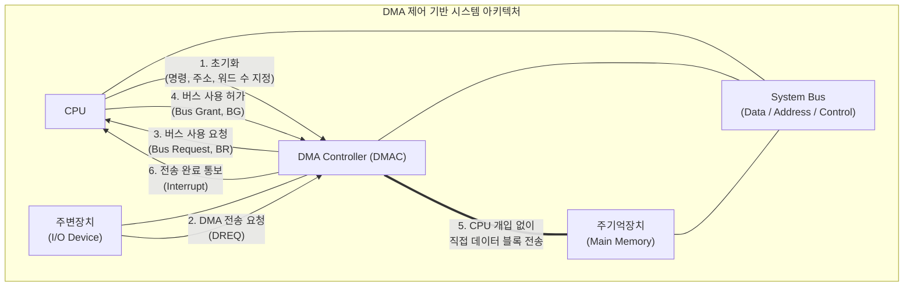

# DMA (Direct Memory Access)

---

## I. CPU 개입 최소화를 통한 시스템 성능 향상 기법, DMA의 개요

* **정의**: 주변장치(I/O Device)와 주기억장치(Main Memory) 간의 데이터 전송 시, [[CPU]]의 개입 없이 DMA 컨트롤러(DMAC)가 직접 시스템 버스를 제어하여 고속으로 데이터를 전송하는 하드웨어 제어 기법
* **배경 및 필요성**:
* 기존 방식(Programmed I/O, 인터럽트 기반 I/O)은 대용량 데이터 전송 시 CPU 오버헤드가 급증함
* CPU 연산 작업과 I/O 장치의 데이터 전송을 병렬로 수행하여 시스템 전체의 처리율(Throughput)을 극대화하기 위해 도입됨

* **특징**: 하드웨어 모듈(DMAC) 기반의 버스 제어, CPU 부하 감소, 고속 대용량 데이터 블록 전송

---

## II. DMA의 개념도 및 핵심 기술 요소

### 가. DMA의 아키텍처 및 동작 원리

* CPU가 DMAC에 I/O 명령을 하달하고 버스 제어권을 양보(BG)하면, DMAC가 시스템 버스를 독점 또는 공유하여 메모리와 I/O 장치 간 데이터를 직접 전송함.
* 전송이 완료되면 DMAC는 CPU에 인터럽트를 발생시켜 작업 종료를 알림.

### 나. DMA의 핵심 기술 및 구성 요소

| 분류 | 요소기술(키워드) | 세부 설명 |
| --- | --- | --- |
| **제어 주체** | DMAC (DMA Controller) | 데이터 전송을 총괄하는 하드웨어로 Address, Word Count, Control 레지스터를 포함 |
| **제어 신호** | BR / BG (Bus Request/Grant) | DMAC가 CPU에 버스 제어권을 요청(BR)하고, CPU가 이를 승인하여 제어권을 넘기는 신호(BG) |
| **동작 모드** | Burst Mode (블록 전송) | DMAC가 버스 제어권을 획득한 후, 데이터 블록 전체 전송이 끝날 때까지 버스를 독점하는 방식 |
| **동작 모드** | Cycle Stealing Mode | CPU가 시스템 버스를 사용하지 않는 사이클을 훔쳐서(공유하여) 1 워드씩 데이터를 전송하는 방식 |
| **동작 모드** | Transparent Mode | CPU가 버스를 사용하지 않는 상태(명령어 해독 등)를 감지하여 CPU 동작 지연 없이 데이터를 전송 |
| **채널 확장** | I/O 프로세서 (IOP / Channel) | DMA의 기능을 확장하여 독자적인 명령어 집합을 가지고 다수의 I/O 장치를 제어하는 전용 프로세서 |
| **충돌 방지** | 버스 중재 (Bus Arbitration) | 다수의 DMA(또는 마스터)가 동시에 버스를 요청할 때 우선순위를 판별하는 하드웨어 로직 |
| **완료 메커니즘** | [[인터럽트|인터럽트 (Interrupt)]] | 설정된 워드 카운트(Word Count)가 0이 되어 전송이 완료되었음을 CPU에 통보하는 신호 |

---

## III. I/O 제어 방식 비교 및 DMA 기술의 발전 전망

### 가. 컴퓨터 I/O 데이터 전송 제어 방식 비교

| 비교 항목 | Programmed I/O | Interrupt-driven I/O | DMA (Direct Memory Access) |
| --- | --- | --- | --- |
| **버스 제어 주체** | CPU | CPU | **DMAC (하드웨어)** |
| **동작 방식** | CPU가 I/O 상태 플래그를 지속 확인(Polling) | I/O 장치가 준비되면 인터럽트로 CPU 호출 | 초기화 후 DMAC가 데이터 전송 직접 제어 |
| **CPU 오버헤드** | 매우 높음 (대기 시간 낭비) | 보통 (데이터 전송 시마다 개입) | **매우 낮음 (시작과 끝에만 개입)** |
| **전송 단위** | Word (문자) 단위 | Word (문자) 단위 | **Block (대용량 버퍼) 단위** |
| **주요 활용** | 초기 컴퓨팅 시스템, 단순 마이컴 | 키보드, 마우스 등 소용량 이벤트 기기 | 디스크, 네트워크 카드(NIC), [[GPU]] 등 |

### 나. DMA 기술의 한계 극복 및 향후 전망

* **원격지 메모리 직접 접근 (RDMA)**: 단일 시스템 내의 DMA를 넘어, 분산 네트워크 상에서 원격 서버의 메모리에 직접 접근하는 **RDMA(Remote DMA)** 기술로 진화 중임.
* **클라우드 및 AI 인프라 적용**: CPU 개입과 OS [[커널]] 스택([[TCP]]/IP)을 우회(Bypass)하여 제로 카피(Zero-copy) 전송을 구현하는 RoCE(RDMA over Converged Ethernet) 및 InfiniBand 기술이 데이터 센터, [[딥러닝]] 클러스터, NVMe-oF 스토리지 성능 향상의 핵심 기술로 자리 매김함.

---

### 🔗 연관 토픽

- **소속 도메인**: [[00_컴퓨터구조_MOC|💻 컴퓨터구조]]
- **세부 분류**: `1. CPU 프로세서 & 마이크로아키텍처`
- **핵심 연관 토픽**:
  - [[CPU]]
  - [[GPU]]
  - [[MMU(Memory Management Unit)]]
  - [[커널|커널(Kernel)]]
  - [[딥러닝]]
