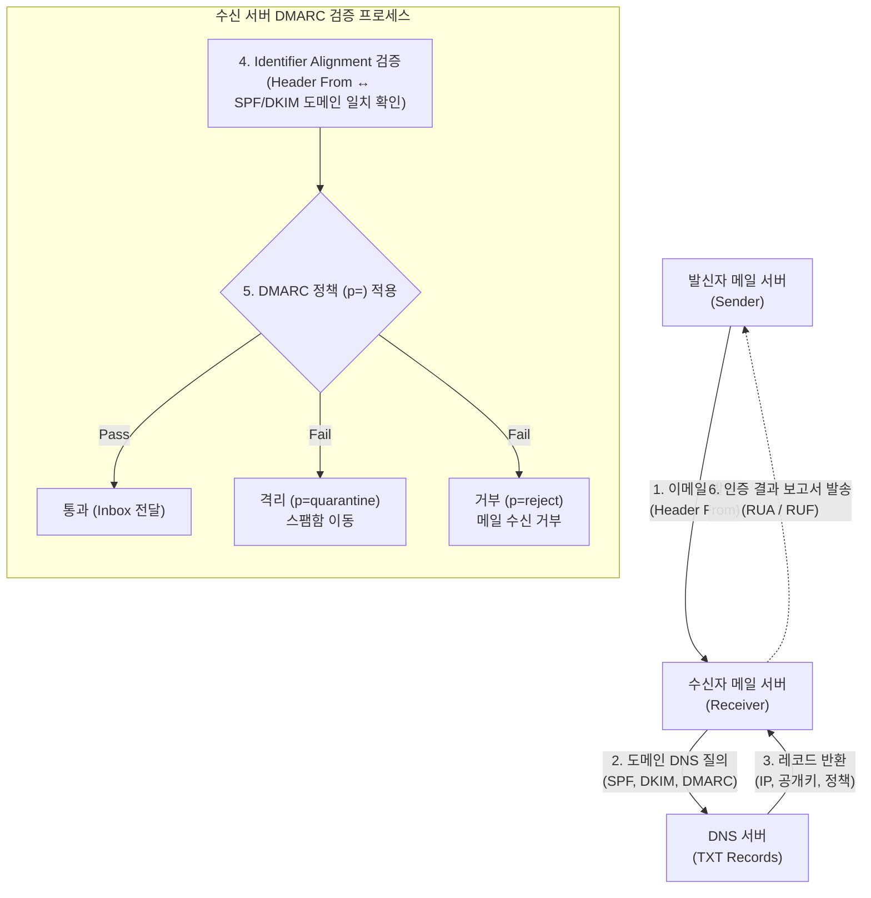

# DMARC (Domain-based Message Authentication, Reporting and Conformance)

---

## I. 이메일 스푸핑 방지 및 발신자 인증의 완성, DMARC의 개요

* **정의**: 이메일 발신자 주소(From) 위장 및 피싱(Phishing) 공격을 방지하기 위해, SPF와 DKIM 인증 결과를 바탕으로 메일 처리 정책을 명시하고 수신 결과를 보고하는 발신자 도메인 기반 이메일 인증 [[프로토콜]]
* **필요성 및 특징**:
* **기존 인증 메커니즘의 한계 극복**: SPF(봉투 발신자 검증)와 DKIM(전자서명 검증)만으로는 사용자에게 보이는 '헤더 발신자(Header From)' 주소 위장 방어에 한계 존재
* **도메인 소유자의 통제권 확보**: 인증 실패 메일에 대한 처리 정책(모니터링, 격리, 완전 거부)을 도메인 소유자가 [[DNS(Domain Name System)|DNS]]를 통해 직접 수신 서버에 지시 가능
* **글로벌 의무화 추세**: 구글(Gmail), 야후 등 글로벌 이메일 서비스 제공자(ESP)의 대량 발송자 대상 DMARC 적용 의무화(2024년 2월 발효)

---

## II. DMARC의 개념도 및 핵심 기술 요소

### 가. DMARC의 동작 개념도 및 검증 프로세스

* 수신 서버는 이메일 수신 시 DNS에서 발신자 도메인의 DMARC 정책을 조회하고, SPF/DKIM 정렬(Alignment)을 검증함.
* 검증 실패 시 DNS에 명시된 정책(p=)에 따라 메일을 처리하고, 결과를 발신자에게 피드백(Report) 함.

### 나. DMARC의 핵심 구성 요소

| 분류 | 요소기술(키워드) | 세부 설명 |
| --- | --- | --- |
| **기반 인증** | SPF (Sender Policy Framework) | 송신 서버의 IP 주소를 사전에 DNS에 등록하여 인가된 발송자임을 확인하는 기술 |
| **기반 인증** | DKIM (DomainKeys Identified Mail) | 발송 메일 헤더와 본문을 개인키로 전자서명하고, DNS의 공개키로 위변조를 검증하는 기술 |
| **핵심 검증** | Identifier Alignment (정렬) | 사용자에게 보이는 'Header From' 도메인이 SPF(Envelope From) 및 DKIM(d= 태그) 도메인과 일치하는지 검증 |
| **처리 정책** | p=none (Monitoring) | 인증 실패 시에도 메일을 정상 수신(Inbox)하며, 현황 파악 및 모니터링을 위해 사용하는 초기 도입 정책 |
| **처리 정책** | p=quarantine (격리) | 인증 실패 메일을 의심스러운 메일로 분류하여 스팸(Spam) 또는 정크(Junk) 폴더로 이동시키는 정책 |
| **처리 정책** | p=reject (거부) | 인증을 통과하지 못한 메일을 수신 서버 단에서 완전히 차단(Drop) 및 거부(Bounce)하는 가장 강력한 보안 정책 |
| **보고 기능** | RUA (Aggregate Reports) | 일별/주별 등 주기적으로 DMARC 인증 성공/실패 통계 정보를 지정된 주소로 발송하는 종합 보고서 |
| **보고 기능** | RUF (Forensic Reports) | 인증에 실패한 개별 이메일에 대한 상세 실패 사유(헤더 정보 등)를 실시간으로 발송하는 포렌식 보고서 |

---

## III. 이메일 인증 기술 비교 및 향후 보안 동향

### 가. 이메일 발신자 인증 3대 프로토콜 비교 (SPF, DKIM, DMARC)

| 비교 항목 | SPF | DKIM | DMARC |
| --- | --- | --- | --- |
| **인증 기반 자원** | 발신자 서버의 **IP 주소** | 메일 본문 및 헤더 **전자서명** ([[암호화]]) | SPF, DKIM 결과 및 **정책(Policy)** |
| **방어 대상** | Envelope From (봉투 주소) 위조 | 이메일 메시지의 [[무결성]] 훼손 | **Header From (표시 주소)** 위조 |
| **메일 포워딩 시** | IP가 변경되므로 **인증 실패** | 내용 미변경 시 **인증 유지** | DKIM이 유효하면 정렬 검증 **통과 가능** |
| **처리 결정 주체** | 수신 서버의 자체 스팸 정책에 의존 | 수신 서버의 자체 스팸 정책에 의존 | **발신자(도메인 소유자)가 명시적 결정** |

### 나. 최신 동향 및 향후 전망

* **BIMI (Brand Indicators for Message Identification) 도입 가속화**: DMARC 정책을 'p=quarantine' 또는 'p=reject'로 강력하게 적용한 도메인에 한해, 수신자 이메일 클라이언트에 기업의 공식 로고를 표시해주는 BIMI 표준 도입이 글로벌 브랜드 중심으로 확산 중
* **제로 트러스트([[제로 트러스트 보안모델|Zero Trust]]) 아키텍처의 필수 요소**: 피싱 메일이 [[랜섬웨어]] 및 APT 공격의 주요 초기 침투 경로(Initial Access)로 사용됨에 따라, DMARC는 단순 스팸 필터링을 넘어 기업의 제로 트러스트 보안 모델 완성을 위한 핵심 인프라 기술로 격상됨

---

### 🔗 연관 토픽

- **소속 도메인**: [[00_보안_MOC|🛡️ 보안]]
- **세부 분류**: `5. 사이버 공격 기법 & 침해사고 대응`
- **핵심 연관 토픽**:
  - [[DNS(Domain Name System)]]
  - [[암호화|암호화 (Encryption)]]
  - [[제로 트러스트 보안모델|제로 트러스트 (Zero Trust) 보안모델]]
  - [[랜섬웨어]]
  - [[무결성]]
