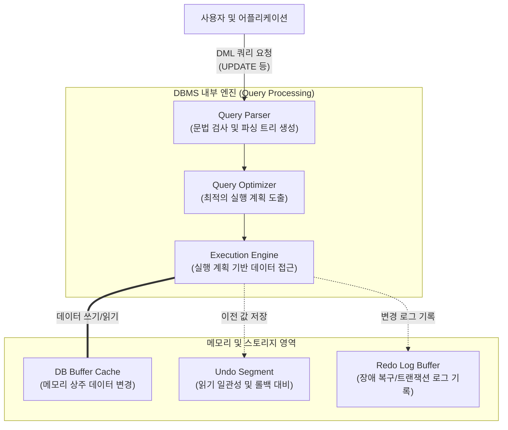

# DML (Data Manipulation Language)

---

## I. 관계형 데이터베이스 데이터 조작의 핵심, DML의 개요

* **정의**: [[데이터베이스]] 관리 시스템([[DBMS]])에서 사용자 또는 응용 프로그램이 테이블(Table) 내의 실질적인 데이터를 검색, 삽입, 수정, 삭제하기 위해 사용하는 데이터 조작 언어
* **특징**:
* **[[트랜잭션]](Transaction) 연계**: 실행 후 데이터베이스에 영구 반영하기 위해 반드시 `COMMIT`, 취소 시 `ROLLBACK` 등 TCL(Transaction Control Language)과 연계가 필요함 (Auto-Commit 아님)
* **선언적 언어(Declarative)**: 사용자가 원하는 결과셋(What)만 명시하면, 접근 경로 및 처리 방법(How)은 DBMS의 [[옵티마이저]]([[OPTIMIZER|Optimizer]])가 결정
* **레코드 단위 처리**: 릴레이션(테이블)의 튜플(Tuple/Row) 단위로 데이터를 조작하며 [[무결성]] 제약조건을 준수함

---

## II. DML의 처리 메커니즘 및 핵심 명령어

### 가. DML의 처리 메커니즘 및 동작 원리

* 사용자로부터 DML(예: UPDATE)이 인입되면 파싱과 최적화 단계를 거쳐 실행 계획(Execution Plan)이 생성됨
* 동시성 제어와 장애 복구를 위해 디스크 원본 수정 전 Buffer Cache에서 데이터를 변경하며, Undo(롤백용) 및 Redo(복구용) 영역에 기록을 동시 수행함

### 나. DML의 핵심 명령어 및 기능 요소

| 구분 | 명령어(키워드) | 세부 설명 |
| --- | --- | --- |
| **데이터 검색** | `SELECT` | 테이블에서 조건에 맞는 데이터를 조회 (질의어 기능이 커서 DQL로 별도 분류하기도 함) |
| **데이터 삽입** | `INSERT` | 새로운 튜플(레코드)을 테이블에 추가 (단일 행 또는 Subquery를 통한 다중 행 삽입) |
| **데이터 수정** | `UPDATE` | 기존 테이블에 저장된 튜플의 특정 컬럼 값을 조건(`WHERE`)에 따라 변경 |
| **데이터 삭제** | `DELETE` | 조건에 맞는 튜플을 삭제하며, 테이블 구조는 유지됨 (트랜잭션 로그 기록으로 복구 가능) |
| **데이터 병합** | `MERGE` | 데이터 존재 여부에 따라 `INSERT` 또는 `UPDATE`를 한 번의 쿼리로 분기하여 수행 (Upsert 기능) |
| **동시성 제어** | Lock (잠금) | DML 수행 시 정합성 보장을 위해 행 수준(Row-Level) 배타적 잠금(Exclusive Lock) 발생 |
| **무결성 보장** | Constraint | DML 실행 시 기본키(PK), 외래키(FK) 등 사전에 정의된 데이터 무결성 제약조건 위배 여부 확인 |
| **접근 경로** | Execution Plan | 옵티마이저가 생성하는 DML 처리 경로(Table Full Scan, [[RDBMS 인덱스(index)|Index]] Range Scan 등) |

---

## III. SQL 언어 그룹 간 비교 및 DML 성능 최적화 방안

### 가. SQL 그룹별 비교 (DML vs DDL vs DCL)

| 비교 항목 | DML (조작어) | [[DDL]] (정의어) | [[DCL]] (제어어) |
| --- | --- | --- | --- |
| **주요 목적** | 데이터(레코드) 조회, 추가, 수정, 삭제 | 객체(테이블, 인덱스 등) 구조의 생성, 변경, 삭제 | 데이터베이스 접근 권한 부여 및 회수 |
| **적용 대상** | 테이블 내의 **튜플(Row)** | 데이터베이스 **[[스키마]](Schema) 및 객체** | 사용자(User) 및 롤(Role) |
| **트랜잭션(Commit)** | 명시적 제어 필요 (수동 Commit) | 실행 즉시 자동 반영 (Auto-Commit) | 실행 즉시 자동 반영 (Auto-Commit) |
| **주요 명령어** | `SELECT`, `INSERT`, `UPDATE`, `DELETE` | `CREATE`, `ALTER`, `DROP`, `TRUNCATE` | `GRANT`, `REVOKE` |
| **로그 기록량** | 튜플 단위 전체 로그 기록 (대량 발생) | 메타데이터 변경 로그만 기록 (소량) | 딕셔너리 변경 로그 기록 (소량) |

### 나. 대용량 DML 처리 시 성능 최적화(Tuning) 방안

* **인덱스(Index) 전략 고려**: 무분별한 인덱스는 `INSERT`, `UPDATE`, `DELETE` 시 오버헤드를 발생시키므로 조회를 위한 최소한의 최적화된 인덱스만 구성
* **힌트(Hint) 및 배열 처리(Array Processing) 적용**: 대용량 데이터 DML 시 옵티마이저의 접근 경로를 힌트로 유도하고, 반복적인 쿼리는 Array Binding(다중 행 일괄 처리)을 통해 네트워크 및 [[CPU]] 파싱 오버헤드를 최소화
* **[[파티셔닝]](Partitioning) 활용**: 이력 데이터 대량 삭제 시 `DELETE` DML 대신 파티션 `DROP` 또는 `TRUNCATE` DDL을 활용하여 시스템 부하와 언두(Undo) 로그 생성을 원천 차단

---

### 🔗 연관 토픽

- **소속 도메인**: [[00_데이터베이스_MOC|🗄️ 데이터베이스]]
- **세부 분류**: `2. 트랜잭션 & 동시성 제어 (Concurrency)`
- **핵심 연관 토픽**:
  - [[무결성]]
  - [[트랜잭션]]
  - [[DDL]]
  - [[DCL]]
  - [[RDBMS 인덱스(index)]]
