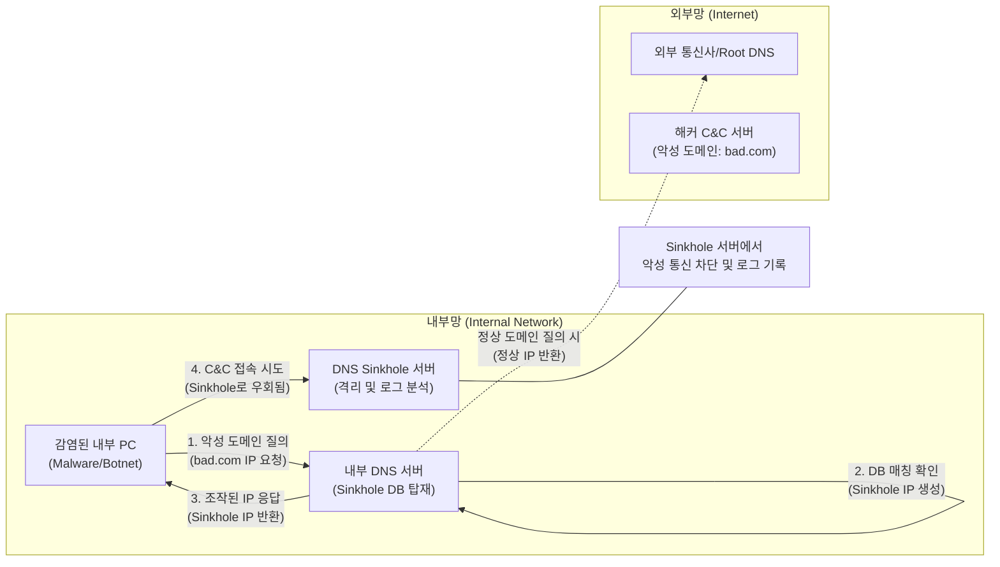

# DNS 싱크홀 (DNS Sinkhole)

---

## I. 악성코드 통신 차단 및 감염 PC 식별을 위한, DNS 싱크홀의 개요

* **정의**: 내부망의 감염된 PC가 악성 도메인(C&C 서버 등)으로 질의할 때, [[DNS(Domain Name System)|DNS]] 서버가 실제 IP 대신 통제된 가짜 IP(Sinkhole IP)를 반환하여 악성 트래픽을 안전한 서버로 우회시키는 네트워크 보안 방어 기술
* **배경 및 필요성**:
* 지능형 지속 위협(APT) 증가: 내부로 침투한 [[랜섬웨어]] 및 봇넷(Botnet)의 외부 C&C 서버 통신을 원천 차단할 필요성 대두
* 감염 PC 조기 식별: 시그니처 기반 탐지를 우회한 악성코드의 비정상적인 아웃바운드(Outbound) 통신을 수집하여 감염된 내부 자산을 신속하게 식별

* **특징**: 악성 트래픽 격리 및 로그 분석 기능 제공, KISA(한국인터넷진흥원) 등 외부 위협 정보([[CTI]])와의 실시간 연동 기반 차단 목록 동기화

---

## II. DNS 싱크홀의 개념도 및 핵심 기술 요소

### 가. DNS 싱크홀의 개념도 및 동작 원리

* 감염된 PC가 C&C 서버와 통신하기 위해 내부 DNS에 질의하면, DNS는 차단 목록을 기반으로 악성 도메인 여부를 판단함.
* 악성 도메인일 경우 실제 해커의 IP 대신 내부 싱크홀 서버의 IP를 반환하여 통신을 가로채고(Interception), 접속 로그를 남겨 감염된 PC를 색출함.

### 나. DNS 싱크홀의 핵심 기술 및 구성 요소

| 분류 | 요소기술(키워드) | 세부 설명 |
| --- | --- | --- |
| **보안 인프라** | Sinkhole DB (차단 목록) | KISA, 보안 벤더 등으로부터 주기적으로 수집되는 최신 악성 도메인(C&C 서버 등) 블랙리스트 |
| **보안 인프라** | Sinkhole Server | 악성 통신 시도를 수용하여 연결을 종료시키고, 질의를 시도한 내부 PC의 IP와 시간 등을 기록하는 격리 서버 |
| **탐지 및 대응** | DNS Interception (가로채기) | 내부 클라이언트의 DNS 질의 과정을 모니터링하고 개입하여 위협 여부를 평가하는 통제 기법 |
| **탐지 및 대응** | DNS Spoofing (합법적 조작) | 악성 도메인에 한하여 고의로 위조된 IP 주소(싱크홀 IP)를 응답하여 트래픽의 방향을 전환하는 방어 기법 |
| **주요 방어 대상** | C&C (Command & Control) | 해커가 감염된 좀비 PC들에게 악성 행위([[DDOS|DDoS]], 정보 유출 등) 명령을 내리기 위해 운영하는 원격 조종 서버 |
| **주요 방어 대상** | DGA (Domain Generation Alg.) | 차단을 회피하기 위해 무작위 문자의 악성 도메인을 동적으로 수시 생성하는 [[알고리즘]] (싱크홀의 핵심 방어 타겟) |
| **연동 및 분석** | CTI (Cyber Threat Intelligence) | 전 세계의 사이버 위협 정보를 수집/분석하여 싱크홀의 악성 도메인 DB를 실시간으로 갱신하는 지능형 체계 |
| **연동 및 분석** | [[SIEM]] (통합 보안 관제 연동) | 싱크홀 서버에 쌓인 접속 시도 로그를 중앙 관제 시스템(SIEM)으로 이관하여 전사적 침해사고 분석에 활용 |

---

## III. DNS 싱크홀과 유사 보안 기술 비교 및 향후 전망

### 가. 트래픽 차단 라우팅 기술 비교 (DNS Sinkhole vs Blackhole Routing)

| 비교 항목 | DNS 싱크홀 (Sinkhole) | 블랙홀 라우팅 (Blackhole Routing) |
| --- | --- | --- |
| **동작 계층** | L7 (Application Layer - DNS [[프로토콜]]) | L3 (Network Layer - IP 라우팅) |
| **주요 방어 목적** | C&C 통신 차단 및 **내부 감염 PC 식별** | 대용량 DDoS 공격 트래픽의 **신속한 폐기** |
| **차단 및 식별 기준** | 도메인 이름 (Domain Name) 기반 | IP 주소 (Source/Destination IP) 기반 |
| **트래픽 처리 방식** | 분석용 가짜 서버(Sinkhole)로 우회시켜 로그 기록 | Null 인터페이스(쓰레기통)로 보내 즉시 드롭(Drop) |
| **데이터 활용** | 감염 자산 식별, 포렌식 및 위협 분석 데이터로 활용 | 공격 트래픽의 시스템 및 대역폭 과부하 방지에 집중 |

### 나. 한계점 및 향후 발전 전망

* **한계점**: 최신 악성코드가 DNS 질의 없이 IP 주소(Hard-coded IP)로 직접 C&C 서버와 통신하거나, DoH(DNS over HTTPS)를 사용하여 DNS 패킷을 암호화할 경우 탐지 및 차단이 어려움.
* **발전 및 향후 전망**:
* **AI 기반 DGA 예측**: [[인공지능]] 머신러닝 알고리즘을 도입하여, 알려지지 않은 DGA(동적 도메인) 패턴을 실시간으로 예측하고 선제적으로 싱크홀 목록에 추가하는 능동형 방어 체계로 발전 중임.
* **제로 트러스트(ZTNA) 연동**: 싱크홀 서버에 감염 PC의 접속 로그가 찍히는 즉시 NAC(네트워크 접근 제어) 및 ZTNA 솔루션과 연동하여 해당 엔드포인트를 네트워크에서 자동 격리하는 [[SOAR (Security Orchestration, Automation and Response)|SOAR]](보안 오케스트레이션 및 자동화) 기반 플레이북 적용이 확산되고 있음.

---

### 🔗 연관 토픽

- **소속 도메인**: [[00_보안_MOC|🛡️ 보안]]
- **세부 분류**: `2. 현대 암호학 & 키 관리 · 전자서명`
- **핵심 연관 토픽**:
  - [[랜섬웨어]]
  - [[CTI]]
  - [[SIEM]]
  - [[SOAR (Security Orchestration, Automation and Response)]]
  - [[DDOS]]
