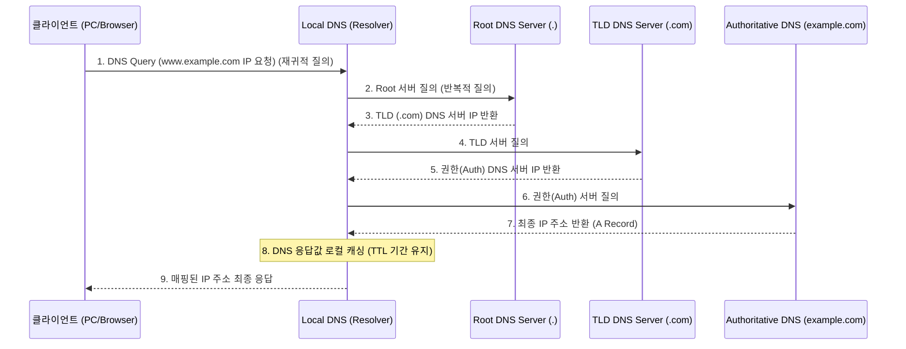

# DNS (Domain Name System)

---

## I. 인터넷의 전화번호부, DNS(Domain Name System)의 개요

* **정의**: 사용자가 기억하기 쉬운 영문 도메인 이름(URL)을 컴퓨터 및 네트워크 장비가 인식할 수 있는 IP 주소로 변환(Resolution)해 주는 분산형 계층적 네이밍 시스템
* **필요성 및 특징**:
* **접근 편의성**: 복잡한 숫자로 구성된 IP 주소([[IPv4]], [[IPv6]]) 대신 의미 있는 문자열을 사용하여 사용자 편의성 극대화
* **분산 및 확장성**: Root, TLD, SLD 기반의 전 세계적인 계층적 트리 구조를 통한 분산 데이터베이스로 무한한 확장 지원
* **서비스 유연성 보장**: 서버의 물리적 IP가 변경되더라도 도메인 이름은 유지되어 서비스의 연속성 및 로드밸런싱(GSLB) 제공

---

## II. DNS의 아키텍처 및 핵심 구성 요소

### 가. DNS의 계층적 동작 원리 및 개념도

* Local DNS(Resolver)는 캐시(Cache)에 도메인 정보가 없으면 Root부터 시작하여 권한 서버까지 반복적 질의(Iterative Query)를 수행함.
* 조회된 결과는 TTL(Time To Live) 값만큼 로컬 시스템에 캐싱되어 이후 질의에 대한 응답 속도를 향상시킴.

### 나. DNS의 핵심 기술 및 구성 요소

| 분류 | 요소기술(키워드) | 세부 설명 |
| --- | --- | --- |
| **시스템 계층** | Root DNS Server | 도메인 계층 트리의 최상위로, 전 세계에 13개의 논리적 원본 서버(A~M)로 구성 및 운영 |
| **시스템 계층** | TLD (Top-Level Domain) | .com, .net (gTLD) 또는 .kr, .uk (ccTLD) 등 최상위 도메인의 정보를 관리하는 네임 서버 |
| **시스템 계층** | Authoritative DNS | 특정 도메인(예: example.com)에 대한 최종적이고 실제적인 IP 주소 레코드를 보유한 권한 서버 |
| **질의 주체** | Resolver (Local DNS) | 사용자를 대리하여 전체 도메인 트리 탐색을 수행하고, 결과를 캐싱하여 반환하는 클라이언트/서버 요소 |
| **자원 레코드 (RR)** | A / AAAA Record | 도메인 이름을 IPv4 주소(A) 및 IPv6 주소(AAAA)로 맵핑하는 가장 기본적인 레코드 |
| **자원 레코드 (RR)** | CNAME Record | 특정 도메인에 대한 별칭(Canonical Name, Alias)을 지정하여 다른 도메인으로 매핑하는 레코드 |
| **자원 레코드 (RR)** | MX Record | 해당 도메인과 연관된 이메일 서버(Mail Exchange)를 지정하는 레코드 |
| **통신 [[프로토콜]]** | UDP / [[TCP]] 53 포트 | 일반적인 빠른 질의 응답은 UDP 53을 사용하며, 존 트랜스퍼(Zone Transfer) 등 대용량 데이터 전송 시 TCP 53 사용 |

---

## III. DNS 보안 위협 및 최신 발전 동향

### 가. DNS 보안 강화 및 성능 향상 기술 동향

| 구분 | 기술 동향(키워드) | 세부 설명 |
| --- | --- | --- |
| **데이터 [[무결성]]** | [[DNSSEC(Domain Name System Security Extension)|DNSSEC]] (DNS Security Extensions) | 공개키 [[암호화]](전자서명)를 통해 DNS 응답의 위변조(DNS Spoofing, Cache Poisoning)를 원천 방지하는 보안 표준 |
| **전송 구간 프라이버시** | DoH (DNS over HTTPS) | DNS 질의를 평문 통신(UDP 53) 대신 HTTPS(TCP 443) 프로토콜로 암호화하여 통신 감청 및 조작 방지 |
| **전송 구간 프라이버시** | DoT (DNS over TLS) | DNS 트래픽을 TLS(TCP 853)로 암호화하여 전송 구간의 보안을 확보하는 기술 |
| **[[HA(High Availability)|고가용성]] 및 성능** | Anycast DNS | 다수의 전 세계 분산 서버가 동일한 IP를 공유하여, 클라이언트와 가장 가까운 최단 경로 서버가 응답 ([[DDOS|DDoS]] 방어 탁월) |
| **트래픽 제어** | GSLB (Global Server Load Balancing) | 단순 DNS를 넘어 클라이언트의 지리적 위치, 서버 상태를 종합 판단하여 최적의 서버 IP를 지능적으로 반환하는 동적 로드밸런싱 |

* **전망**: 평문 기반의 레거시 DNS 취약점을 노린 공격(DDoS, 파밍 등)이 고도화됨에 따라, DoH/DoT를 통한 종단 간 프라이버시 보호와 DNSSEC 도입이 글로벌 테크 기업(구글, 애플 등)의 OS 및 브라우저 단에서 기본 정책으로 의무화되는 추세임.

---

### 🔗 연관 토픽

- **소속 도메인**: [[00_네트워크_MOC|🌐 네트워크]]
- **세부 분류**: `1. OSI 7계층 & 데이터링크 계층 (L1/L2)`
- **핵심 연관 토픽**:
  - [[TCP]]
  - [[DNSSEC(Domain Name System Security Extension)]]
  - [[IPv4]]
  - [[IPv6]]
  - [[프로토콜]]
