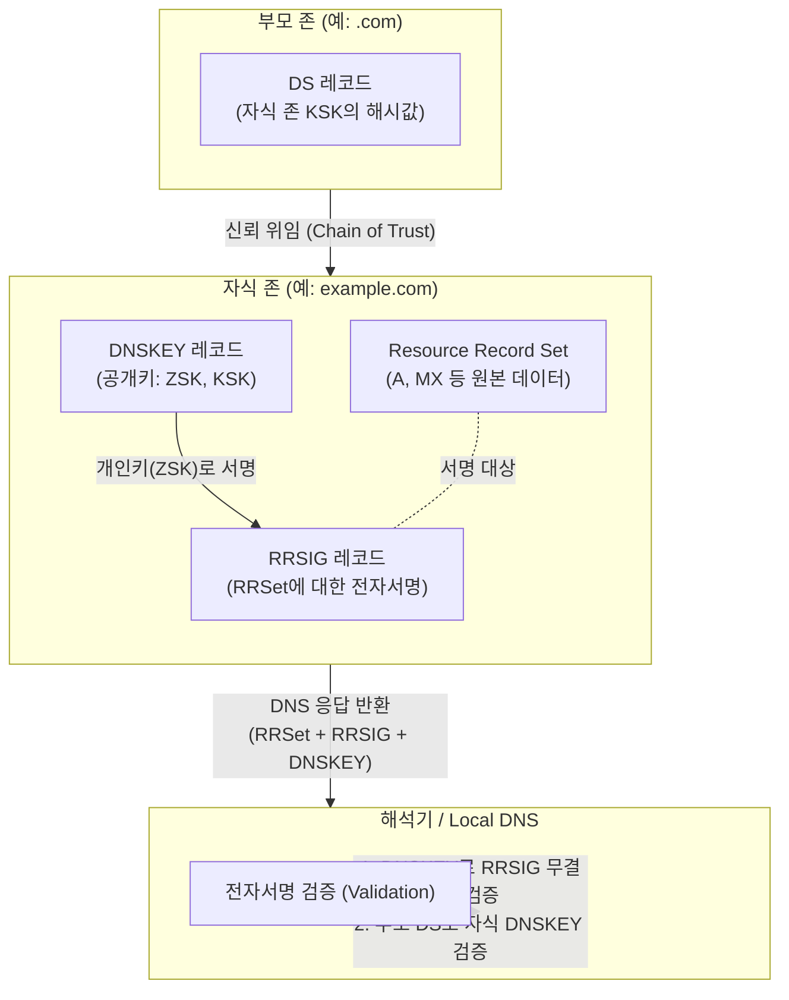

# DNSSEC (Domain Name System Security Extension)

---

## I. DNS 데이터 위변조 방지를 위한 신뢰 체인, DNSSEC의 개요

* **정의**: [[DNS(Domain Name System)|DNS]] 질의 응답의 데이터 [[무결성]](Integrity)과 데이터 발신처 인증(Authentication)을 제공하기 위해, 기존 DNS 자원 레코드에 공개키 [[암호화]] 방식의 전자서명을 추가한 IETF 보안 확장 표준 기술
* **등장 배경**:
* 기존 DNS 프로토콜은 UDP 기반 평문 전송을 수행하여 위조된 응답에 취약함
* 공격자가 DNS 캐시를 조작하여 사용자를 악성 사이트로 유도하는 DNS 스푸핑(Spoofing) 및 캐시 포이즈닝(Cache Poisoning) 공격 위협 급증

* **특징**:
* **무결성 및 출처 인증**: 전자서명을 통해 수신한 DNS 데이터가 위조되지 않았음을 보장
* **부재 인증(Denial of Existence)**: 요청한 도메인이 실제로 존재하지 않음을 암호학적으로 안전하게 증명
* **[[기밀성]] 미제공**: 패킷 자체를 암호화하지 않으므로 트래픽 감청(Sniffing) 방지 기능은 제공하지 않음

---

## II. DNSSEC의 개념도 및 핵심 기술 요소

### 가. DNSSEC의 동작 원리 및 신뢰 체인(Chain of Trust) 개념도

* 하위 존(자식)은 자신의 자원 레코드(RRSet)를 개인키로 서명하여 RRSIG를 생성하고, 해석기(Resolver)는 공개키(DNSKEY)로 이를 검증함.
* 상위 존(부모)은 하위 존 공개키의 해시값(DS)을 가지고 있어, Root부터 이어지는 계층적인 신뢰 체인(Chain of Trust)을 완성함.

### 나. DNSSEC의 핵심 구성 요소 (신규 레코드 및 키)

| 분류 | 요소기술(키워드) | 세부 설명 |
| --- | --- | --- |
| **신규 레코드** | RRSIG (RR Signature) | 원본 자원 레코드 셋(RRSet)에 대해 개인키로 생성한 전자서명 값을 보관하는 레코드 |
| **신규 레코드** | DNSKEY | RRSIG의 전자서명을 검증하기 위한 자식 존의 공개키(KSK, ZSK)를 보관하는 레코드 |
| **신규 레코드** | DS (Delegation Signer) | 자식 존 KSK의 해시값을 부모 존에 저장하여, 상-하위 존 간의 신뢰 체인을 연결하는 레코드 |
| **신규 레코드** | NSEC / NSEC3 | 질의한 도메인 이름이나 레코드 타입이 존재하지 않음을 안전하게 증명(부재 인증)하는 레코드 |
| **암호화 키** | ZSK (Zone Signing Key) | 일반적인 자원 레코드(A, MX, CNAME 등)에 서명하기 위해 사용하는 개인키/공개키 쌍 |
| **암호화 키** | KSK (Key Signing Key) | ZSK를 포함한 DNSKEY 레코드 집합에 서명하기 위해 사용하는 마스터 개인키/공개키 쌍 |
| **검증 메커니즘** | Chain of Trust | Root 존부터 TLD, SLD로 이어지는 계층 구조를 따라 DS와 DNSKEY를 연속적으로 검증하는 신뢰 체인 |
| **검증 메커니즘** | Trust Anchor | 신뢰 체인의 최상단에 위치하여 모든 검증의 절대적인 출발점이 되는 Root 존의 검증된 공개키 |

---

## III. DNS 보안 기술 간 비교 및 최신 동향

### 가. DNS 보안 기술 비교 (DNSSEC vs DoH vs DoT)

| 비교 항목 | DNSSEC (DNS Security Extension) | DoH (DNS over HTTPS) | DoT (DNS over TLS) |
| --- | --- | --- | --- |
| **주요 목적** | **무결성(Integrity) 및 출처 인증** | **기밀성(Confidentiality) 보장** | **기밀성(Confidentiality) 보장** |
| **적용 대상** | DNS 데이터(Payload) 자체 | 전송 구간 (Transport Layer) | 전송 구간 (Transport Layer) |
| **통신 [[프로토콜]]** | 기존 UDP/[[TCP]] 53 포트 동일 사용 | HTTPS (TCP 443 포트) | TLS (TCP 853 포트) |
| **보안 위협 방어** | 스푸핑, 캐시 포이즈닝 완벽 방어 | 트래픽 스니핑, 프라이버시 침해 방어 | 트래픽 스니핑, 프라이버시 침해 방어 |
| **구현 주체** | 도메인 소유자 및 DNS 인프라 관리자 | 브라우저(Chrome 등) 및 앱 개발자 | OS(Android 등) 네트워크 레벨 |

### 나. 한계점 극복 및 최신 동향

* **상호 보완적 통합 아키텍처([[제로 트러스트 보안모델|Zero Trust]])**: DNSSEC는 무결성을 보장하지만 기밀성을 제공하지 않으므로, 최근에는 DNSSEC로 서명된 레코드를 DoH/DoT 암호화 채널을 통해 전송하는 하이브리드 방식이 글로벌 표준 권고사항으로 정착 중임.
* **키 롤오버(Key Rollover) 자동화**: 암호화 키(KSK, ZSK) 만료에 대비한 주기적 갱신(Rollover) 작업 시 설정 오류로 인한 대규모 DNS 장애(Outage) 위험이 존재하므로, RFC 9364(DNSSEC Automation) 기반의 무중단 키 교체 파이프라인 구축이 필수적으로 요구됨.

---

### 🔗 연관 토픽

- **소속 도메인**: [[00_보안_MOC|🛡️ 보안]]
- **세부 분류**: `1. 정보보안 원칙 & 거버넌스 · 인증`
- **핵심 연관 토픽**:
  - [[DNS(Domain Name System)]]
  - [[기밀성]]
  - [[암호화|암호화 (Encryption)]]
  - [[스니핑, 스푸핑|스니핑(Sniffing) & 스푸핑(Spoofing)]]
  - [[제로 트러스트 보안모델|제로 트러스트 (Zero Trust) 보안모델]]
