# DRDoS (Distributed Reflection Denial of Service)

---

## I. 은닉성과 증폭 효과를 극대화한 진화된 서비스 거부 공격, DRDoS의 개요

* **정의**: 공격자가 출발지 IP를 표적 대상의 IP로 변조(Spoofing)하여 수많은 정상 서버(반사체)에 접속을 요청하고, 반사체들의 대규모 응답 트래픽을 표적으로 집중시켜 가용성을 마비시키는 분산 반사 서비스 거부 공격
* **특징**:
* **추적 회피 (Traceback Impossible)**: 정상적인 서버(반사체)를 거쳐 응답 형태로 공격하므로, 표적 시스템에서는 실제 공격의 근원지(좀비 PC 및 해커) 파악이 매우 어려움
* **증폭 효과 (Amplification)**: 작은 크기의 질의(Query) 패킷으로 매우 큰 크기의 응답(Response) 패킷을 유도하여 네트워크 대역폭 고갈 효과를 기하급수적으로 극대화함
* **방어 난해성**: 공격에 악용되는 반사체들이 정상적인 퍼블릭 서버([[DNS(Domain Name System)|DNS]], NTP 등)이므로, 무작정 IP를 차단할 경우 정상 서비스에 심각한 영향을 초래할 수 있음

---

## II. DRDoS의 아키텍처 및 핵심 구성요소

### 가. DRDoS의 동작 개념도 및 원리

```mermaid
flowchart LR
    subgraph Attack_Infrastructure ["공격 인프라 (Attack Infra)"]
        direction TB
        Attacker["공격자<br/>(Attacker)"]
        CnC["C&C 서버<br/>(명령 제어)"]
        Bots["감염된 좀비 PC<br/>(Botnet)"]
        Attacker --> CnC --> Bots
    end

    subgraph Reflectors ["정상 반사체 네트워크 (Reflectors)"]
        direction TB
        DNS["DNS 서버<br/>(UDP 53)"]
        NTP["NTP 서버<br/>(UDP 123)"]
        Mem["Memcached 서버<br/>(UDP 11211)"]
    end

    subgraph Target_System ["표적 (Target)"]
        Target["표적 시스템<br/>(Victim)"]
        Resource["네트워크 대역폭<br/>및 자원 고갈"]
        Target --> Resource
    end

    Bots == "1. IP Spoofing 기반 요청<br/>(Source IP = 표적 IP)" ===> Reflectors
    Reflectors == "2. 증폭된(Amplified) 대규모 응답 트래픽<br/>(Target으로 자동 집중)" ===> Target

```

* 봇넷은 자신의 IP를 표적 시스템의 IP로 위조(Spoofing)하여 인터넷 상의 개방형 정상 서버(DNS, NTP 등)들에게 응답 크기가 큰 특정 질의 패킷을 발송함.
* 요청을 받은 정상 서버(반사체)들은 위조된 출발지인 표적 시스템으로 거대한 응답(증폭) 트래픽을 동시에 일제히 전송하여 망을 마비시킴.

### 나. DRDoS의 핵심 기술 및 구성 요소

| 구분 | 요소기술(키워드) | 세부 설명 |
| --- | --- | --- |
| **기반 기술** | IP Spoofing (IP 위조) | 공격자가 봇넷에서 패킷을 생성할 때 출발지(Source) IP 주소를 공격 표적의 IP로 조작하는 기술 |
| **기반 [[프로토콜]]** | 비연결형 UDP 프로토콜 | [[TCP]]의 3-Way Handshake 같은 인증 절차가 없어, 출발지 IP 확인 없이 즉시 응답하는 UDP 특성 악용 |
| **공격 매개체** | Reflector (반사체) | 해커의 요청에 대해 응답을 반환하는 정상적인 인터넷 서버 (오픈 리졸버 DNS, 공용 NTP 등) |
| **공격 극대화** | Amplification (증폭) | 요청 바이트 수 대비 응답 바이트 수의 비율(증폭률). Memcached의 경우 최대 5만 배 이상 증폭 가능 |
| **주요 증폭 벡터** | DNS ANY/TXT 질의 | DNS 서버에 `ANY` 또는 `TXT` 레코드 타입을 질의하여 도메인의 모든 정보를 포함한 대규모 응답 유도 |
| **주요 증폭 벡터** | NTP monlist 질의 | NTP 서버에 `monlist` 명령을 전송하여, 최근 서버에 접속한 최대 600개의 IP 목록을 응답하도록 유도 |
| **TCP 기반 우회** | TCP SYN-ACK 반사 | 봇넷이 경유지 서버에 SYN을 전송하면, 경유지 서버가 표적 IP로 SYN-ACK 패킷을 쏟아붓게 하는 기법 |
| **대응 기술** | Ingress Filtering | [[라우터]] 및 [[ISP (Information Strategy Plan)|ISP]] 단에서, 내부 네트워크 대역과 일치하지 않는 조작된 Source IP의 유출입을 원천 차단 |

---

## III. DRDoS와 기존 DDoS의 비교 및 향후 대응 방안

### 가. DDoS와 DRDoS 공격 기법 비교

| 비교 항목 | [[DDOS|DDoS]] (Distributed [[DoS (Denial of Service)|DoS]]) | DRDoS (Distributed Reflection DoS) |
| --- | --- | --- |
| **공격 주체 (트래픽 발생원)** | 감염된 다수의 **좀비 PC (Botnet)** | 악용된 정상적인 **반사 서버 (Reflector)** |
| **Source IP 조작 여부** | 좀비 PC의 실제 IP (일부 스푸핑) | **표적 시스템의 IP로 완벽히 조작 (Spoofing 필수)** |
| **공격 근원지 역추적** | 봇넷 IP 추적을 통해 일부 식별 가능 | 반사체 뒤에 숨어있어 **추적 사실상 불가능** |
| **공격 효과 (트래픽 볼륨)** | 봇넷의 자체 네트워크 업로드 대역폭에 의존 | 프로토콜 특성을 이용한 **기하급수적 증폭 (수십~수만 배)** |
| **방어 난이도** | 비정상 봇넷 IP 중심의 차단으로 방어 가능 | 반사체가 정상 서버(DNS 등)이므로 무조건 차단 시 부작용 심각 |

### 나. DRDoS 한계점 극복 및 향후 대응 동향

* **근본적 방어 체계 ([[BCP]] 38 적용)**: DRDoS의 근본 원인인 IP Spoofing을 차단하기 위해, 글로벌 ISP 차원에서 BCP 38(네트워크 유입 필터링) 표준을 의무화하여 비정상 라우팅 트래픽을 원천 차단하는 노력이 필수적임.
* **반사체 악용 방지 (설정 취약점 제거)**: DNS 서버의 Open Resolver 차단, NTP 서버의 `disable monitor` 설정(monlist 기능 비활성화), Memcached의 불필요한 UDP 포트(11211) 외부 노출 차단 등 서버 관리자의 보안 패치 및 설정 강화 권고.
* **AI/ML 기반 동적 방어 아키텍처 도입**: 증폭 공격의 볼륨이 Tbps 단위로 거대해짐에 따라, 온프레미스 장비의 한계를 극복하기 위해 글로벌 클라우드 기반 엣지 디펜스([[CDN]] 스크러빙 센터)와 AI 기반의 정밀 트래픽 프로파일링(Flow Analysis) 방어 체계로 전환 중임.

---

### 🔗 연관 토픽

- **소속 도메인**: [[00_보안_MOC|🛡️ 보안]]
- **세부 분류**: `1. 정보보안 원칙 & 거버넌스 · 인증`
- **핵심 연관 토픽**:
  - [[DDOS]]
  - [[DoS (Denial of Service)]]
  - [[DNS(Domain Name System)]]
  - [[CDN|CDN(Contents Delivery Network)]]
  - [[TCP]]
