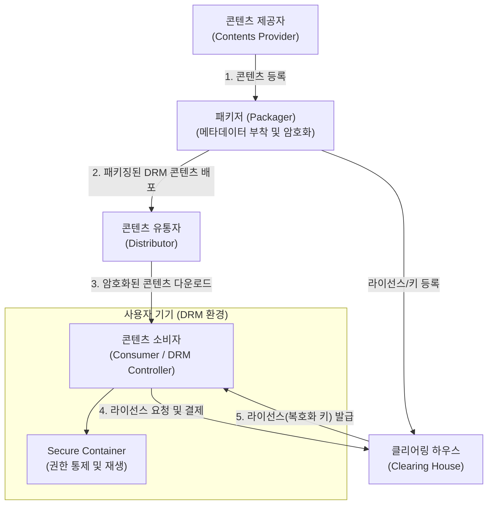

# DRM (Digital Rights Management)

---

## I. 안전한 디지털 콘텐츠 유통 생태계 조성, DRM의 개요

* **정의**: 저작권자가 배포한 디지털 콘텐츠가 의도한 용도로만 사용되도록, 콘텐츠의 생성부터 유통, 이용까지 전 과정에 걸쳐 불법 복제를 방지하고 사용 권한을 제어하는 기술적·관리적 보호 체계
* **배경 및 특징**:
* **콘텐츠 자산 보호**: 디지털화에 따른 원본과 동일한 품질의 무단 복제 및 불법 유통 피해 방지
* **거래 투명성 확보**: 콘텐츠 사용 내역을 추적하여 저작권자와 유통업자 간 정산 기준 제공 및 투명성 보장
* **비즈니스 모델 다각화**: 사용 기간, 횟수, 기기 제한 등 유연한 라이선스 정책을 통해 구독, 대여 등 다양한 상거래 지원

---

## II. DRM의 아키텍처 및 핵심 구성요소

### 가. DRM의 유통 개념도 및 동작 원리

* 콘텐츠 제공자는 패키저를 통해 원본 콘텐츠를 암호화하여 유통자에 배포하고, 권한 규칙은 클리어링 하우스에 등록함.
* 소비자는 유통자로부터 암호화된 콘텐츠를 다운받고, 클리어링 하우스에서 정당한 라이선스(복호화 키)를 발급받아야만 기기 내 DRM 컨트롤러를 통해 콘텐츠를 이용할 수 있음.

### 나. DRM의 핵심 기술 및 구성 요소

| 구분 | 요소기술(키워드) | 세부 설명 |
| --- | --- | --- |
| **핵심 인프라** | 클리어링 하우스 (Clearing House) | 디지털 저작권의 권한 정책, 라이선스 발급, 키 관리 및 사용량에 따른 정산을 총괄하는 핵심 서버 |
| **핵심 인프라** | 패키저 (Packager) | 원본 콘텐츠를 암호화하고 메타데이터, 식별자 등을 결합하여 배포 가능한 보안 [[컨테이너]] 단위로 묶는 도구 |
| **이용 통제** | DRM 컨트롤러 (Controller) | 사용자 기기에 설치되어 발급된 라이선스의 권한(기간, 횟수, 캡처 방지 등) 내에서만 사용을 통제하는 모듈 |
| **요소 기술** | [[암호화]] [[알고리즘]] (Encryption) | 허가받지 않은 접근을 차단하기 위해 [[AES]], [[RSA (Rivest Shamir Adleman)|RSA]] 등 대칭/비대칭 키 방식을 활용하여 콘텐츠 자체를 암호화 |
| **요소 기술** | 저작권 표현 언어 (XrML, REL) | 사용자의 콘텐츠 이용 권한(Rules) 및 조건을 컴퓨터가 판독할 수 있도록 표현하는 마크업 언어 표준 |
| **요소 기술** | 객체 식별 체계 (DOI, URI) | 수많은 디지털 콘텐츠 및 권리 관계를 유일하게 식별하고 상호 호환성을 유지하기 위한 고유 식별자 |
| **보안 강화** | 워터마킹 (Watermarking) | 불법 유출 시 소유권을 증명하기 위해 원본 콘텐츠에 육안으로 보이지 않는 저작권자 정보를 은닉하는 기술 |
| **보안 강화** | [[핑거프린팅]] (Fingerprinting) | 유출 경로 추적을 위해 구매자(사용자)의 정보를 콘텐츠에 삽입하여 불법 배포자를 식별하는 기술 |

---

## III. DRM과 주요 저작권 보호 기술 비교 및 최신 동향

### 가. 디지털 콘텐츠 보호 기술 비교 (DRM vs 워터마킹 vs 핑거프린팅)

| 비교 항목 | DRM (Digital Rights Management) | 워터마킹 (Watermarking) | 핑거프린팅 (Fingerprinting) |
| --- | --- | --- | --- |
| **핵심 목적** | 사전에 **사용을 제어**하고 **불법 접근 차단** (사전 예방) | 저작권자의 **소유권 증명** 및 무단 도용 방지 (사후 증명) | 유출 시 **불법 배포자(사용자) 추적** (사후 추적) |
| **기술 방식** | 파일 암호화 및 라이선스 기반 권한 통제 | 원본에 저작권자 마크/비식별 정보 삽입 | 원본에 각 구매자의 고유 식별 정보 삽입 |
| **유통 후 추적** | 파일이 불법 복호화되어 유출되면 추적 불가 | 배포자가 누구인지 알 수 없음 (소유권만 확인) | **누가 불법 유출했는지 식별 가능** |
| **적용 관계** | 가장 광범위한 통제 인프라 제공 | DRM이 해제된 이후의 2차 방어선으로 DRM과 함께 상호 보완적으로 적용 |  |

### 나. 향후 발전 전망

* **[[01_IT Tech/블록체인]] 기반의 스마트 컨트랙트 연계**: 기존 중앙집중형 클리어링 하우스의 단점(단일 장애점, 수수료 부담)을 극복하기 위해 블록체인 분산 원장과 스마트 컨트랙트를 활용한 투명하고 즉각적인 로열티 자동 정산 생태계로 진화 중임.
* **멀티/클라우드 DRM 지원 (Multi-DRM)**: 다양한 기기 및 브라우저 파편화 환경(Google Widevine, Apple FairPlay, MS PlayReady 등)에서 콘텐츠를 끊김 없이 제공하기 위해, 클라우드 환경 기반의 통합 Multi-DRM 솔루션이 스트리밍 서비스(OTT)의 필수 아키텍처로 자리매김하고 있음.

---

### 🔗 연관 토픽

- **소속 도메인**: [[00_보안_MOC|🛡️ 보안]]
- **세부 분류**: `6. 개인정보보호 & 프라이버시 강화 기술`
- **핵심 연관 토픽**:
  - [[핑거프린팅|핑거프린팅(Fingerprinting)]]
  - [[암호화|암호화 (Encryption)]]
  - [[RSA (Rivest Shamir Adleman)]]
  - [[AES]]
  - [[디지털 워터마킹|디지털 워터마킹(Digital Watermarking)]]
