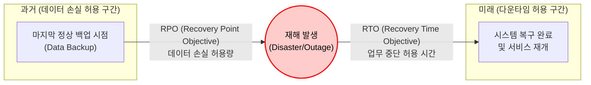

# DRP (Disaster Recovery Plan)

---

## I. 비즈니스 연속성 보장을 위한 핵심 전략, DRP의 개요

* **정의**: 지진, 화재, 사이버 테러 등 예기치 않은 재해나 시스템 장애 발생 시, 기업의 핵심 비즈니스 프로세스와 IT 시스템을 목표 시간(RTO)과 목표 시점(RPO) 내에 복구하기 위한 포괄적인 재해복구 계획
* **등장배경 및 특징**:
* **IT 의존도 심화 및 규제 강화**: 금융, 공공, 의료 등 전 산업에서 무중단 서비스 요구가 증대되고 규제(컴플라이언스)가 강화됨에 따라 필수적인 관리 체계로 대두됨
* **BIA(Business Impact Analysis) 기반 산정**: 업무 중단 시 발생할 수 있는 재무적, 비재무적 영향을 분석하여 최적의 복구 목표 지표(RTO, RPO)를 도출함
* **[[BCP]]의 하위 실행 계획**: 전사적 업무 연속성 계획(BCP) 중 IT 인프라 및 데이터 복구에 초점을 맞춘 기술적, 전술적 실행 방안임

---

## II. DRP의 핵심 지표(RTO, RPO) 및 구성 요소

### 가. RTO와 RPO의 개념도 및 복구 메커니즘

* RPO(목표 복구 시점)는 재해 발생 이전 시점 기준으로 "최근 데이터를 얼마나 잃을 수 있는가"를 의미하며, 백업 및 동기화 주기를 결정함.
* RTO(목표 복구 시간)는 재해 발생 이후 기준으로 "얼마나 빨리 복구되어야 하는가"를 의미하며, 대기 시스템 구성(Hot/Warm 등) 및 재난 대응 체계를 결정함.

### 나. DRP 수립을 위한 핵심 지표 및 구성 요소

| 구분 | 요소기술(키워드) | 세부 설명 |
| --- | --- | --- |
| **핵심 지표** | RTO (Recovery Time Objective) | 업무 중단 발생 시점부터 IT 시스템 및 서비스가 정상적으로 복구되어 가동될 때까지의 최대 허용 시간 |
| **핵심 지표** | RPO (Recovery Point Objective) | 재해로 인해 시스템이 중단되었을 때, 손실을 감수할 수 있는 데이터의 최대 허용 한계 (백업 시점) |
| **확장 지표** | RSO (Recovery Scope Objective) | 재해 발생 시 한정된 자원으로 우선 복구해야 할 핵심 업무 및 IT 시스템의 범위 및 우선순위 |
| **확장 지표** | RCO (Recovery Comm. Objective) | 재해 대응을 위한 내·외부 비상 연락망, 통신 수단 및 상황 전파 네트워크의 복구 목표 |
| **복구 센터 구축** | Hot Site (Active-Active/Standby) | 주 센터와 동일한 환경을 실시간 동기화 상태로 유지하여, 재해 시 수 분 이내(RTO ≒ 0)에 즉시 서비스 전환 |
| **복구 센터 구축** | Warm Site | 핵심 데이터는 실시간/주기적 백업하되, 장비 및 네트워크는 재해 시 활성화하여 수 시간~수일 내 복구 |
| **복구 센터 구축** | Cold Site | 복구 센터에 전력, 공조 등 기반 시설만 확보해 두고, 장비와 데이터는 재해 발생 시 조달하여 구성 (비용 최소화) |
| **선행 분석** | [[BIA (Business Impact Analysis)]] | DRP 수립 전, 업무 중단이 비즈니스에 미치는 재무적/운영적 파급 효과를 분석하여 RTO, RPO를 정량적으로 도출 |

---

## III. DRP와 BCP의 비교 및 최신 재해복구 동향

### 가. DRP와 BCP (Business Continuity Plan) 개념 비교

| 비교 항목 | DRP (Disaster Recovery Plan) | BCP (Business Continuity Plan) |
| --- | --- | --- |
| **핵심 목적** | IT 시스템 및 데이터의 **기술적 복구** | 기업 전체 비즈니스의 **연속성 유지** |
| **적용 범위** | IT 인프라, 애플리케이션, [[데이터베이스]] | 인력, 시설, 공급망, [[프로세스]] 등 전사적 조직 체계 |
| **성격 및 수준** | 전술적, 기술적, 운영적 지침 | 전략적, 관리적, 비즈니스 지향적 지침 |
| **주요 관리 지표** | RTO, RPO, RSO, RCO | MTPD(최대 허용 중단 시간), MBCO(최소 사업 연속성 목표) |
| **구현 솔루션** | [[DRaaS]], 클라우드 백업, 이중화 솔루션 | 전사 비상 대응 프로세스, 업무 대체 매뉴얼(Workaround) |

### 나. DRP의 최신 동향 및 향후 발전 전망

* **DRaaS (Disaster Recovery as a Service)의 확산**: 고비용의 원격지 물리적 복구 센터(On-Premise) 구축 대신, [[클라우드 컴퓨팅]] 환경을 활용하여 초기 투자비(CapEx) 없이 종량제(OpEx) 기반으로 신속하고 유연한 RTO/RPO를 보장하는 서비스형 재해복구로 전환 중임.
* **[[랜섬웨어]] 대응(Cyber DR) 체계 통합**: 기존의 물리적 재해 대응을 넘어, 악성코드 및 랜섬웨어로 인한 데이터 오염(원본 및 백업본 동시 감염)을 방어하기 위해 불변 스토리지(Immutable Storage)와 망이 완전히 분리된 **에어 갭(Air-Gap) 백업 아키텍처**를 DRP에 필수 요소로 내재화하고 있음.

---

### 🔗 연관 토픽

- **소속 도메인**: [[00_경영전략_MOC|📈 경영전략]]
- **세부 분류**: `1. 경영 환경 분석 & 전략 수립 프레임워크`
- **핵심 연관 토픽**:
  - [[BCP|BCP (Business Continuity Planning)]]
  - [[비즈니스 연속성 계획]]
  - [[DRaaS]]
  - [[BIA (Business Impact Analysis)]]
  - [[ISO 22301]]
