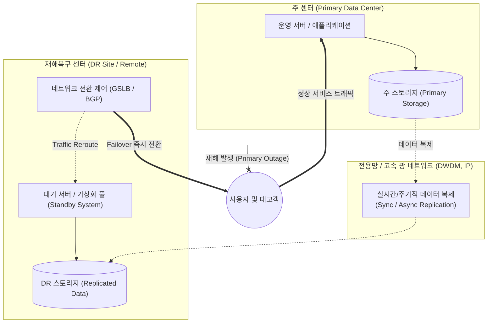

# DRS (Disaster Recovery System)

---

## I. 중단 없는 비즈니스 연속성 보장의 물리적·기술적 기반, DRS의 개요

* **정의**: 자연재해, 화재, 정전, 사이버 공격 등 예기치 못한 재해로 인해 주 전산센터(Primary Site)가 마비되었을 때, 핵심 업무 시스템을 신속하게 정상화하기 위해 원격지에 구축·운영하는 재해복구 시스템
* **등장배경 및 필요성**:
* **비즈니스 연속성 확보**: IT 인프라 다운타임에 따른 막대한 재무적 손실 및 기업 대외 신뢰도 실추 방지
* **컴플라이언스 준수**: 전자금융감독규정, [[개인정보보호법]] 등 법적 규제에 따른 재해복구센터 구축 및 연 1회 이상 모의훈련 의무화 충족

* **특징**: 물리적 원격지 분산 배치(지진/정전 등 동시 피해 방지), 데이터 실시간/비실시간 복제, RTO/RPO 지표 기반의 인프라 계층 설계

---

## II. DRS의 아키텍처 및 핵심 구성요소

### 가. DRS의 아키텍처 및 재해 대응 메커니즘

* 평상시에는 주 센터의 데이터를 고속 광통신망을 통해 원격지 DR 센터로 지속 복제(동기/비동기)하여 최신 상태를 유지함.
* 주 센터 재해 발생 시 GSLB 또는 라우팅([[BGP]]) 경로를 변경하여 DR 센터의 대기 시스템으로 트래픽을 즉각 전환(Failover)함으로써 업무 연속성을 유지함.

### 나. DRS의 핵심 구성 요소 및 기술

| 분류 | 요소기술(키워드) | 세부 설명 |
| --- | --- | --- |
| **복구 지표** | RTO / RPO | 비즈니스 영향 분석([[BIA (Business Impact Analysis)|BIA]])에 근거하여 설정된 목표 복구 시간(RTO)과 목표 복구 시점(RPO) |
| **데이터 복제** | 동기식 복제 (Sync) | 주 센터와 DR 센터 양쪽에 쓰기가 완료되어야 트랜잭션을 종료하는 방식으로 RPO=0 달성 (단거리 적합) |
| **데이터 복제** | 비동기식 복제 (Async) | 주 센터 쓰기 완료 후 백그라운드로 복제하여 거리 제약과 성능 저하를 극복하는 방식 (RPO > 0 발생 가능) |
| **스토리지 기술** | 스토리지 미러링 (SAN/[[NAS]]) | 컨트롤러 하드웨어 레벨에서 블록 단위로 데이터를 원격 복제하여 OS 부하를 원천 차단 |
| **스토리지 기술** | CDP (Continuous Data Protection) | 데이터의 모든 변경 이력을 실시간 로깅하여 장애 발생 직전의 임의 시점으로 정밀 롤백 지원 |
| **네트워크 제어** | GSLB (Global Server LB) | [[DNS(Domain Name System)|DNS]] 기반으로 주 센터 헬스체크 실패 시 클라이언트의 접근 요청을 원격지 DR 센터 IP로 자동 전환 |
| **[[가상화]]/전환** | 오케스트레이션 (Automation) | 사전에 정의된 런북(Runbook) 시나리오에 따라 VM 기동, IP 재할당, DB 마운트를 일괄 자동 수행 |
| **운영 및 검증** | DR 모의훈련 (Drill) | 실제 재해 상황을 가정한 무중단 모의훈련(Sandbox 격리망 테스트)을 정기 수행하여 정합성 검증 |

---

## III. DRS의 4대 구축 운영 형태 비교 및 발전 전망

### 가. DRS 4대 구축 운영 형태 비교

| 비교 항목 | Mirror Site | Hot Site | Warm Site | Cold Site |
| --- | --- | --- | --- | --- |
| **동기화 수준** | **실시간 동기화 (Active-Active)** | 실시간 백업 (Active-Standby) | 주기적/비동기 백업 | 주기적 소산 백업 (소프트웨어 미설치) |
| **RTO (복구 시간)** | **즉시 (RTO ≒ 0)** | 수 분 ~ 수 시간 이내 | 수 시간 ~ 수일 이내 | 수일 ~ 수주일 소요 |
| **RPO (손실 시점)** | **0 (RPO ≒ 0)** | 0에 수렴 | 최근 백업 시점 | 마지막 소산 백업 시점 |
| **구축/유지 비용** | **매우 높음** | 높음 | 보통 | 낮음 |
| **주요 적용 분야** | 증권/금융 결제, 핵심 관제 | 대기업 핵심 업무, 포털 | 일반 기업 ERP, 전산실 | 비핵심 지원 업무, 소규모 기관 |

### 나. DRS 최신 동향 및 향후 발전 전망

* **클라우드 기반 [[DRaaS]](Disaster Recovery as a Service) 전환**: 높은 초기 인프라 구축비(CapEx)가 소요되는 온프레미스 물리 센터 구축에서 벗어나, 평시 스토리지 비용만 지불하고 재해 시 클라우드 인스턴스를 탄력 프로비저닝하는 종량제(OpEx) 모델 확산
* **멀티 리전 Active-Active [[클라우드 네이티브]] 아키텍처**: 단순 주-보조(Active-Standby) 구조를 넘어 [[쿠버네티스]](K8s)와 분산 DB(Spanner, [[CockroachDB]] 등)를 활용하여 다중 리전 간 부하 분산과 무중단 자동 절체를 동시에 실현하는 아키텍처로 진화 중
* **사이버 회복력(Cyber Resilience) 중심의 에어 갭(Air-Gap) 강화**: [[랜섬웨어]] 등 악성코드에 의한 데이터 동시 오염을 방지하기 위해 네트워크를 물리적/논리적으로 격리하는 불변 스토리지(Immutable Storage)와 **에어 갭 백업 볼트(Vault)** 통합 필수화

---

### 🔗 연관 토픽

- **소속 도메인**: [[00_경영전략_MOC|📈 경영전략]]
- **세부 분류**: `3. 비즈니스 프로세스 혁신 & 디지털 전환 (DX)`
- **핵심 연관 토픽**:
  - [[DRaaS]]
  - [[BIA (Business Impact Analysis)]]
  - [[비즈니스 연속성 계획]]
  - [[가상화]]
  - [[쿠버네티스|쿠버네티스(Kubernates)]]
