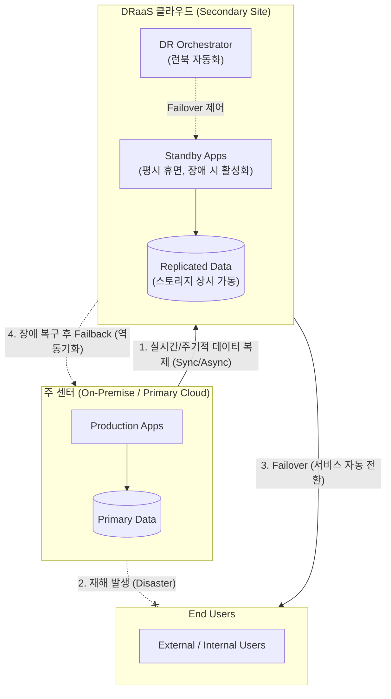

# DRaaS (Disaster Recovery as a Service)

---

## I. 클라우드 기반의 중단 없는 비즈니스 연속성 확보, DRaaS의 개요

* **정의**: 기업의 IT 인프라, 애플리케이션 및 데이터를 클라우드 서비스 제공자([[CSP]])의 인프라로 복제하여, 재해 발생 시 클라우드 환경에서 신속하게 시스템을 복구하고 서비스를 재개하는 클라우드 기반 재해복구(DR) 서비스
* **등장배경 및 특징**:
* **비용 효율성**: 물리적인 원격지 재해복구 센터(Secondary Site) 구축에 따른 초기 투자비용(CapEx) 부담을 종량제 기반의 운영비용(OpEx)으로 전환
* **신속한 비즈니스 영속성([[BCP]])**: 고도화된 복제 및 오케스트레이션 기술을 통해 강력한 RTO(복구목표시간) 및 RPO(복구목표시점) 달성
* **관리 및 테스트 유연성**: 전문가 그룹의 통합 관리 환경 제공 및 운영망에 영향을 주지 않는 상시 모의 훈련(Sandboxing) 지원

---

## II. DRaaS의 아키텍처 및 핵심 구성요소

### 가. DRaaS의 동작 개념도 및 페일오버 프로세스

* 평상시에는 주 센터의 데이터를 DRaaS 환경의 스토리지로 지속 복제(Replication)하여 보관함.
* 주 센터 재해 발생 시, DR 오케스트레이터가 [[클라우드 컴퓨팅]] 자원(VM 등)을 즉시 프로비저닝하여 대기 중인 애플리케이션을 가동(Failover)하고 사용자 트래픽을 우회시킴.

### 나. DRaaS의 핵심 기술 요소

| 분류 | 요소기술(키워드) | 세부 설명 |
| --- | --- | --- |
| **복구 목표** | RTO / RPO | 비즈니스 중요도([[BIA (Business Impact Analysis)|BIA]])에 따라 복구에 걸리는 허용 시간(RTO)과 데이터 손실 허용 시점(RPO) 정의 |
| **데이터 동기화** | Replication (데이터 복제) | 스토리지, 하이퍼바이저, OS 레벨에서 발생하는 I/O를 캡처하여 클라우드로 동기/비동기 전송 |
| **서비스 전환** | Failover / Failback | 주 센터 장애 시 클라우드 환경으로 서비스 전환(Failover), 주 센터 정상화 시 변경분 역동기화 후 복귀(Failback) |
| **자동화** | DR Orchestration | 사전에 정의된 재해복구 시나리오(Runbook)에 따라 네트워크 설정 변경, VM 기동 등을 자동 수행 |
| **데이터 보호** | CDP (지속 데이터 보호) | 스냅샷 기반이 아닌 블록 단위의 연속적인 데이터 백업을 통해 원하는 시점(초 단위)으로의 롤백 지원 |
| **인프라 자원** | Pay-as-you-go (종량제) | 평상시에는 스토리지 자원 비용만 지불하고, 재해 발생 시 기동되는 컴퓨팅 자원([[CPU]], Mem)에만 요금 부과 |
| **안정성 검증** | Non-disruptive Testing | 클라우드 내 독립된 가상 네트워크(Sandbox)를 생성하여, 운영 환경 무중단 상태로 재해복구 모의 훈련 수행 |
| **보안 체계** | Multi-Tenant Isolation | 퍼블릭 클라우드 환경에서 타 기업과의 자원, 네트워크, 데이터를 물리적/논리적으로 완벽히 격리 |

---

## III. 전통적 DR과 DRaaS의 비교 및 향후 발전 동향

### 가. 전통적 DR(On-Premise)과 DRaaS 비교

| 비교 항목 | 전통적 DR (Traditional DR) | DRaaS (Disaster Recovery as a Service) |
| --- | --- | --- |
| **구축 환경** | 자사 소유 또는 임대한 원격지 데이터센터 | AWS, Azure 등 퍼블릭/프라이빗 클라우드 인프라 |
| **비용 구조** | 높은 초기 구축비(CapEx) 및 [[유지보수]] 비용 | 구독형 종량제 모델 기반의 운영비(OpEx) |
| **확장성 및 유연성** | 물리적 장비 도입 필요(확장 소요 시간 장기화) | 즉각적인 스케일업/다운 가능 (탄력성 우수) |
| **유지 관리 주체** | 자사 IT 조직 전담 (인력 부담 큼) | CSP 및 MSP 전문가 집단 위탁 관리 |
| **복구 테스트** | 운영 서비스 영향도로 인해 테스트 주기가 김 | 샌드박스를 활용한 빈번하고 자동화된 테스트 용이 |

### 나. 한계 극복 및 최신 동향

* **[[랜섬웨어]] 방어 결합**: 단순 재해복구를 넘어, 랜섬웨어 감염 시 백업본까지 암호화되는 것을 막기 위해 불변 스토리지(Immutable Storage)와 **에어 갭(Air-Gapped)** 기술을 DRaaS 아키텍처에 기본 내장하는 추세임.
* **멀티/하이브리드 클라우드 DR**: 특정 CSP의 리전(Region) 단위 장애에 대비하여 온프레미스 자원을 다수의 퍼블릭 클라우드(Multi-Cloud)로 분산 복제하거나, 클라우드 워크로드 자체를 다른 클라우드로 페일오버하는 **C2C(Cloud-to-Cloud) DRaaS**로 진화 중임.

---

### 🔗 연관 토픽

- **소속 도메인**: [[00_경영전략_MOC|📈 경영전략]]
- **세부 분류**: `3. 비즈니스 프로세스 혁신 & 디지털 전환 (DX)`
- **핵심 연관 토픽**:
  - [[BCP|BCP (Business Continuity Planning)]]
  - [[BIA (Business Impact Analysis)]]
  - [[BCM|BCM (Business Continuity Management)]]
  - [[DRS (Disaster Recovery System)]]
  - [[CSP|CSP (Cloud Service Provider)]]
