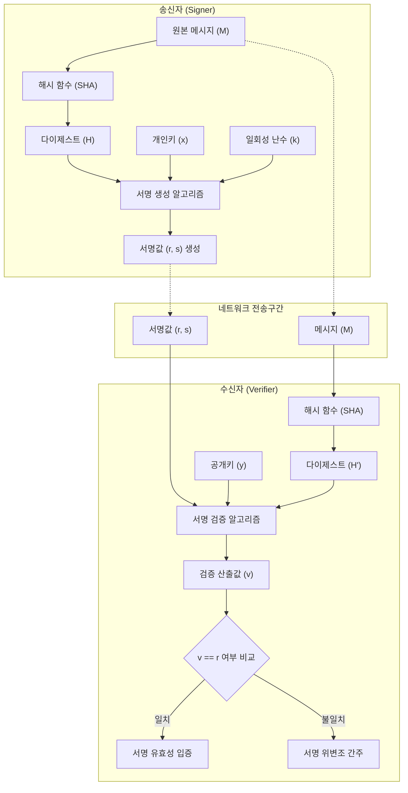

# DSA(Digital Signature Algorithm)

---

## I. 이산대수 기반의 국가 전자서명 표준, DSA의 개요

* **정의**: 이산대수 문제(Discrete Logarithm Problem)의 난해성을 수학적 기반으로 하여, 전자문서의 [[무결성]] 보장 및 송신자 인증을 제공하는 미국 NIST의 전자서명 표준 [[알고리즘]]([[FIPS (Federal Information Processing Standards)|FIPS]] 186)
* **필요성 및 특징**:
* **보안성 및 효율성**: ElGamal 전자서명 방식을 개선하여 서명 속도를 향상시키고 서명 데이터의 크기를 단축함
* **단일 목적성**: [[RSA (Rivest Shamir Adleman)|RSA]] 알고리즘과 달리 암호화나 키 교환에는 사용되지 않고 '전자서명' 용도로만 특화됨
* **비대칭 연산 속도**: 서명 생성 속도는 상대적으로 빠르나, 서명 검증 단계에서의 연산 부하가 더 큰 특성 보유

---

## II. DSA의 개념도 및 핵심 기술 요소

### 가. DSA의 개념도 및 동작 원리

* 송신자는 매번 고유한 난수(k)와 개인키(x)를 결합하여 서명(r, s)을 생성하고 메시지와 함께 전송함
* 수신자는 공개키(y)를 통해 산출한 검증값(v)이 수신된 서명값(r)과 일치하는지 비교하여 무결성 및 인증 수행

### 나. DSA의 핵심 기술 및 구성 요소

| 구분 | 요소기술(키워드) | 세부 설명 |
| --- | --- | --- |
| **수학적 기반** | 이산대수 문제 ([[DLP]]) | $y = g^x \mod p$ 구조에서 $y, g, p$를 알아도 개인키 $x$ 역산이 불가한 성질 활용 |
| **도메인 변수** | 글로벌 파라미터 (p, q, g) | 사용자 그룹 간 공유되는 소수(Prime Number) 및 생성자(Generator) 변수 |
| **키 관리** | 비대칭 키 쌍 (x, y) | 송신자가 기밀로 보관하는 서명용 개인키($x$) 및 외부에 배포하는 검증용 공개키($y$) |
| **무결성 보장** | 해시 함수 (SHA) | 메시지의 위변조 여부 확인을 위해 고정 길이의 안전한 다이제스트(Digest) 추출 |
| **보안 핵심** | 일회성 난수 (k) | 서명 생성 시마다 고유하게 발급되는 난수 (k값 유출 시 개인키 도출 위험 존재) |
| **서명 결과** | 서명 쌍 (r, s) | 난수와 도메인 변수로 $r$ 도출 후, 메시지 해시값과 개인키를 융합하여 $s$ 산출 |
| **서명 생성** | 서명 알고리즘 ($Sig$) | 원본 메시지(M), 개인키(x), 난수(k)를 입력받아 서명 결과물인 (r, s)를 출력하는 과정 |
| **서명 검증** | 검증 알고리즘 ($Ver$) | 수신된 (r, s), 메시지 해시, 공개키(y)로 검증값 $v$를 도출하고 $r$과의 동치성 검사 수행 |

---

## III. 주요 전자서명 알고리즘 비교 및 최근 동향

### 가. DSA와 유사 전자서명 알고리즘 비교

| 비교 항목 | DSA (Digital Signature Algorithm) | RSA (Rivest–Shamir–Adleman) | ECDSA (Elliptic Curve DSA) |
| --- | --- | --- | --- |
| **기반 알고리즘** | 이산대수 문제 (DLP) | 소인수분해 문제 (IFP) | 타원곡선 이산대수 문제 (ECDLP) |
| **주요 기능** | 전자서명 전용 | 전자서명, 데이터 [[암호화]], 키 교환 | 전자서명 전용 |
| **동작 속도** | 서명 생성 빠름, 서명 검증 느림 | 서명 생성 느림, 서명 검증 빠름 | 서명 생성 및 검증 모두 우수 |
| **키 길이(동일 보안성)** | 상대적으로 김 (예: 2048bit) | 상대적으로 김 (예: 2048bit) | 매우 짧음 (예: 224bit) (모바일 최적화) |
| **난수 의존성** | 난수(k) 사용 필수 (k 유출 시 치명적) | 서명 시 별도 난수 불필요 | 난수(k) 사용 필수 |

### 나. DSA의 향후 전망 및 최신 동향

* **표준 제정의 변화**: 미국 국립표준기술연구소(NIST)는 최신 **FIPS 186-5 (2023년 발간) 표준에서 신규 전자서명 생성 용도로 DSA 사용을 전면 중단(Deprecated) 권고**함
* **대체 알고리즘 전환**: 보안성 및 성능 한계 극복을 위해 효율성이 극대화된 **ECDSA**나, 부채널 공격에 강한 EdDSA(Edwards-curve Digital Signature Algorithm)로 산업 표준이 빠르게 마이그레이션 중임
* **레거시 검증 허용**: 기존에 DSA로 생성된 과거 전자문서의 유효성 유지를 위해, '서명 검증(Verification)' 용도로서의 사용은 제한적으로 허용 중임

---

### 🔗 연관 토픽

- **소속 도메인**: [[00_보안_MOC|🛡️ 보안]]
- **세부 분류**: `1. 정보보안 원칙 & 거버넌스 · 인증`
- **핵심 연관 토픽**:
  - [[암호화|암호화 (Encryption)]]
  - [[FIPS (Federal Information Processing Standards)]]
  - [[암호 알고리즘]]
  - [[비대칭키 암호화]]
  - [[쇼어 & 그루버 알고리즘]]
