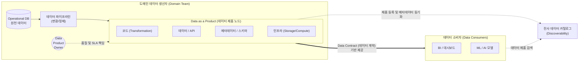

# DaaP (Data as a Product)

---

## I. 데이터 메쉬(Data Mesh)의 핵심 원칙, DaaP의 개요

* **가. DaaP(Data as a Product)의 정의**: 데이터를 단순한 시스템의 부산물(By-product)이 아닌 독립적인 비즈니스 가치를 지닌 '제품(Product)'으로 간주하여, 소비자의 경험(UX)과 신뢰성을 보장하도록 설계·배포·관리하는 분산형 데이터 관리 패러다임
* **나. DaaP의 등장배경 및 특징**:
* **등장배경**: 중앙집중식 데이터 레이크(Data Lake) 및 DW의 병목현상 발생, 파이프라인 유지보수로 인한 데이터 엔지니어의 피로도 증가, 데이터 사일로와 품질 저하 문제 해결 필요
* **특징**:
* **도메인 오너십 (Domain Ownership)**: 데이터 생성 도메인 팀이 직접 데이터 제품의 품질과 생명주기를 책임짐
* **사용자 중심 (Consumer-centric)**: 데이터 분석가, AI 모델러 등 소비자가 쉽게 데이터를 발견하고 이해할 수 있는 형태(API, 파일 등)로 제공
* **DATS 특성 보장**: 발견 가능(Discoverable), 접근 가능(Addressable), 신뢰 가능(Trustworthy), 자체 설명(Self-describing) 특성 확보

---

## II. DaaP의 아키텍처 개념도 및 핵심 기술 요소

### 가. DaaP의 내부 구성 요소 및 동작 개념도

* 데이터 제품(Data Product)은 단순한 데이터 셋을 넘어 데이터, 변환 코드, 메타데이터, 구동 인프라가 하나의 자율적인 논리적 단위로 결합된 구조임

### 나. DaaP의 핵심 기술 및 구성 요소

| 구분 | 핵심 기술(키워드) | 세부 설명 |
| --- | --- | --- |
| **제품 특성** | Discoverable (발견 가능성) | 데이터 카탈로그, 검색 엔진과 연동되어 소비자가 전사 내에서 필요한 데이터를 쉽게 검색 가능 |
| **제품 특성** | Trustworthy ([[신뢰성]]) | 데이터 품질 지표(Data [[SLA]]) 및 최신성(Freshness)을 명시하고 보장하여 소비자의 신뢰 확보 |
| **제품 특성** | Self-describing (자체 설명력) | 명확한 [[스키마]], 의미론적(Semantic) 정보, 샘플 데이터를 내장하여 관리자 개입 없이 해석 가능 |
| **제품 특성** | Interoperable (상호운용성) | 글로벌 표준 포맷(Parquet, [[JSON]] 등) 및 REST API 등을 사용하여 다른 도메인 데이터와 결합 용이 |
| **구현 요소** | Data Contract (데이터 계약) | 생산자와 소비자 간의 데이터 스키마, 품질, 제공 방식(SLA)에 대한 명시적이고 강제적인 합의 체계 |
| **구현 요소** | DataOps (데이터 옵스) | CI/CD 파이프라인, 자동화된 테스트를 통해 소프트웨어처럼 데이터 제품을 신속하고 안정적으로 배포 |
| **조직/역할** | Data Product Owner (DPO) | 데이터 제품의 생명주기를 관리하고 소비자 요구사항을 수집하여 제품 로드맵을 수립하는 전담 책임자 |
| **거버넌스** | Federated Computational Gov. | 도메인 자율성을 침해하지 않으면서, 전사 보안 및 상호운용성 표준을 코드로 자동 강제(Policy as Code) |

---

## III. 전통적 데이터 관리와 DaaP의 비교 및 향후 전망

### 가. 전통적 데이터 관리(Data as a By-product)와 DaaP의 비교

| 비교 항목 | 전통적 데이터 관리 (Data as a By-product) | Data as a Product (DaaP) |
| --- | --- | --- |
| **데이터의 관점** | 애플리케이션 운영의 **부산물(By-product)** | 비즈니스 가치를 창출하는 **독립적 제품(Product)** |
| **관리 및 소유 주체** | 중앙 집중형 데이터/IT 팀 (Centralized) | 데이터를 생성하는 **도메인 단위 교차 기능 팀** |
| **핵심 성공 지표(KPI)** | 파이프라인 안정성, 추출/변환 처리 건수 | 데이터 **소비자의 만족도, 제품 활용도(MAU/NPS)** |
| **품질 장애 대응** | 사후 복구 및 데이터 엔지니어의 수동 조치 | **데이터 계약(Data Contract)** 위반 시 파이프라인 차단 등 사전 통제 |
| **아키텍처 패러다임** | Data Warehouse, Data Lake (Monolithic) | Data Mesh 기반 분산형 아키텍처 (Decentralized) |

### 나. 향후 전망 및 기술 동향

* **데이터 계약(Data Contract)의 표준화 및 도구화 가속**: DaaP가 성공하기 위해 필수적인 생산자-소비자 간의 규약인 '데이터 계약'을 YAML/JSON 형태로 명세하고, 스키마 레지스트리와 연동하여 CI/CD 파이프라인에서 자동으로 검증하는 전용 솔루션(예: Data Contract CLI) 도입이 확산되고 있음
* **생성형 AI(GenAI) 파이프라인과의 결합**: [[초거대 언어 모델|LLM]] 애플리케이션(RAG 등)의 성능은 원천 데이터의 품질에 직결되므로, [[할루시네이션]](Hallucination)을 줄이고 고품질의 도메인 특화 데이터를 AI에 주입하기 위한 핵심 아키텍처로서 DaaP의 중요성이 급격히 부상하고 있음

---

### 🔗 연관 토픽

- **소속 도메인**: [[00_데이터베이스_MOC|🗄️ 데이터베이스]]
- **세부 분류**: `5. 분산 데이터베이스 & NoSQL & 대용량`
- **핵심 연관 토픽**:
  - [[스키마]]
  - [[할루시네이션|할루시네이션(Hallucination)]]
  - [[JSON]]
  - [[초거대 언어 모델|초거대 언어 모델(Large Language Model)]]
  - [[신뢰성]]
