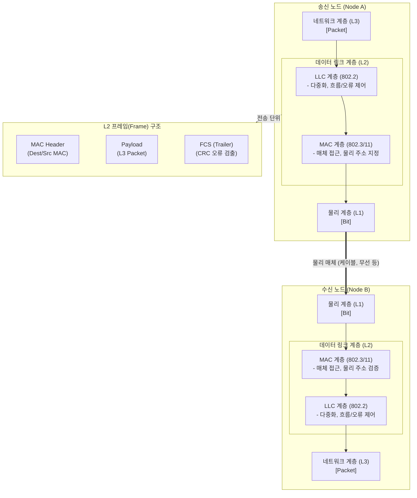

# 데이터 링크 계층 (Data Link Layer)

---

## I. 인접 노드 간 신뢰성 있는 데이터 전송을 보장하는, 데이터 링크 계층의 개요

* **가. [[데이터 링크 계층]](Data Link Layer)의 정의**: 개방형 시스템 간 상호 연결(OSI) 7계층 모델의 두 번째 계층으로, 물리 계층을 통해 인접한 두 통신 노드 간에 오류 없는 프레임(Frame) 전송을 보장하고 매체 접근을 제어하는 통신 계층
* **나. 데이터 링크 계층의 필요성 및 특징**:
* **필요성**: 물리적 전송 매체에서 발생하는 전기적 노이즈 및 오류(Error) 극복, 한정된 통신 매체의 효율적 공유 및 충돌 방지
* **특징**:
* **2개의 서브 계층**: 상위 계층과 인터페이스하는 LLC와 물리 매체 접근을 제어하는 [[MAC]]으로 분리(IEEE 802 표준)
* **[[물리 주소]] 지정**: MAC 주소(48비트 하드웨어 고유 주소)를 기반으로 목적지 노드를 식별하여 프레임 스위칭 수행
* **투명성 제공**: [[네트워크 계층]](L3)에 오류가 없는 가상의 [[신뢰성]] 있는 통신 링크를 제공

---

## II. 데이터 링크 계층의 개념도 및 핵심 기술 요소

### 가. 데이터 링크 계층의 아키텍처 및 동작 원리 개념도

* 송신 노드의 L2는 패킷에 MAC 헤더와 오류 검출용 트레일러(FCS)를 캡슐화하여 프레임을 생성하고, 수신 노드는 이를 역캡슐화하여 오류를 검증한 후 L3로 전달함

### 나. 데이터 링크 계층의 핵심 기술 및 구성 요소

| 구분 | 요소기술(키워드) | 세부 설명 |
| --- | --- | --- |
| **서브 계층** | LLC (Logical Link Control) | 네트워크 계층 [[프로토콜]] 식별([[다중화]]) 및 논리적 연결 유지, 흐름 제어, 오류 제어 담당 (IEEE 802.2) |
| **서브 계층** | MAC (Media Access Control) | 물리적 매체에 대한 접근 제어, MAC 주소 기반의 송수신지 식별 기능 수행 (IEEE 802.3, 802.11 등) |
| **핵심 기능** | Framing (프레이밍) | 비트 스트림을 의미 있는 데이터 블록인 프레임(Frame) 단위로 묶고 헤더와 트레일러를 부가 |
| **핵심 기능** | Error Control (오류 제어) | 프레임 손상 유무를 검출(Parity, Checksum, **[[CRC]]**)하고, 필요 시 재전송(ARQ)을 통해 오류 복구 |
| **핵심 기능** | Flow Control (흐름 제어) | 송신자와 수신자의 처리 속도 차이로 인한 프레임 손실을 막기 위해 전송량 조절 (Stop & Wait, Sliding Window) |
| **접근 제어** | [[CSMA CD|CSMA/CD]], [[CSMA CA|CSMA/CA]] | 공유 매체 환경에서 노드 간 프레임 전송 충돌을 방지/해결하기 위한 다중 접속 제어 기법 |
| **주요 장비** | L2 Switch ([[스위치 (Layer 3 Switch)|스위치]]) | MAC 주소 테이블(CAM Table)을 기반으로 수신된 프레임을 해당 목적지 포트로만 포워딩하여 충돌 도메인 분할 |
| **표준 프로토콜** | Ethernet, Wi-Fi, PPP | 유선 이더넷(802.3), 무선 랜(802.11) 및 점대점 통신([[Point-to-Point]] Protocol), HDLC 등 |

---

## III. 데이터 링크 계층과 네트워크 계층 비교 및 진화 동향

### 가. 데이터 링크 계층(L2)과 네트워크 계층(L3)의 핵심 비교

| 비교 항목 | 데이터 링크 계층 (L2 - Data Link) | 네트워크 계층 (L3 - Network) |
| --- | --- | --- |
| **전송 범위** | **인접한 노드(Node-to-Node) 간** 전송 (동일 LAN 내부) | **종단 간([[End-to-End]])** 라우팅 (서로 다른 네트워크 간) |
| **주소 체계** | 물리적 주소 (**MAC Address** - 48bit, 고정) | 논리적 주소 (**IP Address** - [[IPv4]]/[[IPv6]], 가변) |
| **데이터 전송 단위** | **Frame** (프레임) | **Packet** (패킷) 또는 Datagram |
| **핵심 동작** | Switching (스위칭, MAC 테이블 기반) | Routing (라우팅, 라우팅 테이블 기반) |
| **대표 장비** | L2 스위치, 브릿지, NIC(랜카드) | L3 스위치, [[라우터]](Router) |

### 나. 데이터 링크 계층의 최신 진화 동향

* **[[가상화]] 기반 L2 네트워킹 (Network Virtualization)**: 클라우드 환경의 확산으로 물리적인 L2 스위치를 대신하여, 하이퍼바이저 내부에 소프트웨어 형태로 구현된 가상 스위치(OVS: Open vSwitch)가 가상 머신 간의 L2 프레임 스위칭을 수행함
* **오버레이 네트워크(Overlay Network)로의 확장**: 물리적 L2 도메인의 한계(VLAN 4096개 제약 등)를 극복하기 위해, L3 IP 망 위에서 L2 프레임을 터널링([[캡슐화]])하여 전송하는 **VXLAN, GENEVE** 등의 기술이 데이터센터 네트워킹의 표준으로 자리잡음

---

### 🔗 연관 토픽

- **소속 도메인**: [[00_네트워크_MOC|🌐 네트워크]]
- **세부 분류**: `1. OSI 7계층 & 데이터링크 계층 (L1/L2)`
- **핵심 연관 토픽**:
  - [[프로토콜]]
  - [[라우터]]
  - [[스위치 (Layer 3 Switch)]]
  - [[네트워크 계층|네트워크 계층 (Network Layer)]]
  - [[IPv6]]
