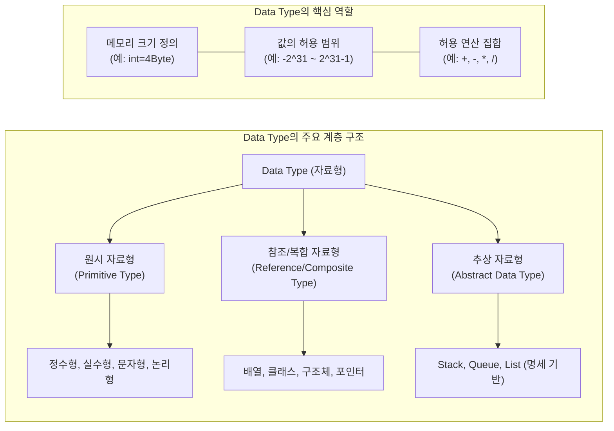

# Data Type (자료형)

---

## I. 안전한 메모리 할당과 연산의 기준, Data Type의 개요

* **가. Data Type(자료형)의 정의**: 프로그래밍 언어에서 변수나 상수가 가질 수 있는 값의 종류, 메모리 할당 크기, 그리고 해당 데이터에 적용할 수 있는 연산(Operation)의 집합을 정의한 분류 체계
* **나. Data Type의 필요성 및 특징**:
* **필요성**: 메모리 공간의 낭비 방지(효율적 할당), 부적절한 연산 시도 원천 차단(Type Checking), 코드의 가독성 및 유지보수성 향상
* **특징**:
* **해석의 기준**: 0과 1로 이루어진 동일한 바이너리 데이터를 정수, 실수, 또는 문자로 어떻게 해석할지 결정
* **타입 안전성(Type Safety)**: 자료형 위반 시 컴파일 에러 또는 런타임 에러를 발생시켜 프로그램의 예측 가능성 보장

---

## II. Data Type의 개념도 및 핵심 분류 체계

### 가. Data Type의 분류 및 역할 개념도

* 자료형은 시스템 수준에서 메모리 구조와 연산을 강제하며, 논리적 수준에서 원시, 참조, 추상 자료형으로 계층화되어 소프트웨어 설계를 지원함

### 나. Data Type의 핵심 기술 및 구성 요소

| 분류 | 요소기술(키워드) | 세부 설명 |
| --- | --- | --- |
| **원시 자료형** | 정수형 / 실수형 | `int`, `long`, `float`, `double` 등 숫자를 표현하며, 바이트 크기에 따라 표현 가능한 값의 범위가 엄격히 결정됨 |
| **원시 자료형** | 문자형 / 논리형 | `char`(ASCII/Unicode 인코딩 기반 문자), `boolean`(True/False 제어 로직) 등 단일 값 체계 |
| **참조 자료형** | 배열 (Array) | 동일한 데이터 타입을 메모리 상에 연속적으로 할당하여 인덱스를 통해 고속 접근하는 복합 자료형 |
| **참조 자료형** | [[클래스]] (Class) | 데이터(속성)와 이를 다루는 연산(메서드)을 캡슐화하여 사용자가 직접 정의하는 객체지향의 핵심 자료형 |
| **참조 자료형** | 포인터 (Pointer) | 실제 값이 아닌, 데이터가 저장된 메모리의 주소(Address)를 값으로 가지는 자료형 (C/C++ 등) |
| **논리 확장** | 추상 자료형 (ADT) | 데이터 구조의 '구현'은 숨기고, 수행 가능한 '연산의 명세(Interface)'만 수학적으로 정의한 자료형 |
| **타입 제어** | Type Casting | 크기가 작은 타입에서 큰 타입으로의 묵시적 형변환, 혹은 데이터 손실을 감수하는 명시적 형변환(강제 캐스팅) |
| **타입 제어** | Type Inference | `auto` (C++), `var` (Java)처럼 변수 초기화 시 컴파일러가 값의 형태를 분석하여 타입을 자동 추론하는 기법 |

---

## III. 데이터 타입 검사(Type Checking) 방식의 비교 및 최신 동향

### 가. 정적 타이핑(Static)과 동적 타이핑(Dynamic) 비교

| 비교 항목 | 정적 타이핑 (Static Typing) | 동적 타이핑 (Dynamic Typing) |
| --- | --- | --- |
| **검사 시점** | **컴파일 타임 (Compile-time)** | **런타임 (Run-time)** |
| **변수 선언** | 변수 선언 시 데이터 타입을 명시해야 함 | 데이터 타입 명시 없이 값 할당 시 타입 결정 |
| **장점** | 실행 전 타입 에러 조기 발견, 실행 속도 빠름 | 유연한 코딩 가능, 스크립트 작성 속도 빠름 |
| **단점 / 한계** | 코드 작성량이 많아지고 유연성이 상대적으로 낮음 | 실행 도중(Run-time) 예기치 않은 타입 에러(Crash) 발생 위험 |
| **대표 언어** | C, C++, Java, Go, Rust | Python, JavaScript, Ruby, PHP |

### 나. 향후 전망 및 기술 동향

* **점진적 타이핑(Gradual Typing)의 대세화**: JavaScript의 유연성에 정적 타입 시스템을 얹은 **TypeScript**의 폭발적 성장이나, Python의 Type Hints(`typing` 모듈) 도입처럼, 런타임 언어에 컴파일 타임의 타입 안전성을 결합하는 하이브리드 접근법이 현대 프로그래밍 언어의 표준 트렌드로 자리 잡음
* **메모리 안전성(Memory Safety) 보장 언어 부상**: C/C++의 포인터 및 타입 캐스팅 취약점을 노린 보안 사고가 급증함에 따라, 컴파일러 단에서 소유권(Ownership)과 엄격한 타입 체킹을 강제하여 메모리 누수와 데이터 레이스를 원천 차단하는 **Rust** 언어가 시스템 프로그래밍의 핵심으로 부상하고 있음

---

### 🔗 연관 토픽

- **소속 도메인**: [[00_컴퓨터구조_MOC|💻 컴퓨터구조]]
- **세부 분류**: `2. 캐시 & 메모리 계층 구조 · 스토리지`
- **핵심 연관 토픽**:
  - [[클래스]]
  - [[Int Type]]
  - [[변수]]
  - [[Boolean Type]]
  - [[빅오 표기법|빅오 표기법 (O-Notation)]]
