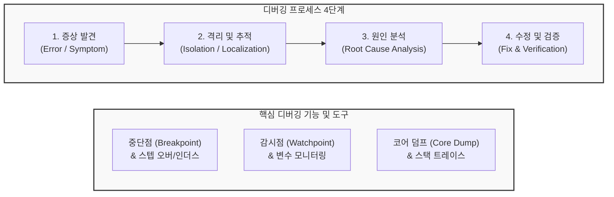

# Debugging (디버깅)

---

## I. 오류의 원인 추적 및 결함 제거 메커니즘, 디버깅의 개요

* **가. 디버깅(Debugging)의 정의**: 소프트웨어 또는 하드웨어 시스템에서 발생하는 예기치 않은 오작동, 결함(Bug), 또는 실패의 원인을 식별하고, 그 위치를 추적하여 코드를 수정하고 검증하는 체계적인 문제 해결 [[프로세스]]
* **나. 디버깅의 필요성 및 특징**:
* **필요성**: 소프트웨어 품질(Quality) 및 [[신뢰성]] 확보, 장애 복구 시간(MTTR) 단축, 시스템 운영 [[유지보수]] 비용 최소화
* **특징**:
* **테스팅과의 차별성**: 테스팅은 '오류의 발견(Detection)'에 초점을 맞추는 반면, 디버깅은 발견된 오류의 '근본 원인 규명 및 수정(Correction)'에 초점
* **비선형적 탐색**: 증상(Symptom)과 실제 원인(Root Cause)의 위치가 일치하지 않는 경우가 많아 높은 분석적 사고와 도구 활용 능력이 요구됨

---

## II. 디버깅의 프로세스 및 핵심 기술 요소

### 가. 디버깅 프로세스 및 주요 기법 개념도

* 디버깅은 시스템이 오작동하는 증상을 포착한 후, 실행 경로를 좁혀나가며 원인을 규명하고 코드를 수정한 뒤 재검증하는 순환 구조로 이루어짐

### 나. 디버깅의 핵심 기술 및 구성 요소

| 구분 | 요소기술(키워드) | 세부 설명 |
| --- | --- | --- |
| **실행 제어** | Breakpoint (중단점) | 지정한 소스코드 라인에 도달했을 때 프로그램의 실행을 일시 중지시키고 상태를 점검할 수 있는 기능 |
| **실행 제어** | Step Execution | 중지된 상태에서 코드를 한 줄씩 실행(Step Over)하거나 함수 내부로 진입(Step Into)하여 흐름 추적 |
| **변수 추적** | Watchpoint (감시점) | 특정 변수의 값이 변경되거나 읽힐 때 프로그램을 강제로 중지시켜 오염 경로를 역추적 |
| **장애 진단** | [[Stack]] Trace (스택 트레이스) | 예외 발생 시 함수가 호출된 역순의 경로(Call Stack)를 출력하여 에러 발생 지점 식별 |
| **장애 진단** | Core Dump (코어 덤프) | 프로세스가 비정상 종료(Crash)된 순간의 메모리 상태와 레지스트리 정보를 파일로 저장하여 사후 분석 지원 |
| **고급 기법** | TTD (Time-Travel Debugging) | 프로그램의 실행 과정을 역방향으로 기록(Record)하고 재생(Replay)하여 과거 시점으로 돌아가 원인 분석 |
| **원격 분석** | Remote Debugging | 로컬 개발 환경에서 네트워크를 통해 원격 서버나 클라우드/[[컨테이너]] 내부에서 실행 중인 프로세스 진단 |

---

## III. 전통적 디버깅과 최신 디버깅 트렌드 비교

### 가. 전통적 디버깅 기법과 최신 고급 디버깅 비교

| 비교 항목 | 전통적 디버깅 (Print / Local) | 최신 고급 디버깅 (AI / Time-Travel) |
| --- | --- | --- |
| **진단 방식** | `print()` 문 삽입 후 재빌드, 로컬 IDE 중단점 위주 | 기록 기반 역방향 재생(TTD), AI 자동 분석 |
| **재현성 문제** | 간헐적 버그(Heisenbug) 발생 시 원인 파악 불가 | 실행 기록(Trace)을 기반으로 언제든 동일 시점 재현 가능 |
| **분석 소요 시간** | 개발자의 직관과 수동 로그 분석에 의존하여 장시간 소요 | AI가 에러 로그와 소스코드를 매칭하여 원인 및 수정안 즉시 제시 |
| **적용 환경** | 단순 단일 프로세스 응용 프로그램 | 대규모 분산 마이크로서비스([[MSA (Micro Service Architecture)|MSA]]), [[클라우드 네이티브]] 환경 |

### 나. 향후 전망 및 기술 동향

* **생성형 AI 기반의 자동 디버깅 (AI-Driven Program Repair)**: 런타임 에러 로그와 스택 트레이스를 [[초거대 언어 모델|LLM]]이 실시간으로 분석하여, 개발자가 원인을 찾기 전에 취약점의 정확한 위치를 집어내고 패치 코드(Pull Request)까지 자동으로 생성해 주는 자율형 디버깅 에이전트 도입이 가속화됨
* **분산 트레이싱(Distributed Tracing)과의 융합**: 마이크로서비스 아키텍처(MSA) 환경에서 수십 개의 컨테이너를 거쳐 가는 요청의 흐름을 추적하기 위해, 단일 디버거를 넘어 OpenTelemetry 등 표준 기반의 분산 트레이싱 로그와 결합된 통합 관측성(Observability) 디버깅 체계가 표준으로 자리 잡음

---

### 🔗 연관 토픽

- **소속 도메인**: [[00_소프트웨어공학_MOC|🏗️ 소프트웨어공학]]
- **세부 분류**: `6. 소프트웨어 테스팅 & 품질 보증 (QA/QC)`
- **핵심 연관 토픽**:
  - [[프로세스]]
  - [[클라우드 네이티브]]
  - [[신뢰성]]
  - [[MSA (Micro Service Architecture)]]
  - [[컨테이너|컨테이너 (Container)]]
