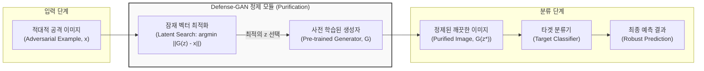

# Defense-GAN (적대적 공격 방어 프레임워크)

---

## I. 딥러닝 모델의 취약점 보완을 위한 정제 메커니즘, Defense-GAN의 개요

* **가. Defense-[[GAN (Generative Adversarial Network)|GAN]]의 정의**: [[딥러닝]] 분류 모델을 무력화하는 [[적대적 공격]](Adversarial Attacks)에 대응하기 위해, 정상 데이터의 분포(Manifold)를 사전에 학습한 GAN의 생성자(Generator)를 활용해 교란된 입력 이미지를 정상적인 이미지로 정제(Purification)한 뒤 분류기에 전달하는 전처리 기반 방어 [[프레임워크]]
* **나. Defense-GAN의 필요성 및 특징**:
* **필요성**: 기존 대표적 방어 기법인 적대적 학습(Adversarial Training)이 새로운 유형의 공격이나 미지의 교란에 취약한 한계를 극복하고, [[모델 구조]] 수정 없이 범용적으로 적용 가능한 방어 체계 필요
* **특징**:
* **분류기 독립성**: 기존에 학습된 타겟 분류기(Classifier)의 구조나 가중치를 전혀 변경하지 않고 전처리(Pre-processing) 단계에서 독립적으로 동작
* **매니폴드 투영(Projection)**: 적대적 변조가 가해진 입력 이미지를 정상 데이터가 존재하는 잠재 공간(Latent Space) 상의 가장 가까운 정상 이미지로 매핑
* **다양한 공격 대응**: 특정 공격 알고리즘에 국한되지 않고 화이트박스(White-box) 및 블랙박스(Black-box) 환경의 다양한 적대적 공격에 높은 강건성(Robustness) 제공

---

## II. Defense-GAN의 아키텍처 및 핵심 기술 요소

### 가. Defense-GAN의 정제 및 분류 프로세스 개념도

* 입력된 이미지가 적대적 교란을 포함하고 있더라도, Defense-GAN은 사전에 정상 데이터만 학습한 생성자의 잠재 공간에서 가장 오차가 적은 지점을 탐색하여 원본의 특징을 복원(Purification)한 뒤 분류기로 전달함

### 나. Defense-GAN의 핵심 기술 및 구성 요소

| 구분 | 요소기술(키워드) | 세부 설명 |
| --- | --- | --- |
| **사전 학습** | 정상 데이터 학습 (Normal Data) | 공격 대상 클래스의 정상적인 원본 이미지만을 사용하여 GAN의 생성자(Generator)를 미리 학습시킴 |
| **정제 핵심** | 잠재 벡터 최적화 (Latent Search) | 입력 이미지 $x$와 생성자가 만든 이미지 $G(z)$ 간의 유클리드 거리(Reconstruction Error)를 최소화하는 최적의 잠재 벡터 $z^*$를 경사 하강법 등으로 탐색 |
| **작동 원리** | 매니폴드 투영 (Projection) | 적대적 공격자가 미세하게 조작한 픽셀 노이즈는 정상 데이터의 매니폴드(Manifold) 바깥에 존재하므로, 생성자 공간으로 투영하는 과정에서 노이즈가 자연스럽게 제거됨 |
| **방어 대상** | 화이트박스 / 블랙박스 공격 | 공격자가 모델의 구조와 가중치를 완전히 알고 있는 화이트박스 환경의 그라디언트 기반 공격(FGSM, PGD 등) 방어에 탁월 |
| **제어 인자** | 재구성 반복 횟수 및 restart | 최적화 과정에서 지역 최솟값(Local Minimum)에 빠지는 것을 방지하기 위해 여러 개의 무작위 시작점(Random Restart)을 두어 최적의 복원 수행 |

---

## III. 전통적 적대적 학습과 Defense-GAN의 비교 및 최신 동향

### 가. 적대적 학습(Adversarial Training)과 Defense-GAN 비교

| 비교 항목 | 적대적 학습 (Adversarial Training) | Defense-GAN (생성 모델 기반 방어) |
| --- | --- | --- |
| **방어 메커니즘** | 학습 단계에서 적대적 예제를 미리 생성해 포함시켜 모델 자체의 내성 강화 | 추론(Inference) 단계에서 전처리를 통해 **입력 이미지를 정제(Purification)** |
| **분류기 수정 여부** | 분류기(Model)의 가중치 및 구조를 변경해야 함 | 분류기 수정 없이 **외부 전처리 모듈** 형태로 부착 가능 |
| **미지의 공격 대응** | 학습에 사용되지 않은 새로운 유형의 공격에 취약할 수 있음 | 정상 데이터의 분포만 학습하므로 **새로운 공격(Unseen Attacks)에도 상대적으로 강건** |
| **연산 오버헤드** | 학습(Training) 시점에 막대한 컴퓨팅 자원 소요 | 추론(Inference) 시점에 **잠재 벡터 최적화 연산으로 인해 응답 지연(Latency) 발생** |

### 나. 향후 전망 및 기술 동향

* **추론 속도 개선을 위한 인코더(Encoder) 결합형 구조**: Defense-GAN의 가장 큰 단점인 실시간 추론 시의 최적화 지연(Optimization Delay) 문제를 해결하기 위해, 역방향 인코더를 결합하여 최적화 과정 없이 단일 순전파(Single Forward Pass)로 즉시 정제를 수행하는 고속 변형 모델 연구 활성화
* **디퓨전 모델(Diffusion Models) 기반의 정제 프레임워크로의 진화**: GAN의 모드 붕괴 한계를 극복하고 이미지 복원 능력이 비약적으로 뛰어난 최신 디퓨전 모델의 노이즈 제거(Denoising) 프로세스를 적대적 방어 전처리에 접목하여, 고해상도 이미지와 복잡한 비전 태스크까지 방어 범위를 확장하는 추세임

---

### 🔗 연관 토픽

- **소속 도메인**: [[00_인공지능_MOC|🤖 인공지능]]
- **세부 분류**: `1. 수학 · 통계학 & 데이터 전처리`
- **핵심 연관 토픽**:
  - [[GAN (Generative Adversarial Network)]]
  - [[Diffusion 모델]]
  - [[딥러닝]]
  - [[이상치]]
  - [[결측치]]
