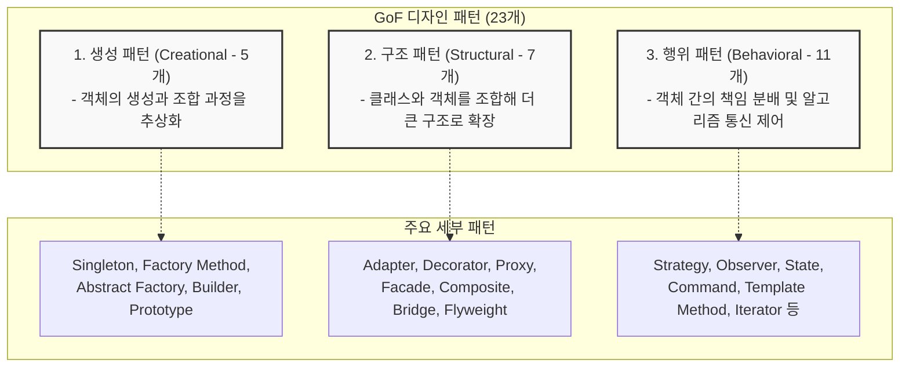

# Design Pattern (GoF 23개 디자인 패턴)

---

## I. 소프트웨어 재사용성과 유지보수성의 표준, 디자인 패턴의 개요

* **가. [[디자인 패턴]](Design Pattern)의 정의**: 소프트웨어 공학에서 반복적으로 발생하는 설계 상의 문제들을 해결하기 위해, 선행 연구자들이 검증한 모범적인 해법들을 [[클래스]], 객체 간의 관계 및 상호작용 방식으로 정리하여 재사용할 수 있도록 한 표준화된 설계 템플릿
* **나. 디자인 패턴의 필요성 및 특징**:
* **필요성**: 개발자 간의 원활한 소통 공통 언어 제공, 코드의 확장성 및 유연성 확보, [[결합도]](Coupling)는 낮추고 [[응집도]](Cohesion)는 높인 구조 설계
* **특징**:
* **GoF(Gang of Four) 분류**: 에리히 감마(Erich Gamma) 등 4인의 저자가 정립한 총 23개의 클래식 패턴이 표준으로 통용됨
* **3대 카테고리 분리**: 객체의 생성(Creational), 구조(Structural), 행위(Behavioral)의 3가지 목적에 따라 명확히 분류됨

---

## II. GoF 23개 디자인 패턴 분류 체계 및 핵심 아키텍처

### 가. 3대 영역별 디자인 패턴 구조도

* 소프트웨어 설계 목적에 따라 생성, 구조, 행위의 세 가지 축으로 나뉘며, 각 패턴은 [[객체지향]] 원칙(SOLID)을 현업 소스코드에 효과적으로 녹여내기 위한 구체적인 솔루션을 제공함

### 나. GoF 23대 디자인 패턴 상세 목록

| 카테고리 | 패턴 명칭 (Pattern Name) | 핵심 의도 및 주요 특징 |
| --- | --- | --- |
| **생성 패턴(Creational)총 5개** | **[[Singleton (전역 인스턴스)|Singleton]]** (싱글톤) | 클래스의 인스턴스가 오직 1개만 생성되도록 보장하고, 전역적인 접근점 제공 |
|  | **[[Factory Method (생성 위임)|Factory Method]]** (팩토리 메서드) | 객체 생성 코드를 서브클래스로 위임하여, 팩토리 클래스가 어떤 객체를 만들지 유연하게 결정 |
|  | **Abstract Factory** (추상 팩토리) | 서로 연관되거나 의존적인 객체들의 조합을 생성하는 인터페이스 제공 (구체적 클래스 격리) |
|  | **Builder** (빌더) | 복잡한 객체의 생성 과정과 표현 방식을 분리하여, 동일한 생성 절차로 서로 다른 표현 결과 구축 |
|  | **Prototype** (프로토타입) | 기존 객체를 복제(Clone)하여 새로운 객체를 생성함으로써 비용이 큰 초기화 과정 회피 |
| **구조 패턴(Structural)총 7개** | **Adapter** (어댑터) | 호환되지 않는 인터페이스를 가진 클래스들을 함께 사용할 수 있도록 중간 변환 레이어 제공 |
|  | **Decorator** (데코레이터) | 객체에 동적으로 새로운 책임(기능)을 추가할 수 있으며, 서브클래스 생성보다 유연한 확장 보장 |
|  | **Proxy** (프록시) | 실제 객체에 대한 접근을 제어하기 위해 대리인(Proxy) 객체를 두어 원격 제어, 지연 로딩 등 수행 |
|  | **Facade** (퍼사드) | 복잡한 서브시스템 집합에 대한 단순하고 통일된 단일 인터페이스 제공 |
|  | **Composite** (컴포짓) | 객체들을 트리 구조로 구성하여, 단일 객체와 복합 객체를 동일하게 다루도록 처리 |
|  | **Bridge** (브리지) | 구현부에서 추상층을 분리하여, 두 계층이 독립적으로 확장할 수 있도록 결합도 낮춤 |
|  | **Flyweight** (플라이웨이트) | 대량의 유사 객체 간에 공통 속성을 공유(Sharing)하여 메모리 사용량 극도로 절감 |
| **행위 패턴(Behavioral)총 11개** | **[[Strategy (알고리즘 교체)|Strategy]]** (전략) | 동일 계열의 알고리즘들을 정의하고, 각각을 캡슐화하여 런타임에 상호 교체 가능하게 유도 |
|  | **[[Observer (상태 변화 통지)|Observer]]** (옵저버) | 객체의 상태 변화를 관찰하는 옵저버 목록을 관리하여, 상태 변경 시 자동 통지 및 갱신 |
|  | **State** (상태) | 객체의 내부 상태에 따라 스스로 행동을 변경할 수 있도록 객체 지향적으로 상태 클래스화 |
|  | **Command** (커멘드) | 요청을 객체의 형태로 캡슐화하여 매개변수화, 요청 큐 저장, 로깅 및 취소(Undo) 기능 지원 |
|  | **Template Method** (템플릿 메서드) | 알고리즘의 뼈대를 상위 클래스에서 정의하고, 일부 단계를 서브클래스에서 재정의하도록 유도 |
|  | **Iterator** (이터레이터) | 내부 구조를 노출하지 않고 집합체 내의 모든 항목에 순차적으로 접근할 수 있는 인터페이스 제공 |
|  | **Chain of Responsibility** (책임 연쇄) | 요청을 처리할 수 있는 기회를 하나 이상의 객체에 부여하여, 수신자가 연결된 체인을 따라 전달 |
|  | **Mediator** (중재자) | 객체 간의 복잡한 통신을 캡슐화하는 중재 객체를 두어, 객체 간 직접 참조를 줄이고 느슨한 결합 유도 |
|  | **Memento** (메멘토) | 캡슐화를 위반하지 않고 객체의 내부 상태를 외부로 추출하여, 나중에 해당 상태로 복원 가능 |
|  | **Interpreter** (인터프리터) | 언어의 문법 표현과 이를 해석하는 인터프리터를 함께 정의하여 특정 언어 구문 처리 |
|  | **Visitor** (비지터) | 데이터 구조를 변경하지 않고 새로운 연산 기능을 클래스 외부에서 추가할 수 있도록 분리 |

---

## III. 디자인 패턴 적용 시 유의사항 및 최신 아키텍처 연계 동향

### 가. 디자인 패턴 적용의 Trade-off

* **과도한 설계(Over-engineering) 경계**: 단순한 비즈니스 로직에 불필요하게 복잡한 패턴을 도입할 경우, 코드의 가독성이 급격히 떨어지고 [[유지보수]] 오버헤드가 증가하므로 문제의 본질에 맞는 간결한 설계를 우선해야 함
* **SOLID 원칙과의 연계**: 모든 디자인 패턴의 근간은 객체지향 5대 원칙(SOLID)에 기반하고 있으므로, 패턴 암기보다는 각 패턴이 어떤 원칙(예: OCP, DIP)을 만족하기 위해 적용되는지 이해하는 것이 중요함

### 나. 향후 전망 및 기술 동향

* **[[프레임워크]] 및 [[클라우드 네이티브]] 환경으로의 흡수**: 현대적인 백엔드 프레임워크(Spring, .NET 등)와 마이크로서비스 아키텍처([[MSA (Micro Service Architecture)|MSA]])에서는 의존성 주입(DI), 제어의 역전(IoC), 그리고 메시징 기반 비동기 통신 등이 프레임워크 레벨에 내장되어 있어, 과거 개발자가 직접 구현하던 수많은 GoF 패턴(Factory, Strategy, Observer 등)이 프레임워크의 핵심 인프라 기저 기술로 자동 구현되고 있음

---

### 🔗 연관 토픽

- **소속 도메인**: [[00_소프트웨어공학_MOC|🏗️ 소프트웨어공학]]
- **세부 분류**: `4. 아키텍처 스타일 & 객체지향 설계 원리`
- **핵심 연관 토픽**:
  - [[프레임워크]]
  - [[MSA (Micro Service Architecture)]]
  - [[결합도]]
  - [[응집도]]
  - [[디자인 패턴|디자인 패턴 (Design Pattern)]]
