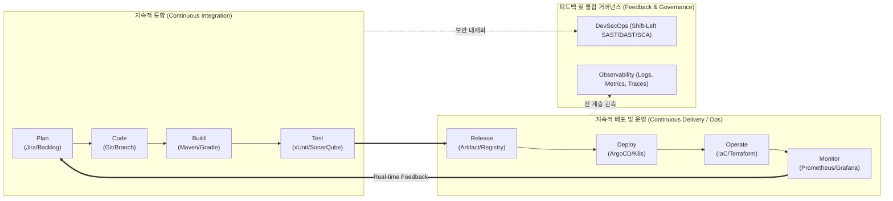

# 데브옵스 (DevOps)

## I. 개발-운영 사일로 해소 및 지속적 가치 전달, 데브옵스(DevOps)의 개요

### 가. 데브옵스(DevOps)의 정의

- 개발(Development)과 운영(Operations) 간의 장벽을 허물고, 기획·개발·테스트·배포·운영 전 단계를 단일 파이프라인으로 통합하여 소프트웨어 가치를 빠르고 안정적으로 지속 제공(Continuous Delivery)하는 **문화, 프랙티스 및 툴체인의 통합 체계**

### 나. 데브옵스의 필요성 및 핵심 특징

- **Time-to-Market 단축**: 시장 요구사항 및 비즈니스 피드백을 프로덕션 환경에 실시간 반영하기 위한 리드타임 최소화
- **릴리스 안정성 확보**: 대규모 일괄 배포 위험을 제거하고, 빈번한 소규모 배포를 통해 결함 격리 및 복구 시간(MTTR) 단축
- **핵심 특징**: CALMS [[프레임워크]](Culture, Automation, [[린 방법론|Lean]], Measurement, Sharing), 지속적 피드백 루프, 인프라 프로그래밍화

## II. 데브옵스의 개념도 및 핵심 기술 요소

### 가. 데브옵스의 인피니티 루프(Infinity Loop) 아키텍처 및 동작 원리

- 개발(Plan-Code-Build-Test)과 운영(Release-Deploy-Operate-Monitor)이 단절 없이 무한 루프로 순환하며, 모니터링을 통해 수집된 메트릭이 다시 기획/개발 단계로 환류되는 지속적 피드백 구조 형성

### 나. 데브옵스의 핵심 기술 및 구성 요소

| 구분            | 요소기술 (키워드)                          | 세부 설명                                                                                      |
| ------------- | ----------------------------------- | ------------------------------------------------------------------------------------------ |
| **문화/프레임워크**  | **CALMS 모델**                        | Culture(협업 문화), Automation(자동화), Lean(낭비 제거), Measurement(지표 측정), Sharing(지식 공유)의 5대 핵심 원칙 |
| **성과 측정 지표**  | **DORA Metrics**                    | 성숙도 측정을 위한 4대 지표: 배포 빈도(DF), 변경 리드타임(LT), 변경 실패율(CFR), 서비스 복구 시간(MTTR)                     |
| **지속적 통합**    | **CI (Continuous Integration)**     | [[형상 관리]](Git), 자동 빌드, 정적 코드 분석, 단위/[[통합 테스트]] 자동화를 통한 결함 조기 식별 체계 (Jenkins, GitHub Actions)       |
| **지속적 전달/배포** | **CD (Continuous Delivery/Deploy)** | [[무중단 배포]](Blue-Green, Canary, Rolling) 자동화 및 스테이징-프로덕션 환경으로의 무결격 릴리스 파이프라인 구축                 |
| **선언적 인프라**   | **IaC (Infrastructure as Code)**    | 인프라 상태를 코드로 정의·버전 관리하여 환경 일치성(Idempotency) 및 재현성 보장 (Terraform, Ansible, Pulumi)           |
| **선언적 배포 운영** | **GitOps**                          | Git 레포지토리를 시스템의 단일 진실 공급원(SSOT)으로 정의하고 클러스터 상태를 자동 동기화(Reconciliation) (ArgoCD, Flux)      |
| **보안 통합**     | **[[DevSecOps]] (Shift-Left)**          | 파이프라인 전 과정에 [[SAST]], [[DAST]], SCA 및 [[컨테이너]] 이미지 취약점 스캐닝을 내재화하여 배포 전 보안 결함 차단                        |
| **품질/가시성**    | **Full-[[Stack]] Observability**        | 단순 모니터링을 넘어 로그, 메트릭, 분산 추적(Tracing)의 3대 축(Telemetry)을 OpenTelemetry 기반으로 수집·상관 분석          |

## III. 데브옵스(DevOps) vs SRE 비교 및 최신 발전 동향

### 가. DevOps vs SRE (Site Reliability Engineering) 비교

|비교 항목|데브옵스 (DevOps)|[[SRE (Site Reliability Engineering)]]|
|---|---|---|
|**개념 정의**|조직 문화, 협업 철학 및 자동화 프랙티스|DevOps 철학을 소프트웨어 공학 기법으로 구현한 실천체|
|**핵심 관계**|원칙 및 인터페이스 정의 ("What to do")|인터페이스의 구체적 [[클래스]] 구현체 ("How to do")|
|**주요 초점**|릴리스 속도 향상, 지속적 배포 파이프라인|시스템 [[HA(High Availability)|가용성]], 복원력(Resilience), 대규모 분산 안정성|
|**지표 체계**|DORA Metrics (배포 빈도, 리드타임 등)|SLI(지표), SLO(목표), [[SLA]](협약), Error Budget(오류 예산)|
|**장애 처리 방식**|신속한 롤백, 피드백 루프 개선|오류 예산 소진 시 배포 중단, 포스트모템(Blameless) 수행|
|**반복 업무 관리**|도구 연동을 통한 파이프라인 자동화|토일(Toil, 수작업 운영 업무)을 업무 시간의 50% 이하로 통제|

### 나. 최신 기술 동향 및 진화 방향

- **플랫폼 엔지니어링(Platform Engineering)으로의 발전**: 데브옵스 확산에 따른 개발자의 인지 부하(Cognitive Load) 문제를 해결하기 위해 골든 패스(Golden Path) 기반 **내부 개발자 플랫폼(IDP, Internal Developer Platform)** 구축 확산
- **AIOps 및 [[LLMOps]] 결합**: 대규모 원격 측정 데이터 분석에 AI/머신러닝을 접목하여 장애 사전 예측, 배포 이상 자동 롤백, 생성형 AI 에이전트 기반의 코드 리뷰 및 파이프라인 자동 복구(Self-healing) 고도화 진행

---

### 🔗 연관 토픽

- **소속 도메인**: [[00_소프트웨어공학_MOC|🏗️ 소프트웨어공학]]
- **세부 분류**: `2. 애자일(Agile) & 지속적 통합/배포(CI/CD)`
- **핵심 연관 토픽**:
  - [[DevSecOps]]
  - [[형상 관리]]
  - [[린 방법론|린 (Lean) 방법론]]
  - [[SRE (Site Reliability Engineering)]]
  - [[리그레션 테스트|리그레션(회귀, Regression) 테스트]]
