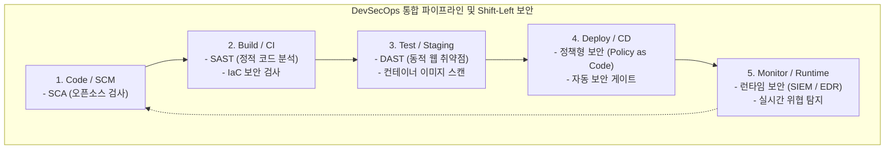

# DevSecOps (Development, Security, and Operations)

---

## I. 개발 초기 단계부터 보안을 내재화하는, DevSecOps의 개요

* **가. DevSecOps의 정의**: 기존 [[DevOps]] 파이프라인의 속도와 효율성에 보안(Security)을 전 과정에 걸쳐 통합하여, 소프트웨어 개발 초기 단계부터 보안을 고려하고 자동화된 보안 검증을 수행하는 개발 문화 및 방법론
* **나. DevSecOps의 필요성 및 특징**:
* **필요성**: 전통적인 개발 완료 후 사후 보안 검증(Gatekeeper 방식)으로 인한 배포 지연 및 비용 증가 해결, [[클라우드 네이티브]] 환경에서의 지능형 사이버 위협 선제적 차단
* **특징**:
* **Shift-Left Security (시프트 레프트)**: 보안 검증 시점을 개발 라이프사이클의 가장 앞단(코딩 및 빌드 단계)으로 앞당겨 취약점 조기 발견
* **보안 자동화 (Security Automation)**: CI/CD 파이프라인에 보안 스캐닝 도구를 연동하여 수동 개입 없이 상시 검증 수행
* **보안의 내재화 및 책임 공유**: 개발, 운영 팀뿐만 아니라 보안(Sec) 팀까지 하나의 유기적인 팀으로 결합하여 공동 책임 실현

---

## II. DevSecOps의 아키텍처 및 핵심 기술 요소

### 가. DevSecOps 파이프라인(Shift-Left) 통합 아키텍처 개념도

* 소프트웨어 개발 파이프라인의 각 단계(코드 작성, 빌드, 테스트, 배포, 운영)마다 적합한 자동화 보안 도구를 밀착시켜 결함을 실시간으로 차단함

### 나. DevSecOps의 핵심 기술 및 구성 요소

| 구분 | 요소기술(키워드) | 세부 설명 |
| --- | --- | --- |
| **코드 분석** | SCA (Software Composition Analysis) | 프로젝트에서 사용하는 외부 오픈소스 라이브러리의 알려진 취약점([[CVE]]) 및 라이선스 위반 검사 |
| **코드 분석** | [[SAST]] (Static Application Security Testing) | 소스코드에 대한 화이트박스 분석을 통해 [[SQL(Structured Query Language)|SQL]] 인젝션, [[XSS]] 등 코드 레벨의 잠재적 취약점 탐지 |
| **인프라 검사** | IaC Security (코드형 인프라 검사) | Terraform, Kubernetes 설정 파일 등의 보안 취약점과 권한 설정 오류를 배포 전에 사전 진단 |
| **실행 검사** | [[DAST]] / IAST | 실행 중인 애플리케이션의 블랙박스 동적 모의 공격 및 내부 에이전트 기반 실시간 취약점 추적 |
| **[[컨테이너]] 검사** | Container Image Scanning | 도커([[도커|Docker]]) 이미지 내부에 포함된 OS 패키지 및 바이너리 취약점을 빌드 시점에 스캔 |
| **정책 통제** | Policy as Code (OPA 등) | 보안 및 규정 준수 요건을 코드로 정의하고, CI/CD 파이프라인 단계에서 위반 시 배포를 자동 차단 |
| **운영 보안** | Runtime Application Self-Protection | 애플리케이션 내부에서 실행 중 발생하는 공격을 실시간으로 탐지하고 자체 방어(RASP) |

---

## III. 전통적 보안과 DevSecOps 비교 및 최신 동향

### 가. 전통적 보안(Gatekeeper)과 DevSecOps의 비교

| 비교 항목 | 전통적 보안 (Traditional Security) | DevSecOps (통합형 보안) |
| --- | --- | --- |
| **보안 검증 시점** | 개발 완료 후 **출시 직전(Release) 단계**에서 일괄 검증 | 개발 초기부터 배포, 운영까지 **전 과정에 걸쳐 상시 검증** |
| **조직 간 관계** | 개발팀과 보안팀이 분리되어 대립 관계 형성 (병목 유발) | 개발, 운영, 보안이 하나의 팀으로 융합된 **협업 문화** |
| **배포 속도** | 보안 검증 및 수동 승인으로 인해 배포 주기가 매우 느림 | 자동화된 보안 게이트를 통해 **속도를 저해하지 않는 빠른 배포** |
| **비용 및 영향도** | 제품 출시 직전 발견된 취약점 수정 비용이 천정부지로 솟음 | 개발 초기(Shift-Left)에 발견하므로 수정 비용과 리스크 최소화 |

### 나. 향후 전망 및 기술 동향

* **[[SBOM]] (Software Bill of Materials)의 의무화 및 자동화**: 소프트웨어 공급망(Supply Chain) 보안 강화를 위해 모든 구성 요소의 명세서를 작성하고 검증하는 SBOM 관리가 DevSecOps 파이프라인의 필수 기능으로 자리 잡음
* **생성형 AI 기반의 취약점 자동 패치 (AI-Powered Remediation)**: SAST/DAST 스캐너가 탐지한 복잡한 취약점 리포트를 [[초거대 언어 모델|LLM]]이 실시간 분석하여, 보안 엔지니어가 직접 코드를 수정하지 않아도 안전한 패치 코드를 자동으로 제안하고 적용하는 지능형 DevSecOps로 진화하고 있음

---

### 🔗 연관 토픽

- **소속 도메인**: [[00_보안_MOC|🛡️ 보안]]
- **세부 분류**: `6. 개인정보보호 & 프라이버시 강화 기술`
- **핵심 연관 토픽**:
  - [[DevOps|데브옵스 (DevOps)]]
  - [[SBOM]]
  - [[디지털 면역 시스템|디지털 면역 시스템(DIS, Digital Immune System)]]
  - [[DAST]]
  - [[정보보호제품 평가·인증 제도|정보보호제품 평가·인증(CC 평가·인증) 제도]]
