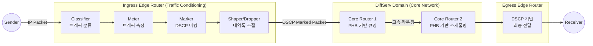

# DiffServ (Differentiated Services)

---

## I. 망의 확장성 한계를 극복한 QoS 제공 기술, DiffServ의 개요

* **정의**: 네트워크 트래픽을 사전에 정의된 [[클래스]](Class) 단위로 분류하고, IP 패킷 헤더의 DSCP(DiffServ Code Point) 값을 기반으로 차등화된 서비스 품질([[QoS]])을 제공하는 확장성 높은 트래픽 관리 기술
* **등장 배경**: RSVP [[프로토콜]] 기반의 IntServ(Integrated Services)는 개별 플로우(Flow)마다 상태를 관리하여 코어 라우터의 과부하 및 망 확장성(Scalability) 문제가 발생함에 따라, 이를 해결하기 위한 대안으로 등장
* **특징**:
* 역할 분담: 에지([[EDGE|Edge]]) 라우터는 분류 및 마킹 등 복잡한 연산을 담당하고, 코어(Core) 라우터는 단순 홉당 전달(PHB)만 수행
* 무상태성(Stateless): 코어 네트워크 라우터가 플로우에 대한 상태 정보를 유지할 필요가 없어 대규모 망 트래픽 처리에 적합

---

## II. DiffServ의 아키텍처 및 핵심 기술 요소

### 가. DiffServ의 동작 아키텍처 및 개념도

* Ingress Edge 라우터에서 트래픽을 분류/측정/마킹(Conditioning) 처리하여 네트워크로 유입시킴.
* Core 라우터는 복잡한 처리 없이 패킷 헤더의 DSCP 값만을 확인하여, 사전에 약속된 PHB(Per-Hop Behavior) 정책에 따라 패킷을 고속으로 전달(전송/폐기)함.

### 나. DiffServ의 핵심 기술 요소

| 분류 | 요소기술(키워드) | 세부 설명 |
| --- | --- | --- |
| **패킷 식별자** | DSCP (DS Code Point) | [[IPv4]]의 ToS(Type of Service) 필드 또는 [[IPv6]]의 Traffic Class 필드 중 6bit를 활용하여 총 64가지의 서비스 등급을 정의 |
| **라우팅 정책** | PHB (Per-Hop Behavior) | 코어 라우터에서 DSCP 값에 따라 패킷에 적용하는 홉 단위의 [[스케줄링]], 큐잉, 폐기 동작 기준 |
| **서비스 등급** | EF (Expedited Forwarding) | 지연 및 지터에 민감한 트래픽(VoIP, 화상회의 등)을 위해 대역폭을 1순위로 보장하는 최우선 전달 등급 |
| **서비스 등급** | AF (Assured Forwarding) | 트래픽을 4개의 클래스로 나누고, 클래스 내에서 3단계의 패킷 폐기 우선순위를 부여하여 차등화된 서비스 제공 (총 12개 등급) |
| **서비스 등급** | BE (Best Effort) | 별도의 품질 보장 없이 네트워크 자원에 여유가 있을 때 전송되는 기본(Default) 서비스 등급 |
| **컨디셔닝** | Classifier (분류기) | 유입되는 패킷의 헤더 정보(IP 주소, 포트, 프로토콜 등)를 검사하여 사전에 정의된 트래픽 클래스로 분류하는 역할 |
| **컨디셔닝** | Meter & Marker | 트래픽 프로파일에 따라 트래픽 양을 측정(Meter)하고, 결과에 따라 패킷 헤더에 적절한 DSCP 값을 마킹(Marker) |
| **컨디셔닝** | Shaper / Dropper | 허용된 대역폭을 초과하는 패킷을 버퍼에 저장하여 지연(Shaping)시키거나 완전히 폐기(Dropping)하여 트래픽 규제 |

---

## III. DiffServ와 IntServ 기술 비교 및 활용 동향

### 가. QoS 제공 방식 비교 (DiffServ vs IntServ)

| 비교 항목 | DiffServ (Differentiated Services) | [[IntServ (Integrated Services)]] |
| --- | --- | --- |
| **서비스 제공 단위** | **Class (유사 트래픽 그룹) 단위** | 개별 Flow 단위 ([[End-to-End]]) |
| **네트워크 제어 방식** | 패킷 헤더(DSCP) 마킹에 의한 우선순위 제어 | RSVP 프로토콜을 통한 사전 자원 예약 |
| **상태 정보 유지** | 유지 안 함 (Stateless, 코어 [[라우터]] 부하 최소화) | 모든 라우터가 [[세션]] 상태 유지 (Stateful) |
| **망 확장성(Scalability)** | **매우 우수** (초대규모 네트워크에 적합) | 낮음 (네트워크 규모 증가 시 라우터 오버헤드 급증) |
| **품질 보장 수준** | 상대적 품질 보장 (Soft QoS) | 절대적 품질 보장 (Hard QoS) |
| **주요 활용 분야** | 인터넷 [[백본망]], 기업용 대규모 WAN, 통신사 코어망 | 소규모 폐쇄망, 특정 고품질 실시간 방송망 |

### 나. 한계 극복 및 향후 전망

* **한계점**: DiffServ는 개별 노드에서의 홉당 동작(PHB)을 정의하므로, 종단 간(End-to-End) 절대적인 품질 보장 및 지연시간 확약에는 한계가 존재함.
* **향후 발전 동향**:
* 최근 5G/6G 및 클라우드 네트워크 인프라에서는 DiffServ를 기본 트래픽 관리 정책으로 채택함.
* 여기에 **[[SDN(Software Defined Network)|SDN]](Software Defined Networking)** 기반의 중앙 집중형 트래픽 엔지니어링 및 망 분할 기술인 [[네트워크 슬라이싱]](Network Slicing)을 결합하여, 확장성을 유지하면서도 종단 간 지연 시간 보장을 달성하는 하이브리드 QoS 형태로 진화하고 있음.

---

### 🔗 연관 토픽

- **소속 도메인**: [[00_네트워크_MOC|🌐 네트워크]]
- **세부 분류**: `1. OSI 7계층 & 데이터링크 계층 (L1/L2)`
- **핵심 연관 토픽**:
  - [[IPv4]]
  - [[IntServ (Integrated Services)]]
  - [[QoS|QoS (Quality of Service)]]
  - [[프로토콜]]
  - [[라우터]]
