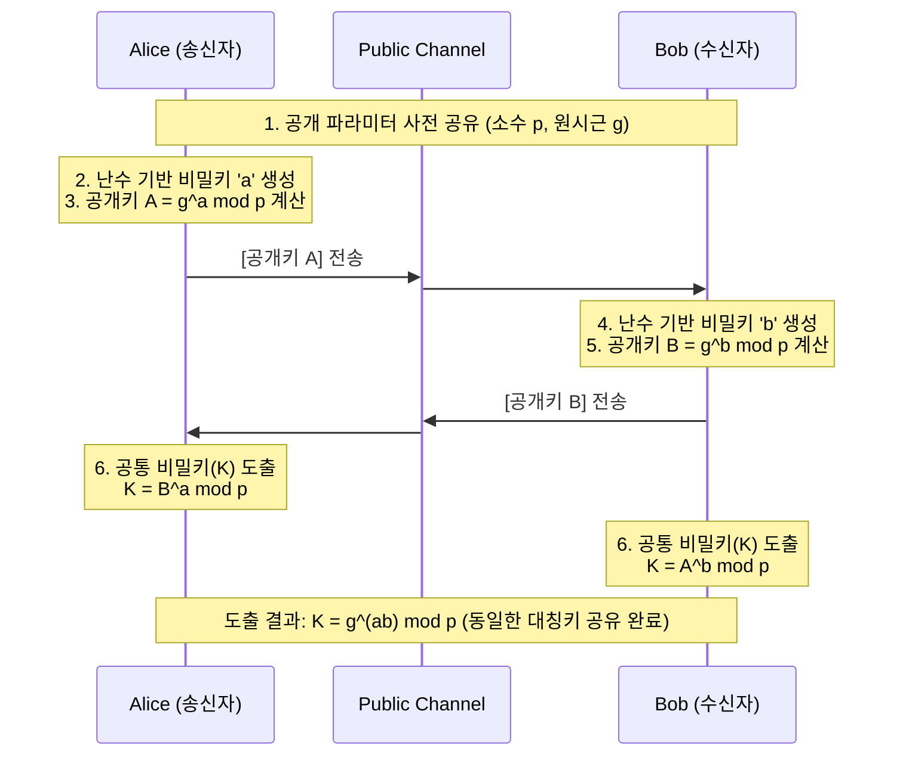

# Diffie-Hellman 키 교환 (Diffie-Hellman Key Exchange)

---

## I. 대칭키 분배 문제 해결을 위한, Diffie-Hellman 키 교환의 개요

* **정의**: 공개 채널 상에서 안전하게 대칭키를 공유하기 위해 이산 대수 문제(Discrete Logarithm Problem)의 계산적 난해성을 활용하는 공개키 기반의 키 합의(Key Agreement) [[알고리즘]]
* 최초의 공개키 [[암호화]] 개념을 제시한 알고리즘으로, 현대 암호 통신(TLS, [[IP Sec|IPsec]] 등)의 핵심 키 교환 방식으로 사용됨
* **특징 및 필요성**:
* 사전 공유 불필요: 통신 당사자 간 비밀키를 사전에 물리적/보안 채널로 공유할 필요가 없음
* 대칭키 분배 문제 해결: $O(n^2)$로 증가하는 대칭키 관리 문제 및 키 전달 과정의 노출 위험 원천 차단
* 인증 메커니즘 부재: 키를 교환하는 상대방의 신원을 확인하는 기능이 없어 중간자 공격(MITM)에 취약함

---

## II. Diffie-Hellman 키 교환의 동작 원리 및 핵심 기술 요소

### 가. Diffie-Hellman 키 교환의 개념도 및 동작 원리

* 양 종단(Alice, Bob)은 각자가 생성한 비밀키($a, b$)를 노출하지 않고, 공개키($A, B$)만을 교환함
* 수신한 상대방의 공개키와 자신의 비밀키를 각각 모듈러 지수 연산하여, 안전하게 동일한 공통 [[세션]] 키($K$)를 도출함

### 나. Diffie-Hellman 키 교환의 핵심 구성 요소

| 분류 | 요소기술(키워드) | 세부 설명 |
| --- | --- | --- |
| **수학적 기반** | 이산 대수 문제 ([[DLP]]) | $Y = g^X \bmod p$ 에서 $Y, g, p$를 알아도 지수 $X$를 구하기 매우 어려운 단방향 수학적 난제 |
| **공개 파라미터** | 큰 소수 ($p$) | 유한 필드(Finite Field)의 크기를 결정하는 큰 소수 (NIST 기준 2048-bit 이상 권장) |
| **공개 파라미터** | 원시근 ($g$) | 모듈러 연산 시 $1$부터 $p-1$까지의 모든 정수를 생성할 수 있는 생성자(Generator) |
| **개인 키(비밀값)** | 난수 $a, b$ | 통신 당사자 Alice와 Bob이 각각 독립적으로 생성하여 외부로 절대 유출하지 않는 비밀값 |
| **공개 키** | 교환값 $A, B$ | 각 당사자가 이산 대수 연산을 수행하여 공개 채널을 통해 서로에게 전송하는 값 |
| **공통 비밀키** | 세션 키 ($K$) | 양방향 통신 보안([[대칭키 암호화]])을 위해 최종적으로 합의된 암호화 키 ($K = g^{ab} \bmod p$) |
| **취약점** | 중간자 공격 (MITM) | 상대방 신원 인증 부재로 인해, 공격자가 통신 중간에서 공개키를 가로채고 변조하는 해킹 기법 |
| **발전 기술** | ECDH | 타원 곡선(Elliptic Curve) 암호를 적용하여 더 짧은 키 길이로 동일한 보안성을 제공하는 알고리즘 |

---

## III. Diffie-Hellman과 RSA 알고리즘의 비교 및 향후 동향

### 가. Diffie-Hellman과 RSA 알고리즘 비교

| 비교 항목 | Diffie-Hellman (DH) | [[RSA (Rivest Shamir Adleman)|RSA (Rivest-Shamir-Adleman)]] |
| --- | --- | --- |
| **수학적 기반** | 이산 대수 문제 (Discrete Logarithm) | 큰 수의 소인수 분해 문제 (Integer Factorization) |
| **주요 목적** | 대칭키 교환 및 합의 (Key Agreement) | 키 분배, 데이터 암호화, [[전자 서명]] 다목적 활용 |
| **키 도출 방식** | 양 종단이 파라미터를 교환하여 **공동 생성(합의)** | 송신자가 대칭키를 수신자의 공개키로 암호화하여 **전달** |
| **인증 메커니즘** | 자체 인증 기능 없음 (MITM 취약) | 개인키 기반의 전자 서명(Digital Signature) 가능 |
| **통신 방향성** | 실시간 양방향 통신을 통한 동적 키 생성 | 수신자 공개키만 알면 단방향 전달 가능 (비동기) |

### 나. 한계 극복 및 최신 보안 동향

* **인증 메커니즘 결합 (STS Protocol)**: 중간자 공격(MITM) 방어를 위해 DH 키 교환 과정에 RSA 전자 서명이나 PKI(공개키 기반 구조) 인증서를 결합하여 상호 신원을 검증하는 Station-to-Station [[프로토콜]] 적용
* **완전 순방향 비밀성 (PFS, Perfect Forward Secrecy) 보장**: 고정된 키를 쓰지 않고 통신 세션마다 새로운 난수(Ephemeral Key)를 생성하는 DHE(Diffie-Hellman Ephemeral) 방식 사용 의무화
* **경량화 및 표준화 ([[ECDHE]])**: TLS 1.3 표준에서는 성능 향상과 보안 강화를 위해 기존 RSA 키 교환을 폐기하고, 타원 곡선 기반의 임시 키 교환 방식인 ECDHE(Elliptic Curve Diffie-Hellman Ephemeral)를 기본 키 교환 메커니즘으로 채택함

---

### 🔗 연관 토픽

- **소속 도메인**: [[00_보안_MOC|🛡️ 보안]]
- **세부 분류**: `2. 현대 암호학 & 키 관리 · 전자서명`
- **핵심 연관 토픽**:
  - [[RSA (Rivest Shamir Adleman)]]
  - [[ECDHE]]
  - [[암호화|암호화 (Encryption)]]
  - [[IP Sec]]
  - [[대칭키 암호화]]
