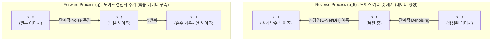

# Diffusion 모델 (Diffusion Model)

---

## I. 고품질 이미지 및 영상 생성의 핵심 기술, Diffusion 모델의 개요

* **정의**: 데이터에 점진적으로 가우시안 노이즈(Gaussian Noise)를 추가하는 정방향 과정과, 노이즈를 예측하여 제거하는 역방향 과정을 학습하여 완전히 새로운 고품질 데이터를 생성하는 확률 기반 생성형 [[인공지능]] 모델
* **등장 배경**: 기존 GAN(생성적 적대 신경망) 모델이 가진 학습 불안정성과 모드 붕괴(Mode Collapse) 문제를 극복하고, 고품질과 다양성을 모두 확보하기 위해 등장
* **특징**:
* 안정적 학습: 마르코프 체인(Markov Chain) 기반의 명시적 확률 모델을 사용하여 모드 붕괴 문제 해결
* 다양한 활용성: 텍스트 프롬프트를 조건으로 부여하여 이미지, 오디오, 3D 모델, 고해상도 비디오(Text-to-Video) 등 [[다형성]] 데이터 생성에 탁월함

---

## II. Diffusion 모델의 아키텍처 및 핵심 기술 요소

### 가. Diffusion 모델의 개념도 및 동작 원리

* **Forward Process (정방향)**: 원본 데이터($X_0$)에 미세한 가우시안 노이즈를 점진적으로 추가하여, 최종적으로 완전한 노이즈 상태($X_T$)로 만드는 마르코프 체인 과정
* **Reverse Process (역방향)**: 순수 노이즈($X_T$)에서 출발하여, 학습된 [[딥러닝]] 모델이 매 단계의 노이즈를 예측하고 제거(Denoising)함으로써 원본 데이터를 생성(복원)하는 과정

### 나. Diffusion 모델의 핵심 기술 요소

| 분류 | 요소기술(키워드) | 세부 설명 |
| --- | --- | --- |
| **수학적 [[프레임워크]]** | DDPM (Denoising Diffusion Probabilistic Models) | 확산 모델의 기반이 되는 확률론적 생성 프레임워크 (노이즈 추가 및 제거의 수학적 모델링) |
| **신경망 아키텍처** | U-Net / DiT | 이미지의 공간 정보를 유지하며 노이즈를 예측하는 딥러닝 구조 (최근 확장성이 뛰어난 Diffusion Transformer로 진화) |
| **연산 최적화** | 잠재 공간 (Latent Space) | 픽셀 차원이 아닌 압축된 잠재 공간에서 확산 과정을 수행하여 연산량 및 메모리를 획기적으로 절감 (Stable Diffusion) |
| **생성 제어** | CFG (Classifier-Free Guidance) | 별도의 분류기 없이 텍스트 조건(Condition)의 영향력을 조절하여 사용자 의도에 맞는 이미지 생성 유도 |
| **고속 샘플링** | DDIM / LCM | 기존 마르코프 체인의 느린 생성 속도를 개선하기 위한 비-마르코프 모델(DDIM) 및 잠재 일관성 모델(LCM) |
| **멀티모달 통합** | CLIP (Contrastive Language-Image Pretraining) | 텍스트 프롬프트와 이미지 간의 의미적 연결을 수행하여 텍스트 기반 조건부 생성 지원 |
| **학습 안정화** | Score Matching | 데이터 분포의 기울기(Score)를 추정하여 노이즈 모델을 학습시키는 SGM(Score-based Generative Model) 기법 |
| **평가 지표** | FID / IS | 생성된 데이터의 화질과 실제 데이터와의 유사도를 평가하는 FID(Fréchet Inception Distance) 및 다양성 평가(IS) |

---

## III. Diffusion 모델과 GAN의 비교 및 최신 동향

### 가. 생성 모델 간 핵심 비교 (Diffusion vs GAN)

| 비교 항목 | Diffusion 모델 | [[GAN (Generative Adversarial Network)]] |
| --- | --- | --- |
| **학습 메커니즘** | 점진적 노이즈 추가 및 Denoising 복원 | 생성자(Generator)와 판별자(Discriminator)의 적대적 경쟁 |
| **학습 안정성** | **매우 높음** (수학적 확률 분포 기반, 모드 붕괴 거의 없음) | 낮음 (생성자-판별자 균형 붕괴 시 학습 실패 확률 높음) |
| **생성 다양성** | 매우 우수함 (데이터 분포 전체를 학습) | 상대적으로 부족 (특정 샘플에 편향되는 모드 붕괴 발생 가능) |
| **생성 속도** | **느림** (수십~수백 단계의 순차적 반복 연산 필요) | 빠름 (단일 패스(One-pass) 연산으로 즉각적 생성) |
| **주요 모델** | Stable Diffusion, Midjourney, DALL-E 3, Sora | StyleGAN, CycleGAN, StarGAN |

### 나. 최신 동향 및 향후 전망

* **아키텍처의 패러다임 전환 (DiT)**: 기존 U-Net 구조의 한계를 넘어, 대규모 스케일링이 용이한 **DiT(Diffusion Transformer)** 아키텍처(Sora, Stable Diffusion 3 적용)로 발전하여 텍스트-이미지-영상의 통합 이해도 상승
* **시공간 영상 생성 (Text-to-Video)**: 이미지 생성을 넘어 프레임 간 일관성과 물리 법칙을 모사하는 동영상 생성 모델(OpenAI Sora 등)로 진화하며 엔터테인먼트, [[메타버스]] 산업의 파괴적 혁신 주도
* **실시간 생성 기술 (Real-time Generation)**: Diffusion의 최대 단점인 느린 추론 속도를 극복하기 위해 LCM(Latent Consistency Models), Turbo 모델 등 1~4 스텝 만에 고품질 결과물을 얻어내는 최적화 기술 상용화 중

---

### 🔗 연관 토픽

- **소속 도메인**: [[00_인공지능_MOC|🤖 인공지능]]
- **세부 분류**: `1. 수학 · 통계학 & 데이터 전처리`
- **핵심 연관 토픽**:
  - [[GAN (Generative Adversarial Network)]]
  - [[인공지능]]
  - [[이상치]]
  - [[Defense GAN]]
  - [[딥러닝]]
