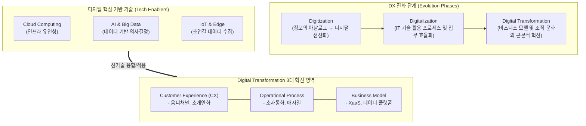

# 디지털 트랜스포메이션 (Digital Transformation, DX)

---

## I. 단순 기술 도입을 넘어선 비즈니스 근본적 혁신, 디지털 트랜스포메이션의 개요

* **정의**: 기업의 모든 영역에 클라우드, AI, 빅데이터 등 디지털 신기술을 적용하여, 기존의 전통적인 비즈니스 모델, [[프로세스]], 고객 경험 및 조직 문화를 근본적으로 변화시키는 파괴적 혁신(Disruptive Innovation) 전략
* **등장배경 및 필요성**:
* 비즈니스 환경 변화: 불확실성(VUCA) 증대 및 초연결/초지능 4차 산업혁명 시대 도래
* 경쟁 패러다임 전환: Tech Giant 중심의 파괴적 경쟁자 등장 및 플랫폼 경제 가속화
* 고객 기여도 변화: 디지털 네이티브 세대의 등장에 따른 개인화된 고객 경험(CX) 혁신 요구 증대

---

## II. 디지털 트랜스포메이션의 개념도 및 핵심 구성요소

### 가. 디지털 트랜스포메이션의 개념도 및 진화 단계

* IT 기반 구축(Digitization)과 프로세스 개선(Digitalization)을 넘어, 기반 기술(Cloud, AI, IoT)을 활용해 비즈니스 모델과 고객 경험을 재창조하는 최종 진화 단계임

### 나. 디지털 트랜스포메이션의 핵심 구성요소

| 구분 | 요소기술(키워드) | 세부 설명 |
| --- | --- | --- |
| **비즈니스 혁신** | [[XaaS]] (Everything as a Service) | 제품의 소유에서 서비스 구독형(Servitization)으로 비즈니스 모델 전환 |
| **비즈니스 혁신** | 옴니 채널 (Omni-Channel) | 온·오프라인의 경계 없이 고객에게 끊김 없는(Seamless) 일관된 경험 제공 |
| **프로세스 혁신** | 하이퍼오토메이션 (Hyperautomation) | RPA, AI, Process Mining을 결합한 엔드투엔드([[End-to-End]]) 업무 프로세스 초자동화 |
| **조직/문화 혁신** | 애자일 & 데브옵스 ([[Agile]] & [[DevOps]]) | 시장 변화에 신속하게 대응하기 위한 수평적 조직 문화 및 CI/CD 기반 빠른 서비스 배포 |
| **기반 기술(Tech)** | [[클라우드 네이티브]] (Cloud Native) | [[MSA (Micro Service Architecture)|MSA]], [[컨테이너]] 기반으로 IT 인프라의 확장성(Scalability)과 유연성 확보 |
| **기반 기술(Tech)** | 빅데이터 & [[인공지능]] (AI) | 데이터 레이크(Data Lake) 기반 통합 분석 및 AI 추론을 통한 데이터 기반 의사결정(DDDM) |
| **기반 기술(Tech)** | 사물인터넷 (AIoT) | 센서 기반 실시간 데이터 수집 및 AI 융합을 통한 지능형 기기 제어 |
| **기반 기술(Tech)** | [[디지털 트윈|디지털 트윈 (Digital Twin)]] | 현실 세계를 가상 공간에 복제하여 시뮬레이션을 통한 최적화 및 선제적 위험 예측 |

---

## III. DX 관련 개념 비교 및 향후 전망

### 가. 기술 발전 수준에 따른 개념 비교 (Digitization vs Digitalization vs DX)

| 비교 항목 | Digitization (전산화) | Digitalization (디지털화) | Digital Transformation (디지털 트랜스포메이션) |
| --- | --- | --- | --- |
| **핵심 목적** | 정보의 형태 변환 (아날로그 → 디지털) | 비즈니스 프로세스 개선 및 운영 효율화 | 비즈니스 모델 창출 및 조직 문화 근본적 혁신 |
| **주요 대상** | 종이 문서, 수기 데이터 | 기존 업무 프로세스, 부서 단위 시스템 | 기업 전사 조직, 생태계, 고객 경험(CX) |
| **대표 사례** | 문서 스캐닝, 바코드 도입 | ERP, [[CRM]], 자동화 시스템 도입 | 넷플릭스(구독 모델), GE(Predix 플랫폼) |
| **비즈니스 파급력** | 낮음 (단순 인프라 구축) | 중간 (비용 절감, 속도 향상) | **매우 높음 (새로운 가치 및 수익 창출)** |

### 나. 향후 전망 및 성공 전략

* **AX([[AX (AI Transformation)|AI Transformation]])로의 진화**: 기존 클라우드와 데이터 중심의 DX 체계 위에 생성형 AI(Generative AI)를 접목하여, 인간의 개입을 최소화하는 자율적 비즈니스 환경(Agentic AI)인 AX로 패러다임 전환 중
* **트윈 트랜스포메이션 (Twin Transition)**: [[디지털 전환]](DX)과 친환경/탄소중립 전환(Green Transformation, GX)을 동시에 추진하여 지속 가능한 [[ESG 경영]] 실현 필수
* **성공 전략**: 기술(Technology) 도입에만 매몰되지 않고, C-Level 중심의 강력한 리더십 기반으로 전사적 변화 관리(Change Management) 및 디지털 리터러시(Digital Literacy) 내재화가 반드시 병행되어야 함

---

### 🔗 연관 토픽

- **소속 도메인**: [[00_디지털서비스_MOC|🚀 디지털서비스]]
- **세부 분류**: `1. 클라우드 컴퓨팅 & 가상화 인프라`
- **핵심 연관 토픽**:
  - [[디지털 전환|디지털 전환(DX)]]
  - [[AX (AI Transformation)]]
  - [[클라우드 네이티브]]
  - [[컨테이너|컨테이너 (Container)]]
  - [[XaaS|XaaS(Everything as a Service)]]
