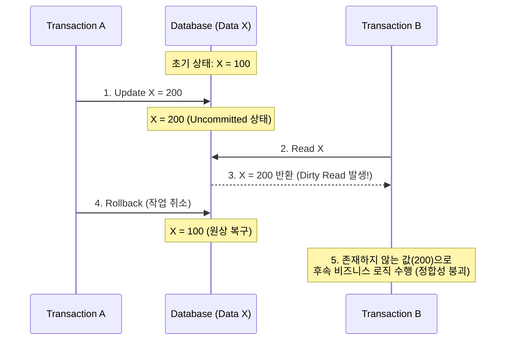

# Dirty Read

---

## I. 커밋되지 않은 데이터 참조로 인한 트랜잭션 무결성 위협 현상, Dirty Read의 개요

* **정의**: 다중 [[트랜잭션]] 동시성 제어 환경에서, 특정 트랜잭션이 다른 트랜잭션이 변경 후 **아직 커밋(Commit)하지 않은 임시 데이터를 읽어오는** [[데이터베이스]] 이상([[Anomaly(이상현상)|Anomaly]]) 현상
* **발생 배경 및 특징**:
* 성능 향상을 위해 트랜잭션 격리 수준([[Isolation Level (격리 레벨고립성 수준)|Isolation Level]])을 가장 낮게 설정(`READ UNCOMMITTED`)할 때 발생
* 데이터 변경 트랜잭션이 정상 커밋되지 않고 롤백(Rollback)될 경우, 무효화된 데이터를 기반으로 연산을 수행하여 **데이터 정합성 파괴** 및 **연쇄 롤백(Cascading Rollback)** 유발

---

## II. Dirty Read의 발생 메커니즘 및 해결을 위한 핵심 요소

### 가. Dirty Read의 동작 개념도 및 발생 원리

* 트랜잭션 A가 업데이트한 후 커밋하지 않은 값을 트랜잭션 B가 읽어(Dirty Read) 감
* 이후 트랜잭션 A가 롤백을 수행하면, 트랜잭션 B는 데이터베이스에 존재한 적 없는 논리적 오류 값을 획득하게 됨

### 나. Dirty Read 관련 핵심 기술 및 방지 요소

| 분류 | 요소기술(키워드) | 세부 설명 |
| --- | --- | --- |
| **발생 원인** | Read Uncommitted | ANSI [[SQL(Structured Query Language)|SQL]]-92 기준 가장 낮은 격리 수준, Lock 획득 없이 데이터 읽기 허용 |
| **이상 현상** | 연쇄 롤백 (Cascading Rollback) | Dirty Read 데이터를 참조한 종속 트랜잭션들이 연쇄적으로 롤백되어야 하는 문제 |
| **보안/[[무결성]]** | ACID 원칙 위반 | 트랜잭션의 특성 중 고립성(Isolation)과 일관성(Consistency) 원칙을 심각하게 훼손 |
| **해결 기법 (Lock)** | 배타적 잠금 (Exclusive Lock) | 데이터 변경 시 Lock을 걸고, Commit/Rollback 전까지 타 트랜잭션의 읽기(Shared Lock) 차단 |
| **해결 기법 (격리)** | Read Committed | 커밋이 완료된 데이터만 읽을 수 있도록 허용하는 격리 수준 (오라클, SQL Server 기본값) |
| **최신 제어 방식** | MVCC (다중버전 동시성 제어) | Lock 대신 Undo 레코드(과거 버전)를 참조하게 하여, 대기 없이 일관된 읽기(Consistent Read) 제공 |
| **제어 메커니즘** | Undo Segment (Rollback Segment) | 커밋 전 데이터를 저장해 두는 영역, MVCC 환경에서 Dirty Read를 방지하기 위해 원본 값 제공 |
| **성능 고려사항** | Concurrency vs Consistency | 엄격한 격리 수준은 Dirty Read를 방지하나 동시성이 저하되므로, 비즈니스 요구에 따른 트레이드오프 조정 필요 |

---

## III. Dirty Read와 주요 트랜잭션 이상 현상 비교 및 고려사항

### 가. ANSI SQL-92 기준 트랜잭션 이상(Anomaly) 현상 비교

| 비교 항목 | Dirty Read (오독) | Non-Repeatable Read (반복 불가능 읽기) | [[Phantom Read]] (유령 읽기) |
| --- | --- | --- | --- |
| **현상 요약** | 커밋되지 않은 데이터 읽기 | 동일 쿼리 반복 시 값이 변경됨 (Update) | 동일 쿼리 반복 시 행(Row)이 추가/삭제됨 (Insert/Delete) |
| **발생 원인** | `UPDATE` 진행 중인 임시 값 참조 | 트랜잭션 도중 타 트랜잭션의 `UPDATE` 커밋 | 트랜잭션 도중 타 트랜잭션의 `INSERT` 커밋 |
| **최소 방어 격리 수준** | `READ COMMITTED` | `REPEATABLE READ` | `SERIALIZABLE` |
| **데이터 보호 대상** | 변경 중인 데이터 자체 | 읽어 들인 특정 레코드 (Row Lock) | 조회 범위 전체 (Range Lock, Gap Lock) |

### 나. 실무 적용 시 고려사항

* **성능과 데이터 정합성의 조율**: Dirty Read 방지를 위해 무조건 높은 격리 수준(Serializable 등)을 적용하면 데드락(Deadlock) 및 대기 시간(Lock Contention)이 급증함
* **MVCC 아키텍처 적극 활용**: 최근 MySQL(InnoDB), PostgreSQL 등 주요 [[DBMS]]는 MVCC 기반의 `REPEATABLE READ` 또는 `READ COMMITTED`를 기본 채택하여, 읽기 작업 시 Lock을 사용하지 않고도 Dirty Read를 원천 차단하면서 동시성을 극대화하고 있음

---

### 🔗 연관 토픽

- **소속 도메인**: [[00_데이터베이스_MOC|🗄️ 데이터베이스]]
- **세부 분류**: `2. 트랜잭션 & 동시성 제어 (Concurrency)`
- **핵심 연관 토픽**:
  - [[Phantom Read]]
  - [[Isolation Level (격리 레벨고립성 수준)]]
  - [[무결성]]
  - [[트랜잭션]]
  - [[고립화 수준]]
