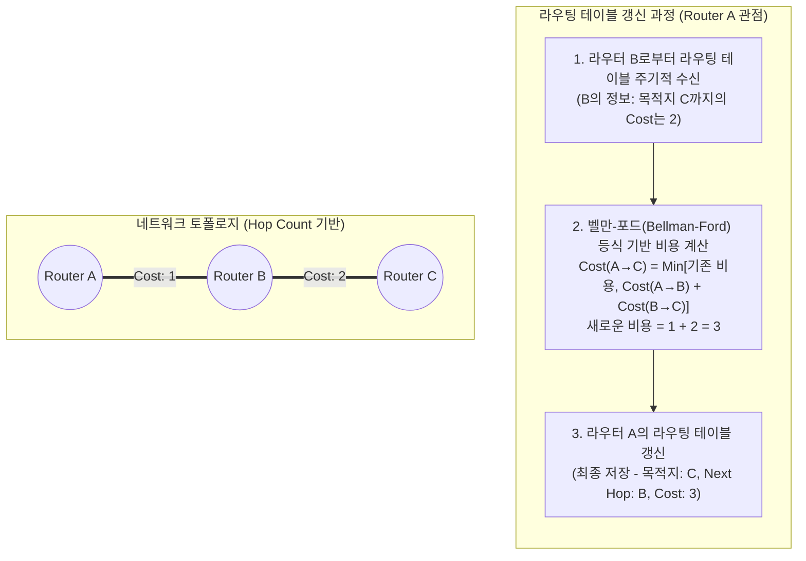

# 거리 벡터 알고리즘 (Distance Vector Algorithm)

---

## I. 인접 라우터 간 정보 교환을 통한 최적 경로 탐색, 거리 벡터 알고리즘의 개요

* **정의**: 벨만-포드(Bellman-Ford) 알고리즘을 기반으로, 라우터가 목적지까지의 거리(Distance)와 방향(Vector) 정보를 포함한 라우팅 테이블 전체를 인접 라우터와 주기적으로 교환하여 최적 경로를 결정하는 동적 [[라우팅 알고리즘]]
* **등장 배경**: 소규모 네트워크 환경에서 라우터의 메모리와 [[CPU]] 자원을 적게 소모하면서도, 자동화된 최적 경로(Shortest Path) 갱신 메커니즘이 필요함에 따라 도입
* **특징**:
* **이웃 의존성 (Neighbor-only)**: 네트워크 전체 토폴로지를 알지 못하며, 오직 직접 연결된 인접 라우터가 전달한 정보에만 의존하여 경로를 계산함
* **주기적 갱신 (Periodic Update)**: 토폴로지 변화와 무관하게 일정 주기(예: RIP의 경우 30초)마다 전체 라우팅 테이블을 브로드캐스트함
* **라우팅 루프 취약성**: 수렴 속도(Convergence Time)가 느려 잘못된 경로 정보가 순환하는 'Count-to-Infinity' 문제 발생 가능성이 존재함

---

## II. 거리 벡터 알고리즘의 동작 원리 및 핵심 기술 요소

### 가. 거리 벡터 알고리즘의 개념도 및 동작 원리

* 각 라우터는 인접 라우터가 보내온 거리 정보(Vector)에 자신과 인접 [[라우터]] 간의 비용(Link Cost)을 더하여, 목적지까지의 최소 비용 경로를 도출하고 라우팅 테이블을 갱신함.

### 나. 거리 벡터 알고리즘의 핵심 기술 요소

| 분류 | 요소기술(키워드) | 세부 설명 |
| --- | --- | --- |
| **수학적 기반** | Bellman-Ford [[알고리즘]] | 단일 출발점에서 모든 목적지까지의 최단 경로를 구하는 알고리즘으로 라우팅 비용 계산의 핵심 논리 |
| **평가 기준** | Metric (메트릭) | 경로의 효율성을 평가하는 기준 (RIP는 Hop Count, IGRP는 대역폭/지연시간 등 혼합 사용) |
| **루프 방지** | Split Horizon | 라우팅 정보를 수신한 인터페이스(포트)로는 해당 라우팅 정보를 다시 전송하지 않는 기법 |
| **루프 방지** | Route Poisoning | 특정 네트워크 장애 발생 시, 해당 경로의 메트릭을 무한대(RIP의 경우 16)로 설정하여 인접 라우터에 즉시 전파 |
| **루프 방지** | Poison Reverse | Route Poisoning을 수신한 라우터가, 확인 응답 차원에서 무한대 메트릭 정보를 원래 인터페이스로 역전송 |
| **루프 방지** | Hold-down Timer | 경로에 문제가 생겼을 때 일정 시간 동안 대체 경로 정보를 무시하여, 잘못된 정보의 확산을 방지하는 타이머 |
| **성능 개선** | Triggered Update | 주기적인 갱신 시간까지 기다리지 않고, 네트워크 토폴로지 변화 감지 시 즉각적으로 변경된 정보를 전송 |
| **대표 [[프로토콜]]** | RIP / IGRP | 거리 벡터 알고리즘을 사용하는 대표적인 내부 [[게이트웨이]] 프로토콜(IGP) |

---

## III. 거리 벡터와 링크 상태 알고리즘 비교 및 향후 전망

### 가. 동적 라우팅 알고리즘 비교 (거리 벡터 vs 링크 상태)

| 비교 항목 | 거리 벡터 (Distance Vector) | 링크 상태 (Link State) |
| --- | --- | --- |
| **대표 알고리즘/수학기반** | Bellman-Ford | [[다익스트라 알고리즘|Dijkstra]] (다익스트라) |
| **대표 라우팅 프로토콜** | RIP, IGRP | OSPF, IS-IS |
| **정보 교환 대상** | **직접 연결된 인접 라우터**에게만 전송 | **네트워크 내 모든 라우터**에게 전송 (Flooding) |
| **교환 정보 내용** | 라우팅 테이블 **전체** | 인접 링크의 상태 정보 (**LSA**, 부분적) |
| **업데이트 발생 시점** | **주기적** 갱신 (Periodic) | **이벤트 발생 시** 갱신 (Event-triggered) |
| **토폴로지 이해도** | 전체 토폴로지 구조를 알지 못함 (이정표 방식) | 전체 네트워크 토폴로지 맵(Map)을 보유함 |
| **수렴 속도 / 리소스 소모** | 수렴 속도 느림 / 메모리 및 CPU 소모 적음 | 수렴 속도 빠름 / 메모리 및 CPU 소모 큼 |
| **적용 권장 네트워크** | 소규모 네트워크 (Hop 수 제한 존재) | 중·대규모 네트워크 (Area 기반 계층적 분할) |

### 나. 한계점 및 최신 라우팅 동향

* **한계점**: 네트워크 규모가 커질수록 브로드캐스트 트래픽에 의한 대역폭 낭비가 심해지고 잦은 라우팅 루프 발생으로 인해 대규모 기업망 적용에 부적합함.
* **최신 동향**: 현재 기업 및 통신사 내부망(IGP)은 OSPF와 같은 링크 상태 알고리즘으로 표준화되어 거리 벡터 라우팅의 비중이 크게 축소되었으나, 두 방식의 장점을 결합한 **혼합형 라우팅 프로토콜(EIGRP)** 및 경로 벡터 방식을 활용하는 외부망 연동 프로토콜(**[[BGP]]**)의 논리적 기초로서 그 가치가 여전히 유효함.

---

### 🔗 연관 토픽

- **소속 도메인**: [[00_네트워크_MOC|🌐 네트워크]]
- **세부 분류**: `2. 네트워크 계층 & 라우팅 프로토콜 (L3)`
- **핵심 연관 토픽**:
  - [[라우팅 알고리즘|라우팅 알고리즘(Routing Protocol, 거리벡터, 링크상태)]]
  - [[Link State Algorithm]]
  - [[BGP|BGP(Border Gateway Protocol)]]
  - [[라우터]]
  - [[게이트웨이]]
