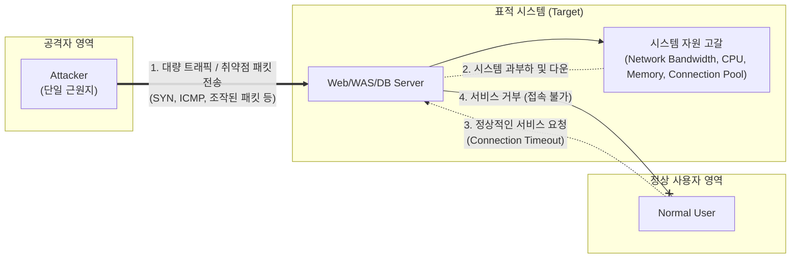

# DoS (Denial of Service)

---

## I. 시스템의 가용성을 위협하는 사이버 공격, DoS의 개요

* **정의**: 공격자가 단일 시스템을 이용해 표적 시스템의 네트워크 대역폭이나 시스템 자원([[CPU]], 메모리 등)을 고갈시켜, 정상적인 사용자가 해당 시스템의 서비스를 이용하지 못하도록 방해하는 악의적 공격 기법
* **등장 배경 및 특징**:
* **[[HA(High Availability)|가용성]](Availability) 침해**: 정보보안의 3대 요소([[기밀성]], [[무결성]], 가용성) 중 시스템이 정상적으로 서비스되어야 하는 가용성을 직접적으로 파괴함
* **취약점 악용 및 자원 고갈**: [[네트워크 프로토콜]]([[TCP]]/IP)의 구조적 취약점을 악용하거나, 처리 용량을 초과하는 대량의 비정상 트래픽을 전송하여 시스템 장애(Crash) 유발
* 단일 근원지(Single Source)에서 발생하므로 공격지 IP 차단 등으로 비교적 방어가 용이함 (이후 [[DDOS|DDoS]]로 진화)

---

## II. DoS 공격의 동작 메커니즘 및 주요 공격 유형

### 가. DoS 공격의 개념도 및 동작 원리

* 공격자는 시스템이 처리할 수 없는 대량의 트래픽을 보내거나(Volume-based), 시스템의 오류를 유발하는 조작된 패킷(Vulnerability-based)을 전송함
* 표적 시스템은 악성 요청을 처리하느라 자원이 고갈되어, 결국 정상 사용자의 서비스 요청에 응답하지 못하게 됨(Time Out / Connection Refused).

### 나. DoS의 주요 공격 유형 및 핵심 기술 요소

| 분류 | 공격 유형 (키워드) | 세부 설명 |
| --- | --- | --- |
| **대역폭 고갈** | UDP Flooding | 의미 없는 대량의 UDP 패킷을 표적 서버로 전송하여 네트워크 회선 대역폭을 고갈시키는 공격 |
| **대역폭 고갈** | Smurf Attack | 출발지 IP를 표적 IP로 위조(Spoofing)한 후, 브로드캐스트 주소로 [[ICMP]] 패킷을 보내 대량의 응답 패킷을 유발하는 증폭 공격 |
| **[[프로토콜]] 취약점** | SYN Flooding | TCP 3-Way Handshake 과정에서 ACK를 보내지 않고 SYN만 무한 전송하여 서버의 백로그 큐(Half-Open 커넥션)를 고갈시킴 |
| **패킷 조작 (오류)** | Ping of Death | 규정된 크기(65,535 바이트) 이상의 큰 ICMP 패킷을 전송하여, 수신 측의 [[단편화]]/재조합 과정에서 버퍼 오버플로우 및 크래시 유발 |
| **패킷 조작 (오류)** | Teardrop Attack | IP 패킷 단편화 시 오프셋(Offset) 값을 중첩되게 조작하여, 수신 측이 패킷을 재조합할 때 연산 오류로 인한 시스템 다운 유발 |
| **패킷 조작 (오류)** | [[Land Attack]] | 패킷의 출발지 IP와 목적지 IP를 표적 서버의 IP로 동일하게 위조하여, 서버가 자기 자신에게 무한히 응답하게 만드는 루프 유발 |
| **애플리케이션(L7)** | Slowloris | HTTP GET 요청 시 헤더의 끝을 나타내는 개행문자(CRLF)를 누락하여 전송함으로써, 웹 서버의 연결(Connection)을 장시간 점유 |
| **애플리케이션(L7)** | R.U.D.Y | HTTP POST 요청 시 Content-Length를 크게 설정한 후, 데이터를 1바이트씩 매우 느리게 전송하여 서버 자원 고갈 |

---

## III. DoS와 DDoS 공격 비교 및 최신 방어 동향

### 가. DoS와 DDoS(Distributed DoS) 공격 기법 비교

| 비교 항목 | DoS (Denial of Service) | DDoS (Distributed DoS) |
| --- | --- | --- |
| **공격 주체 (Source)** | **단일** 공격자 (1:1 공격) | **다수**의 감염된 좀비 PC/Botnet (N:1 공격) |
| **공격 규모 및 타격력** | 상대적으로 작음 | 봇넷을 동원하여 수십 Gbps~Tbps 급의 대규모 트래픽 발생 |
| **탐지 및 방어 난이도** | 쉬움 (단일 IP 필터링 차단 가능) | **매우 어려움** (정상 트래픽과 악성 트래픽 구분이 모호) |
| **주요 방어 기법** | [[방화벽]](FW), IPS를 통한 IP/Port 차단 | Anti-DDoS 전용 장비, [[CDN]](Cloud) 분산 처리, 대역폭 싱크홀 처리 |

### 나. 한계 극복 및 최신 방어 동향

* **진화 양상**: 단순 [[네트워크 계층]](L3/L4) 공격에서 벗어나 정상 사용자로 위장한 애플리케이션 계층(L7) 타겟 공격(Slow HTTP, Ransom-DDoS 등)으로 고도화되고 있음
* **클라우드 기반 엣지 방어 (CDN & WAAP)**: 대규모 볼륨 공격 방어를 위해 온프레미스 장비의 한계를 극복하는 클라우드 기반의 분산 인프라(CDN)와 [[WAAP|WAAP(Web Application and API Protection)]] 도입이 필수화됨
* **AI/ML 기반 이상 탐지 (NBA)**: 시그니처 기반 차단을 우회하는 변종 공격에 대응하기 위해, 머신러닝 알고리즘을 적용한 네트워크 행위 분석(NBA, Network Behavior Analysis) 기반의 선제적 동적 트래픽 차단 기술이 적극 활용되고 있음

---

### 🔗 연관 토픽

- **소속 도메인**: [[00_보안_MOC|🛡️ 보안]]
- **세부 분류**: `1. 정보보안 원칙 & 거버넌스 · 인증`
- **핵심 연관 토픽**:
  - [[기밀성]]
  - [[DDOS]]
  - [[Land Attack]]
  - [[DRDOS]]
  - [[UAM 취약점 및 대응방안]]
