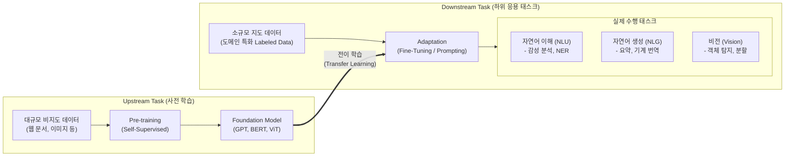

# Downstream Task (하위 태스크)

---

## I. 파운데이션 모델 실용화의 핵심, Downstream Task의 개요

* **정의**: 대규모 데이터로 사전 학습된 [[파운데이션 모델]](Foundation Model)이나 사전 학습 언어 모델(PLM)을 기반으로, 감성 분석, 질의응답, 객체 인식 등 사용자의 실제 비즈니스 목적을 달성하기 위해 수행하는 구체적인 하위 응용 태스크
* **배경 및 특징**:
* **효율적 AI 개발 파이프라인**: Upstream Task(사전 학습)와 분리하여 개발 시간 및 컴퓨팅 자원을 획기적으로 절감
* **전이 학습(Transfer Learning) 활용**: 사전 학습된 범용적 특징(Representation)을 특정 도메인 문제 해결에 [[재사용]]
* **적은 데이터로 고성능 달성**: 소량의 레이블링(Labeled) 데이터만으로도 미세조정([[Fine-Tuning]]) 및 프롬프팅을 통해 높은 정확도 확보

---

## II. Downstream Task의 아키텍처 및 핵심 구성요소

### 가. Downstream Task 처리 파이프라인 및 개념도

* 대량의 비지도 데이터로 언어 및 이미지의 범용적 패턴을 학습(Upstream)한 후, 추출된 가중치를 기반으로 특정 목적에 맞게 모델을 최적화(Downstream)하여 실무에 적용함.

### 나. Downstream Task 적용 및 수행을 위한 핵심 기술 요소

| 분류 | 요소기술(키워드) | 세부 설명 |
| --- | --- | --- |
| **적응 기법 (Tuning)** | Fine-Tuning | 사전 학습 모델의 전체 또는 일부 가중치를 Downstream 데이터에 맞게 재학습하는 미세조정 기법 |
| **적응 기법 ([[PEFT]])** | [[LoRA(Low-rank adaptation)|LoRA]] / QLoRA | 전체 모델 대신 랭크가 낮은 소규모 행렬(Low-Rank)만 추가 학습하여 메모리와 연산량을 극도로 최소화하는 기법 |
| **적응 기법 (추론)** | In-Context Learning | 가중치 업데이트 없이 프롬프트(Prompt)에 예시(Zero/Few-shot)를 제공하여 태스크를 수행하는 기법 |
| **NLP 태스크 (NLU)** | 텍스트 분류 / 감성 분석 | 주어진 문장의 카테고리(스팸 여부, 긍/부정 등)를 분류하는 자연어 이해 기반 하위 작업 |
| **NLP 태스크 (NLU)** | 개체명 인식 (NER) | 문장 내에서 인물, 장소, 조직 등 고유 의미를 갖는 개체명을 식별하고 추출하는 작업 |
| **NLP 태스크 (NLG)** | 질의응답 (QA) 및 요약 | 사용자의 질문에 대한 답을 생성하거나(QA), 긴 문서의 핵심 내용만 추출/생성(Summarization)하는 작업 |
| **Vision 태스크** | Object Detection | 이미지 내에서 특정 객체의 위치(Bounding Box)를 찾고 해당 객체의 클래스를 식별하는 작업 |
| **평가 지표** | GLUE / SuperGLUE | NLP Downstream Task에 대한 언어 모델의 범용적 성능을 평가하기 위한 표준 벤치마크 데이터셋 |

---

## III. Downstream Task와 Upstream Task 비교 및 향후 전망

### 가. Upstream Task와 Downstream Task 비교

| 비교 항목 | Upstream Task (사전 학습) | Downstream Task (미세 조정 및 응용) |
| --- | --- | --- |
| **주요 목적** | 범용적 특징 및 패턴 (Representation) 학습 | 특정 비즈니스 문제 해결 및 실무 적용 |
| **학습 데이터** | 대규모 비지도 데이터 (Unlabeled Data) | 소규모 지도 데이터 (Task-specific Labeled Data) |
| **학습 방법론** | Self-Supervised Learning, Masked LM | Supervised Learning, Fine-tuning, Prompting |
| **컴퓨팅 자원** | 막대한 [[GPU]] 클러스터 및 긴 시간 소요 | 상대적으로 적은 GPU 자원 및 짧은 시간 소요 |
| **주요 결과물** | Foundation Model ([[초거대 언어 모델|LLM]], Vision Model 등) | 도메인 특화 모델 (챗봇, 번역기, 불량 검출기 등) |

### 나. Downstream Task의 최신 트렌드 및 향후 전망

* **RAG(검색 증강 생성) 연계 결합**: 별도의 무거운 Fine-Tuning 과정 없이, 기업 내부의 최신 지식 데이터베이스를 검색(Retrieval)하여 Downstream Task(QA 등)의 [[할루시네이션|환각 현상]](Hallucination)을 억제하고 성능을 극대화하는 추세임.
* **도메인 특화 SLM(Small Language Model) 부상**: 모바일 및 온디바이스(On-Device) 환경에서 특정 Downstream Task만을 빠르고 효율적으로 수행하기 위해 모델 크기를 경량화한 SLM(Phi-3, Llama-3 8B 등) 활용이 확산됨.

---

### 🔗 연관 토픽

- **소속 도메인**: [[00_인공지능_MOC|🤖 인공지능]]
- **세부 분류**: `4. 거대언어모델 (LLM) & 생성형 AI`
- **핵심 연관 토픽**:
  - [[Fine-Tuning]]
  - [[PEFT|PEFT(Parameter-Efficient Fine-Tuning)]]
  - [[파운데이션 모델|파운데이션 모델(Foundation Model)]]
  - [[초거대 언어 모델|초거대 언어 모델(Large Language Model)]]
  - [[LoRA(Low-rank adaptation)]]
