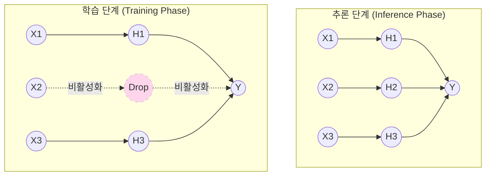

# Dropout (드롭아웃)

---

## I. 인공신경망의 과적합(Overfitting) 방지를 위한 핵심 정규화 기법, Dropout의 개요

* **정의**: [[딥러닝]] 모델의 학습 과정에서 신경망의 일부 노드(뉴런)를 사전에 설정된 확률에 따라 무작위로 비활성화하여 가중치 업데이트를 생략하는 정규화(Regularization) 기법
* **등장 배경**:
* 신경망의 층이 깊어지고 매개변수가 많아질수록 학습 데이터에만 과도하게 적합(Overfitting)되는 문제 발생
* 특정 뉴런들이 서로에게 강하게 의존하여 특징을 추출하는 공동 적응(Co-adaptation) 현상을 방지할 필요성 대두

* **특징**: 특정 노드에 대한 의존성 감소, 매 스텝(Step)마다 다른 형태의 서브 네트워크(Sub-network)가 학습되는 앙상블(Ensemble) 효과 발생

---

## II. Dropout의 동작 원리 및 핵심 기술 요소

### 가. Dropout의 개념도 및 학습/추론 시 동작 원리

* **학습 시**: 지정된 확률(예: 50%)로 무작위 은닉 노드를 0으로 만들어(Drop) 순전파(Forward) 및 [[역전파]](Backward) 시 연산에서 제외함.
* **추론 시**: 모든 노드를 100% 활성화하여 예측의 일관성을 유지하며, 학습 시 누락된 가중치 비율을 보정하기 위한 스케일링(Scaling) 과정을 거침.

### 나. Dropout의 핵심 기술 요소 및 변형 기법

| 분류 | 요소기술(키워드) | 세부 설명 |
| --- | --- | --- |
| **확률 제어** | Keep Probability ($p$) | 노드를 비활성화하지 않고 유지할 확률 파라미터 (일반적으로 입력층 0.8, 은닉층 0.5 적용) |
| **마스킹 연산** | 이진 마스크 (Binary Mask) | 베르누이(Bernoulli) 분포를 활용하여 난수를 생성하고, 노드의 출력값과 행렬 곱을 수행하여 0으로 매핑 |
| **효과 및 목적** | Co-adaptation 방지 | 특정 뉴런 쌍이나 경로가 항상 활성화되는 현상을 막아, 망 전체가 독립적이고 강건한(Robust) 특징을 학습하도록 유도 |
| **효과 및 목적** | 앙상블(Ensemble) 효과 | 에포크(Epoch)마다 뉴런 연결 구조가 달라지므로, 하나의 모델로 수많은 얇은 신경망을 결합한 것과 같은 성능 도출 |
| **최적화 기법** | Inverted Dropout | 추론 시마다 보정 연산을 수행하는 오버헤드를 막기 위해, 학습 시 미리 활성값을 $p$로 나누어($1/p$) 스케일링하는 기법 (PyTorch 등 [[프레임워크]] 기본 적용) |
| **변형 기법 (비전)** | Spatial Dropout (Dropout2d) | [[CNN]] 모델에서 픽셀 단위가 아닌 채널(Feature Map) 전체를 드롭하여 인접 픽셀 간의 높은 상관관계로 인한 효과 저하 방지 |
| **변형 기법 (시계열)** | Recurrent Dropout | [[RNN (Recurrent Neural Network)|RNN]]/[[LSTM (Long Short-Term Memory)|LSTM]] 등 순환 신경망 구조에서 시간축(Time-step) 방향의 상태 정보를 유지하면서 드롭아웃을 적용하는 기법 |

---

## III. Dropout과 다른 정규화(Regularization) 기법의 비교 및 적용 시 주의사항

### 가. 딥러닝 주요 정규화 기법 비교 (Dropout vs Weight Decay)

| 비교 항목 | Dropout | Weight Decay (L1/L2 정규화) |
| --- | --- | --- |
| **정규화 접근 방식** | **구조적 통제** (신경망 아키텍처 개입) | **수식적 통제** (손실 함수에 페널티 항 추가) |
| **작동 메커니즘** | 무작위로 뉴런의 출력을 0으로 비활성화 | 가중치(Weight) 값이 지나치게 커지는 것을 억제 |
| **연산량 오버헤드** | 적음 (단, 학습 수렴 시간은 약 2배 지연될 수 있음) | 약간의 행렬 노름(Norm) 계산 추가 비용 발생 |
| **결과적 효과** | 소수 뉴런에 대한 의존성 분산 (희소성/앙상블) | 가중치 분포를 평활화(L2)하거나 0으로 수렴(L1)시킴 |
| **상호 보완성** | 두 기법은 동작 원리가 달라 함께 조합하여 사용 시 과적합 방지 효과가 극대화됨 |  |

### 나. 실무 적용 시 고려사항 및 최신 동향

* **[[배치 정규화]](Batch Normalization)와의 충돌 유의**: Dropout과 Batch Normalization을 동시에 적용할 경우, Dropout으로 인해 변경된 분산(Variance)이 BN의 통계적 가정(Variance Shift)을 훼손하여 오히려 성능이 저하될 수 있음. (일반적으로 `Conv -> BN -> ReLU -> Dropout` 순서로 배치하거나, 최신 아키텍처에서는 Dropout 대신 BN에 전적으로 의존하는 경향도 존재함)
* **적정 Dropout Rate 설정**: 모델의 용량(Capacity)이 크고 데이터가 적을수록 Dropout Rate를 높여 정규화 강도를 올리고, 과소적합(Underfitting) 발생 시 Rate를 낮추는 방향으로 하이퍼파라미터 튜닝 수행 필수.

---

### 🔗 연관 토픽

- **소속 도메인**: [[00_인공지능_MOC|🤖 인공지능]]
- **세부 분류**: `1. 수학 · 통계학 & 데이터 전처리`
- **핵심 연관 토픽**:
  - [[딥러닝]]
  - [[CNN|CNN (Convolutional Neural Network)]]
  - [[LSTM (Long Short-Term Memory)]]
  - [[등분산성|등분산성 (Homoscedasticity)]]
  - [[베이지안 딥러닝]]
