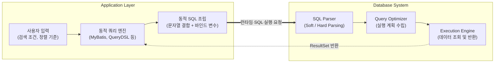

# Dynamic SQL (동적 SQL)

---

## I. 유연한 데이터 처리를 위한 런타임 쿼리 생성 기법, Dynamic SQL의 개요

* **정의**: 컴파일 시점(Compile-time)이 아닌 실행 시점(Run-time)에 사용자의 입력 값이나 비즈니스 조건에 따라 [[SQL(Structured Query Language)|SQL]] 문장을 동적으로 조립하고 실행하는 [[데이터베이스]] 프로그래밍 기법
* **필요성 및 특징**:
* **비즈니스 유연성**: 다중 검색 조건(Optional 필터), 동적 정렬(ORDER BY), 가변적인 테이블/컬럼 선택 등 복잡한 요구사항 대응
* **코드 재사용성**: 유사한 구조의 SQL을 통합하여 중복 코드를 최소화하고 애플리케이션의 유지보수성 향상
* **성능 및 보안 트레이드오프**: 쿼리 구조 변경에 따른 [[DBMS]] 하드 파싱(Hard Parsing) 오버헤드 발생 및 [[SQL Injection]] 보안 위협 존재

---

## II. Dynamic SQL의 개념도 및 핵심 구성 요소

### 가. Dynamic SQL의 개념도 및 동작 원리

* 애플리케이션에서 조건절(WHERE)이나 구조를 런타임에 결정하여 DBMS로 전송하며, 쿼리 텍스트가 변경될 때마다 DBMS는 새로운 실행 계획을 수립(하드 파싱)함

### 나. Dynamic SQL의 핵심 기술 및 구성 요소

| 구분 | 요소기술(키워드) | 세부 설명 |
| --- | --- | --- |
| **구현 방식** | String Concatenation | 런타임에 분기문(if/else)을 통해 SQL 문자열을 직접 결합하는 가장 원시적인 방식 |
| **구현 방식** | ORM / SQL Mapper | MyBatis(`<if>`, `<choose>`), JPA Criteria, Hibernate 등을 활용한 선언적 쿼리 생성 |
| **성능 최적화** | Bind Variable (바인드 변수) | 파라미터 값만 변경되는 경우, SQL 텍스트를 고정하여 Soft Parsing을 유도하는 기법 (`?` 형태) |
| **성능 최적화** | Hard / Soft Parsing | 동적 쿼리 구조 변경 시 하드 파싱, 캐시된 실행 계획(Library Cache) [[재사용]] 시 소프트 파싱 발생 |
| **DBMS 기능** | EXECUTE IMMEDIATE | Oracle PL/SQL 등 DBMS 내부 스토어드 프로시저에서 동적 [[DDL]]/[[DML]]을 실행하는 명령어 |
| **보안 통제** | SQL Injection | 악의적인 쿼리 삽입 공격. 동적 SQL 조립 시 입력값 검증 부재로 발생하는 주요 보안 취약점 |
| **보안 통제** | PreparedStatement | 쿼리 구조를 미리 컴파일하고 데이터만 바인딩하여 SQL 인젝션을 원천적으로 방어하는 API |
| **최신 기술** | Type-Safe Builder | QueryDSL, JOOQ 등을 활용하여 동적 쿼리를 자바 코드로 작성, 컴파일 타임에 오류 사전 검출 |

---

## III. Dynamic SQL과 Static SQL 비교 및 최신 트렌드

### 가. Dynamic SQL과 Static(정적) SQL 비교

| 비교 항목 | Static SQL (정적 SQL) | Dynamic SQL (동적 SQL) |
| --- | --- | --- |
| **쿼리 확정 시점** | 컴파일 시점 (Compile-time) | 실행 시점 (Run-time) |
| **유연성** | 낮음 (고정된 조건 및 구조만 처리) | 높음 (다양한 검색 조건 및 동적 DDL 처리 가능) |
| **DBMS 파싱 부하** | 낮음 (대부분 Soft Parsing 유도 용이) | 상대적으로 높음 (구조 변경 시 Hard Parsing 발생) |
| **실행 계획 캐싱** | 재사용성 매우 높음 | 구조가 바뀔 때마다 캐시 미스(Cache Miss) 발생 |
| **보안 (SQL Injection)** | 상대적으로 안전함 | 입력값 검증 누락 시 매우 취약함 |

### 나. 안전한 Dynamic SQL 활용 방안 및 최신 동향

* **Type-Safe 동적 쿼리의 부상**: 과거 문자열(String) 기반의 MyBatis 동적 쿼리에서 벗어나, 최근에는 **QueryDSL**이나 **JOOQ**와 같이 객체 지향적이고 컴파일 타임에 문법 오류를 검출할 수 있는 Type-Safe 쿼리 빌더가 실무 표준으로 자리매김함
* **시큐어 코딩 의무화**: 동적 쿼리 작성 시 식별자(테이블명, 컬럼명)는 애플리케이션 레벨에서 화이트리스트 방식으로 철저히 검증하고, 데이터 값은 반드시 **PreparedStatement 기반의 바인드 변수를 적용**하여 보안과 성능을 동시에 확보해야 함

---

### 🔗 연관 토픽

- **소속 도메인**: [[00_데이터베이스_MOC|🗄️ 데이터베이스]]
- **세부 분류**: `3. 장애 회복 기법 & 데이터 무결성`
- **핵심 연관 토픽**:
  - [[SQL Injection]]
  - [[SQL(Structured Query Language)]]
  - [[DDL]]
  - [[DML]]
  - [[데이터베이스]]
