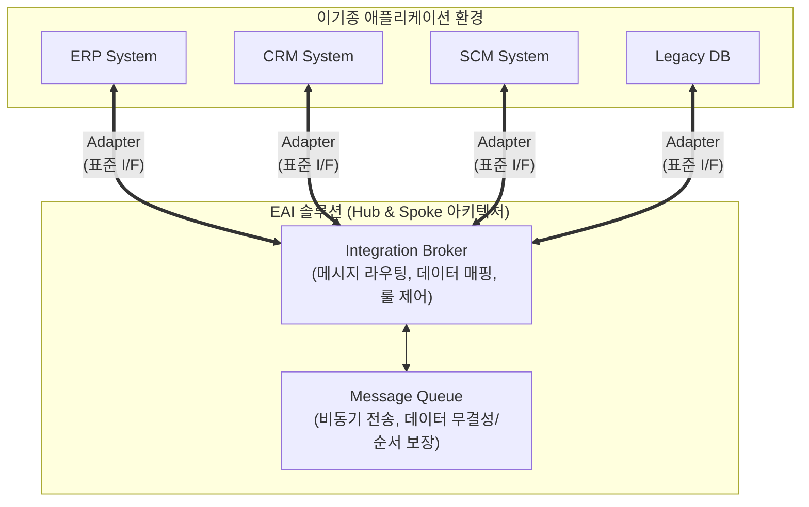

# EAI(Enterprise Application Integration)

---

## I. 이기종 시스템 간 정보 흐름의 단일화, EAI의 개요

* **정의**: 기업 내 독립적으로 운영되는 다양한 이기종 애플리케이션, [[데이터베이스]] 및 레거시 시스템 간의 데이터와 비즈니스 프로세스를 중앙 집중적으로 통합하는 전사적 연계 아키텍처
* **필요성 및 등장배경**:
* **연계 복잡성 해소**: 전통적인 [[Point-to-Point]] 방식의 N*(N-1)/2 연결 구조로 인한 스파게티 네트워크의 한계 극복
* **데이터 사일로(Silo) 제거**: 부서별 분절된 데이터를 통합하여 전사적 단일 진실 공급원(SSOT) 확보 및 실시간 의사결정 지원
* **비즈니스 민첩성 향상**: 새로운 시스템 도입 시 기존 시스템과의 연동을 표준화된 방식으로 신속하게 처리 가능

---

## II. EAI의 개념도 및 핵심 기술 요소

### 가. EAI의 개념도 및 동작 원리

* 어댑터(Adapter)를 통해 이기종 시스템의 고유 프로토콜을 EAI 표준 포맷으로 변환함
* 중앙의 허브(Integration Broker)가 메시지의 룰을 판별하여 라우팅하고, 비동기 큐(MQ)를 통해 전송의 신뢰성을 보장함

### 나. EAI의 핵심 기술 및 구성 요소

| 구분 | 요소기술(키워드) | 세부 설명 |
| --- | --- | --- |
| **연계 접점** | Adapter (어댑터) | 이기종 애플리케이션 및 [[DBMS]]를 EAI 중앙 엔진과 연결하는 표준 인터페이스 모듈 |
| **중앙 제어** | Integration Broker | 전송된 데이터의 변환, 검증 및 목적지 시스템으로의 경로를 결정하는 EAI 핵심 엔진 |
| **변환 처리** | Data Mapping / Transformation | 상이한 시스템 간의 데이터 포맷([[XML]], [[JSON]], CSV 등) 및 의미적 차이를 일치시키는 포맷 변환 기능 |
| **전송 제어** | Message [[Queue]] (MQ) | 비동기 통신을 지원하여 시스템 또는 네트워크 장애 시에도 데이터 무실실 및 전송 순서를 보장 |
| **분배 로직** | Message Routing | 송신 시스템의 메시지 콘텐츠 내용이나 사전 정의된 비즈니스 룰에 따라 적절한 수신처로 배분 |
| **아키텍처 토폴로지** | Hub & Spoke 구조 | 중앙의 허브(Broker)에 연계 노드(Spoke)들이 집중되는 방사형 통신 구조 (관리가 용이하나 병목 발생 우려) |
| **아키텍처 토폴로지** | Message Bus 구조 | 애플리케이션들이 공용 통신 버스를 통해 메시지를 주고받는 미들웨어 기반 분산형 연계 구조 |
| **[[프로세스]] 통합** | BPM (Business Process Management) | 단순 데이터 연계를 넘어, 기업 전체 업무 관점에서 복합 비즈니스 프로세스 흐름을 제어하고 모니터링 |

---

## III. EAI와 ESB 비교 및 최신 트렌드

### 가. 전사적 연계 아키텍처 비교 (EAI vs ESB)

| 비교 항목 | EAI (Enterprise Application Integration) | ESB (Enterprise Service Bus) |
| --- | --- | --- |
| **목적 및 관점** | 이기종 애플리케이션 간의 "데이터 통합" 중심 | SOA 기반의 "서비스 지향 비즈니스 연계" 중심 |
| **주요 아키텍처** | Hub & Spoke (중앙 집중형) | Service Bus (분산 미들웨어 기반) |
| **[[결합도]]** | Tightly Coupled (강한 결합 성향) | Loosely Coupled (표준 기반 느슨한 결합) |
| **표준화 수준** | 벤더 종속적 (독자적 어댑터 및 [[프로토콜]] 사용) | 개방형 웹서비스 표준 (SOAP, REST, XML, WSDL 등) |
| **적용 환경** | 기업 내부(Intranet)의 레거시 단일 연계 환경에 적합 | 기업 내/외부를 아우르는 대규모 분산 서비스 환경에 적합 |

### 나. 엔터프라이즈 시스템 통합 패러다임의 변화 및 전망

* **[[API Gateway]]와 [[MSA (Micro Service Architecture)|MSA]] 연계**: EAI와 ESB를 거쳐 현대의 [[클라우드 네이티브]] 환경에서는 독립적인 마이크로서비스(MSA) 간의 경량화된 통합을 위해 **API Gateway** 및 Event Mesh 중심의 연계 아키텍처가 주류로 자리잡음
* **iPaaS(Integration Platform as a Service)로의 진화**: 온프레미스 레거시 시스템과 다양한 SaaS 클라우드 애플리케이션들을 하이브리드 환경에서 끊김없이 연계하기 위해, 서비스형 통합 플랫폼인 iPaaS 도입이 엔터프라이즈의 핵심 IT 전략으로 부상하고 있음

---

### 🔗 연관 토픽

- **소속 도메인**: [[00_경영전략_MOC|📈 경영전략]]
- **세부 분류**: `2. IT 거버넌스 & 엔터프라이즈 아키텍처 (EA/ISP)`
- **핵심 연관 토픽**:
  - [[Point-to-Point]]
  - [[SI]]
  - [[MSA (Micro Service Architecture)]]
  - [[결합도]]
  - [[API Gateway]]
